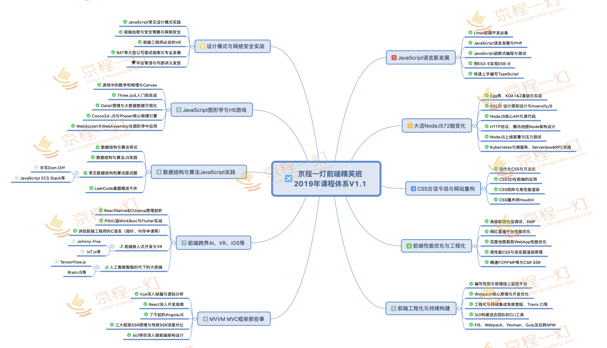

# 想对各位说的话（含个人经历、学习路线、书籍推荐）

## 个（zhuang）人（bi）经历

一些朋友问我，大三才开始学习前端，在这一年多的时间里，是如何做到知识点这么全面、深入的。我希望你看完本文后能够得到自己的答案

### 一、“知人论世”

1. 去年春招

> 去年这个时候，我懵懵懂懂的把一套 HTML5 基础开发的教程看完，练习过基本的 jquery，做过 jsp 项目，写完简历准备春招。可能是大三实习的优势吧，很多大厂都给了笔试机会，但不幸的是从 3 月挂到 5 月。那时我知道自己的实力远远支撑不了“野心”，我该好好学习了

2. 暑假实习

> 最后上海某公司（和学校有长期合作）来学校招聘，根据之前各种凉经加上老师的推荐，最后暑假去了上海实习了 2 个月。在那里开始接触 react、mobx、webpack、babel 等，并开启的 node 编程之路。两个月后我深知要学习的东西还有太多，继续留在公司不利我的知识积累（这取决于你个人的看法），果断选择回学校

3. 秋招实习

> 回学校已是秋招的尾声，朋友劝我可以去试试，边面边学。于是这次我以成都软件园那片区的公司为主，大厂为辅。然后面上了成都一家安全公司，进去一个星期后，美团打电话说给 offer 了，因为一些原因没能去美团实习

4. 备战春招

> 成都这家公司呆了 3 个月，我选择了离职，那时已是一月上旬，我开始准备春招，备战了 2 个多月到了现在...

### 二、技能评估

1. 去年春招期间：懵懂，处于最原始的纯前端开发，使用过 jsp，jquery

2. 上海实习期间：开始接触 react，redux，mobx，node 等，见识到另一片天地，疯狂学习

3. 成都实习期间：全面巩固基础，尝试研究源码，了解前端发展进程

4. 春招期间：如下图

### 三、实习总结

不得不说，去公司实习对能力增长的速度比在学校一个人瞎搞实在快太多。公司会有带你的人为你答疑，会有良好的团队氛围、学习氛围，会听到社会层面同事的故事。无论是对自己技术还是阅历都会有很大的提升，但不管在哪，你都得努力！

## 学习路线

ok，装逼完毕，其实看完我的经历，你应该对我的学习路线大概有个了解，但是我的学习之路是建立在从懵懂到成熟的过程之上，所以并不完全正确

### 一、大前端

1. 首先你得明白这一点，目前阶段所说的前端，再也不是以前的前端——纯网页的时代，现在前端可以做更多事情，如后端开发（nodejs），PC 开发（electron），移动端（rn）、可视化（three.js）、爬虫甚至是人工智能，前端慢慢渗透计算机的各个领域

2. 对于你来说，要做到的不仅仅是：搞好前端开发后开始学习 node，走上全栈的道路。现在的前端式的全栈太多，而且你根本走不长远，应该要有更高的目标：大前端！希望你能认真体会这个概念

### 二、路线推荐

这里只是给个大概且不一定适应全部人群，根据自己情况合理调整

1. 入门学习：html、css、es5-6 和 jquery，掌握 linux、git

> 这里多提一嘴，jquery 是必学的，你可以说 jquery 过时了，但不要说 jquery 没用
>
> 你懂 jquery 选择器怎么实现吗？
>
> 你懂 $(document).ready 如何实现 dom 加载完就执行的吗？
>
> 你懂 deferred 为啥要设计成不符合标准的 promise 吗？...
>
> jquery 的底层思想太过经典和重要

2. 进阶学习：三大框架及相应的状态管理工具，工程化 webpack 等、http 协议

3. 全栈学习：nodejs、express、koa、MongoDB、设计模式

4. 深入学习：1-3 提到的各种源码，手撸简易版的实现，了解前端发展进程

5. 跨界学习：移动端、PC 端、可视化等

然后分享“京城一灯”的知识体系，个人认为比较全面，可根据里面的内容，设计出自己的学习路线（真不是打广告）

## 学习途径

1. 学会科学上网，学会科学上网，学会科学上网

2. 官网：想学什么技术，首先一定是去官网

3. 书籍为主，视频为辅

4. github 看看大佬们的动态

5. 论坛、社区、博客

## 书籍推荐

在这一两年中，我读过但不限于的一些好书

书籍名称 | 重要程度
-------- | -----
JavaScript 高级程序设计（小红书） | ★★★★★
你不知道的 JavaScript 3套（小黄书） | ★★★★★
ES6 标准入门 | ★★★★
HTTP 权威指南 | ★★★★★
HTML5 与 CSS3 权威指南 | ★★★★
高性能 JavaScript | ★★★★
JavaScript 设计模式 | ★★★★
JavaScript 语言精粹 | ★★
CSS 揭秘 | ★★★★
React 与 Redux 开发实例精解 | ★★★
深入 React 技术栈 | ★★★★
深入浅出 Node.js | ★★★★
现代前端技术解析 | ★★★
jQuery 高级编程 | ★★★
剑指 offer（C语言版） | ★★★★

## 最后

1. 个人认为，大三能够找到公司实习是比较好的，最好是有实习生培训那种（而不只是把你当廉价劳动力）。在公司你学到的东西会比在学校里多很多

2. 不要把实习公司看的太重，并不是非大厂不进，当然能进大厂是最好。但无论在什么时候，哪家公司，你都得努力

3. 自制力非常重要，给自己定的任务一定要坚持完成。该学的时候要认真学，该玩的时候就认真玩

4. 分享一句话：提升自己，是最没有风险的投资

5. 最最后，记得按时睡觉，注意发际线~
