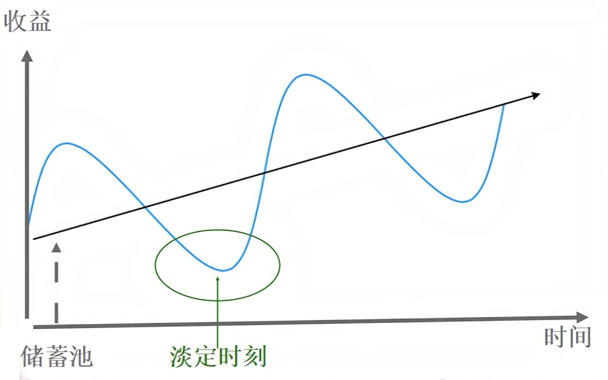
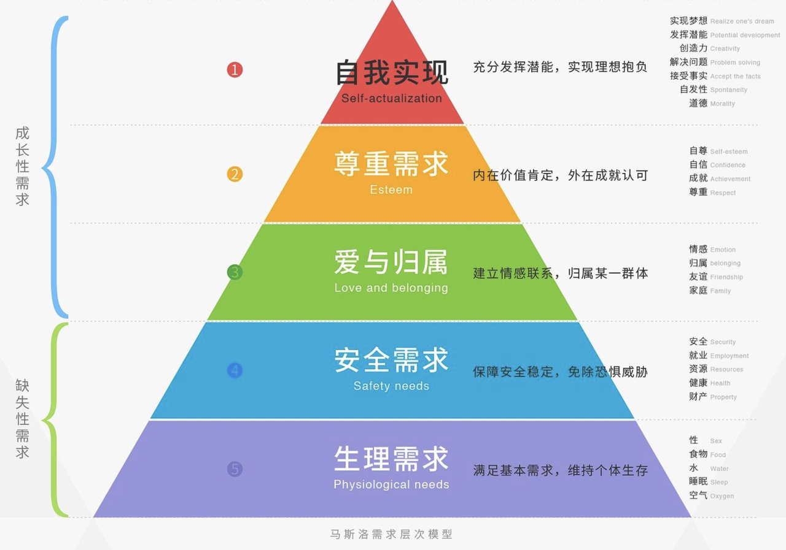
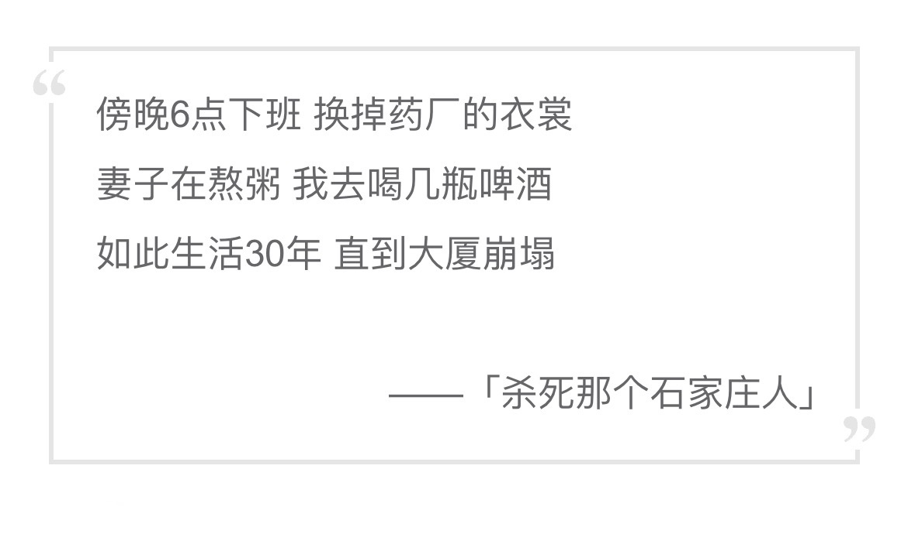

# 毕业三年，我活成了理想中的样子？

[原文地址](https://mp.weixin.qq.com/s?__biz=Mzg2Mzc2NjExNw==&mid=2247483687&idx=1&sn=d439b7709454695f4938aaced505474b&chksm=ce72d22df9055b3b40c61558d139eba63277dc41789686782f8a8eac0455302c9135ac2727e0#rd)

又到了毕业季，不知不觉毕业已经三年了 🤔

在这三年期间对生活有了很多感悟，俗话说“字节一年，人间三年”，感觉自己又读了两个大学 hh

对这三年做个总结吧，同时也分享下自己在杭州、在大厂的所见所得所感，也希望对你有所帮助~

## 一、关于我

> 第一次以这种形式与大家见面，还是自我介绍下吧
>
> 希望尽量用简短的文字让你了解我，同时磨平一些行文的信息差
>
> 那我们从一个小游戏开始吧

### 1.1 “生命年轮”游戏

- 以七年为一个节点，写下七年中，每年对自己最重要的事情
- 并分享给朋友，谈谈对这些事件的看法和对自己的影响，从而让彼此更加亲近

### 1.2 年轮线

成都人，95后，从 2015 年大一到 2022 毕业三年的 7 年

### 1.3 核心事件

- 2016 年：坚持计算机行业。“软件工程”作为高考最后一个志愿，大一结束时本想转专业，但最后还是坚持下来
- 2017 年：担任街舞协会 会长，举办《HipHop 之夜》晚会，邀请了各大高校协会参与
- 2018 年：大三确认技术方向，开始发力，自学前端
- 2019 年：大四实习，应届去了杭州字节跳动
- 2020 年：重新定义了学习，面向方法论成长
- 2021 年：遵从内心，学会勇敢，想清楚自己真正喜欢和擅长什么
- 2022 年：再见杭州，你好魔都。去上海寻找无限可能

### 1.4 个人感受

#### 性格成就现在的我

我是那种“玩和学”能够分开的人，学的时候认真学，玩的时候也会认真玩。所以大一、大二严格来说是“玩”过去的，我过的很开心。大三决定不考研后，开始自学专业课，应届能进大厂

#### 方法论很重要

不得不说公司 2 年多的成长能够抵过大学 4 年的学习（没说不重要）。身边结识了一群优秀的人，才慢慢明白，自己学生生涯的思维是不全面的，学习方式是不高效的，由此才开始慢慢调整

#### 选择大于努力

人生面临各种选择，无论是学生时代还是涉足社会。如果大方向是错的，再怎么努力也不会看到好结果

## 二、城里、城外

那么开始我的分享

> 苏小姐道：“法国也有这么一句话。不过，不说是鸟笼，说是被围困的城堡，城外的人想冲进去，城里的人想逃出来。鸿渐，是不是？”——《围城》

### 2.1 小故事

应届拿到几个大厂 offer，拥有不错的年薪，这也确实是我大学时代的梦，骄傲地跟父母报完喜讯后，马上订了台心仪已久的 Mac Pro。来到杭州报道，同事、环境等都让我格外欣喜和满足。我终于 **进入** 了字节

工作一年多，萌生了 **出** 国留学的想法，想再深造深造。同事D 再三劝阻我重视“沉默成本”，同时目前也是快升职之际，这种时间节点不常，有应该把握，另外出国的话以后稳定了随时都可以出去。句句在理，我被说服了，还是选择 **留** 下来搏一搏

想着暂时不出去的话，那就先 **去** 外企吧。随后去报了雅思课程，无论是之后留学还是外企，总归没有坏处。却因为疫情原因，兜兜转转花了半年终于考过了雅思。有了英语能力加成，加上本身技术底子不错，准备了一阵，拿到了苏州微软的 offer，最后却因为各种原因 **拒绝** 了

一个饭后，阳光明媚，约着同事C 和同事D 下去逛逛，**吐槽** 了下当下种种。C 告知了他准备 **离开** 的想法，我感到稍许失落，但也表示理解。很快，我们就相聚在散伙饭桌上了

### 2.2 感悟

> 关于“城里城外”故事还有很多，相信在你的生活中也萦绕着它们

#### 站在城里：理性看待 对当下的不满

不满足于当下，本身是中性的，它既能变成追求美好生活的 **动力**，也可能成为负能量的源泉，让我们迷失在报怨中。应该要正确看待欲望

- 看清改变的迫切性和必要性
- 树立清晰的目标，制定计划
- 按照计划推进、根据状况调整

#### 不盲目憧憬城外：按照自己的节奏走

城外风光似乎无限美好，为什么他一年就能考上研、升职加薪、出国留学……，总是被别人牵着走，和别人比较，自己永远都不会快乐

想起一个故事，高中时听班主任讲他带过的一个学姐，她想去国外读本科，所以高中就自学雅思，2013年左右，国内考点很少，无奈只能抢国外的场次，于是她一个人在新加坡考完了雅思。而我完成雅思，是在工作 2 年之后，与高中生涯相隔近 10 年，但这是属于我的 **人生节奏**

朋友，认真规划未来，按照自己的轨迹前行，想去的地方总会到达的。同时也能够真心为好友们的成功而祝福

#### 跨越城墙：构筑自己的“储蓄池”

天地悠悠，过客匆匆，潮起又潮落。人生总会面临改变，无论是主动还是被动的。要学会构建自己的认知“储蓄池”

站在《系统论》角度，系统的发展，伴随着正要素和负要素的推动，此消彼长，对应着人生的起伏。我们靠什么去扛过一次次重大改变，仅靠遇事时候的打鸡血、调整心态 是远远不够的，靠的是我们在精神和认知上的 **未雨绸缪**。即

有计划的提升自我，建立具有缓冲能力的储蓄池，以从容应对每次的变更

## 三、幸存者偏差是把双刃剑

> 幸存者偏差效应：指只能看到经过某种筛选而产生的结果，而没有意识到筛选的过程，因此忽略了筛选掉的关键信息

### 3.1 小故事

毕业三年，现在年薪也来到了 n十万，但细想身边同事好友 **谁又不是呢**，自己是个正常水平吧，没有什么优越；学历呢，字节背靠杭州，面向浙大招聘，同事学历也基本至一本起步，自己也没有什么异常。同事W 说如果你学历本科，月入过万，有车有房，帅气阳光，你就已经是百里挑一了。我陷入了沉思

前同事P 来到杭州阿里，相约一起喝酒。我吐槽说其实大厂也就那样，面试造火箭，进去拧螺丝，业务需求 **没啥难度**，写写界面，封封组件……他说：“你也不能这样说，还是有很多人想进都进不了大厂的，我觉得进大厂可以证明自己”。“证明自己”，我一惊，忽然想起这个被抛在“大明湖畔”的词。回想快毕业时，当时天天想着要进大厂。但身处大厂久了，反而被“幸存者偏差”折磨的不成样

### 3.2 感悟

> 不可否认，幸存者偏差是刻在潜意识深处的东西

#### 身处幸存者偏差，让我们与环境拉齐

身处大厂，周围同事都很优秀，我在有意识地吸收他们的工作经验和学习方法。同时也看到自己能力上的不足，并积极改进，慢慢总结出自己的一套方法论 无论什么环境，潜意识本能会 **向均线拉齐**，即所谓耳濡目染：大学寝室中 5 个室友都在打游戏，你会本能想加入，想着大家不都这样；同样身处于优秀的人之间，你会本能向他们靠齐，努力克服惰性

#### 跳出舒适圈

幸存者偏差的缺点就是长此以往，自己会对当下变得麻木，失去对整体局势变化趋势的感知力 没有什么“大家都这样，那我也就这样了”的借口，当直觉层面感到不对时，要 **引起重视**。及时跳出舒适圈，去感受更多的可能性，慢慢从这些可能性中筛选出适宜变化的、高效的、自己够得着的生活方式

## 四、所谓理想

> 兄弟B 在英国留学，兄弟L 在云南做生意，我在杭州当码农，我们都有光明的前途。——《新华字典》（玩个梗 hh）

### 4.1 三十而立

90 后是“悲催”的一代

- 1982 年，计划生育政策正式写入宪法，90后一代基本都是独生子女
- 2000 年，互联网起步，70后、80后陆续下海创业，垄断资源
- 2010 年前后，通货膨胀，物价飞涨
- 2014 年，房价大涨，高处不胜寒，90后初入社会
- 2015 年，二胎政策全面开放，90后成为生育主力军，承受高额房贷
- 2020 年，互联网增量饱和，整个行业开始内卷
- 2030 年，中国逐步进入老龄化社会，90后延迟退休

以上列举的时间线肯定不全或说准确，但我想说的是 90后，同 80后、70后一样，也是背负沉重压力的一代，每个代有着自己的低谷和红利。90后在享受着“第三次工业革命”——互联网时代 的便利的同时，也在 **承担** 着意想不到的压力，很多 90后开始学会摆烂，佛系的生活渐渐流行开来，不婚、晚婚、晚育是常态

2021 年我国结婚登记数据为 763.6 万对，当我妈催我谈恋爱结婚时，我却只能说：“你看，90后 **不都这样**？”

在奔三途中的 90后们，我认为首先要“立”的还是“立己”。一次聚餐时，询问老会长Z，我是考研还是工作好，他脱口而出，“去考研吧，**提升自己是最没有风险的投资**”，这句话我会记一辈子

人们普遍惰于思考，在俗成的时间点随大流，没错，你大概率不会输的很惨。平安喜乐，踞一方天地，亦岂不快哉？所以，更多的是你与自己的博弈

### 4.2 精神上的富裕是最难满足的

古有“饱暖思淫欲”，当代有《马斯洛需求层次理论》金字塔。人有基本的生理、安全和归属需求，能生存下去后，开始思考价值认可和 **理想抱负**。感谢祖国的强大让我们处于和平的年代，能有机会去追求形而上的东西

每次层需求的满足都是奔赴下一境界的激励源，相对的，需求层次越高，也 **更难得到满足**，取决于个人的潜力点和你的预期高度。还有一点就是，人的欲望是无穷无尽的，每个阶段有每个阶段的执念，是安于现状还是继续奋勇前行，也是你说的算。但我认为，对于精神层面的追求，你至少应该有那么一次是为自己而活的

### 4.3 理想的样子

“理想”本来就是一个很虚的概念，它可以杂糅进很多虚幻的东西，但“目标”不是，想清楚自己到底想要什么，勇敢地朝着这个它前进，慢慢部署自己的硬实力和软实力，直到逐渐达到那个高度

对于我来说，为未来 **奋斗** 过程中的自己，本就是我 **理想** 中的样子！

## 五、回归生活

在祖国广袤的土地上，在鳞次栉比的大厦里，我用一把键盘 **养活** 了自己

如果你问我理想的生活是什么，我会告诉你，我拼尽全力，只是为了能够 **平凡** 地度过这一生。正如万青唱的那样：傍晚6点下班……

感谢你的阅读

By Liam

2022.05.19 于杭州
