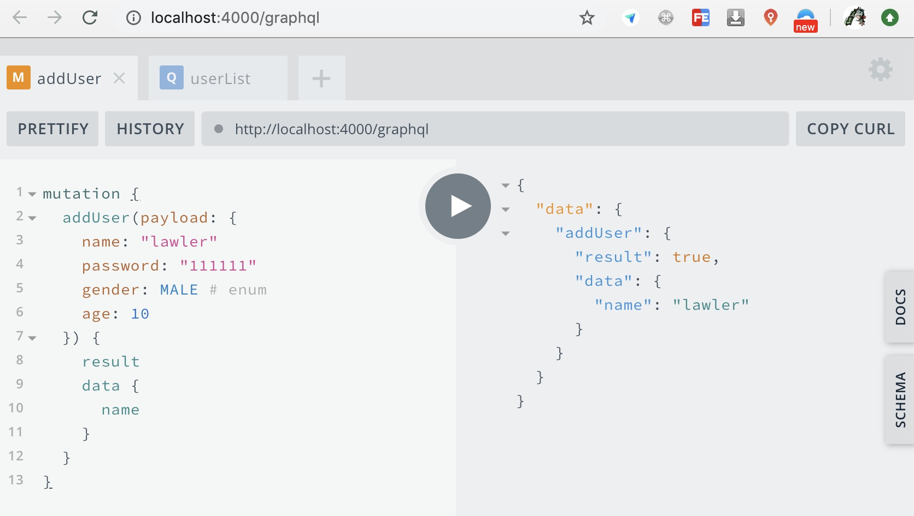
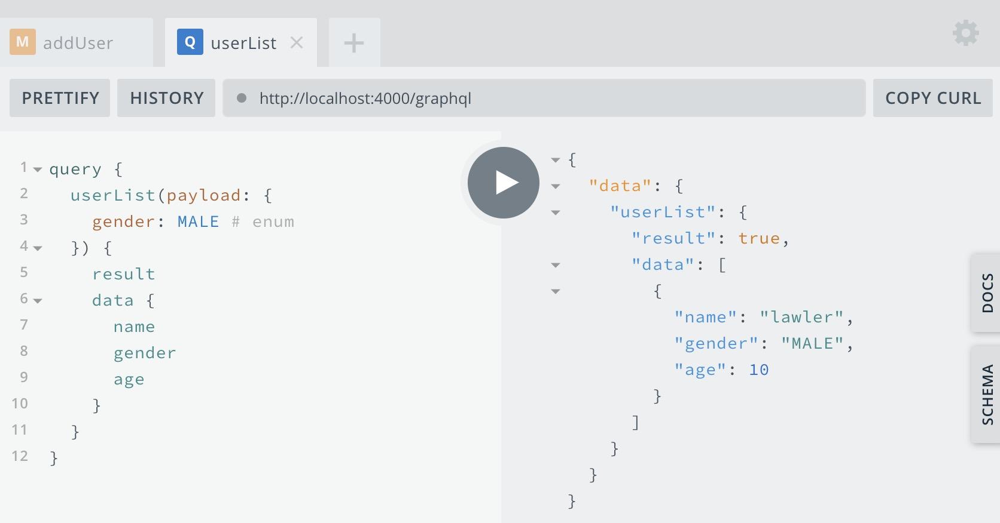
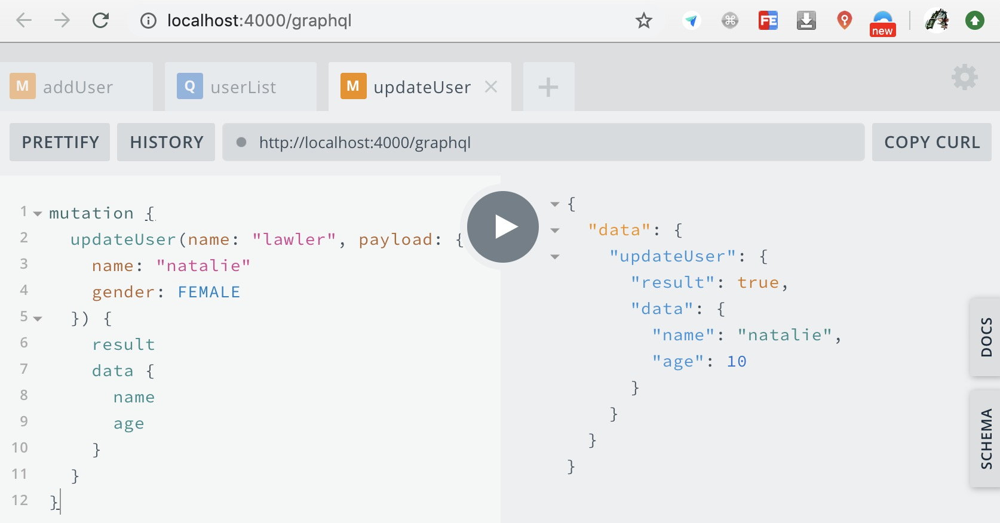
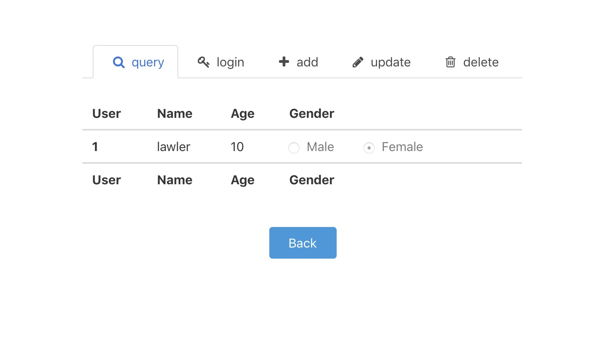
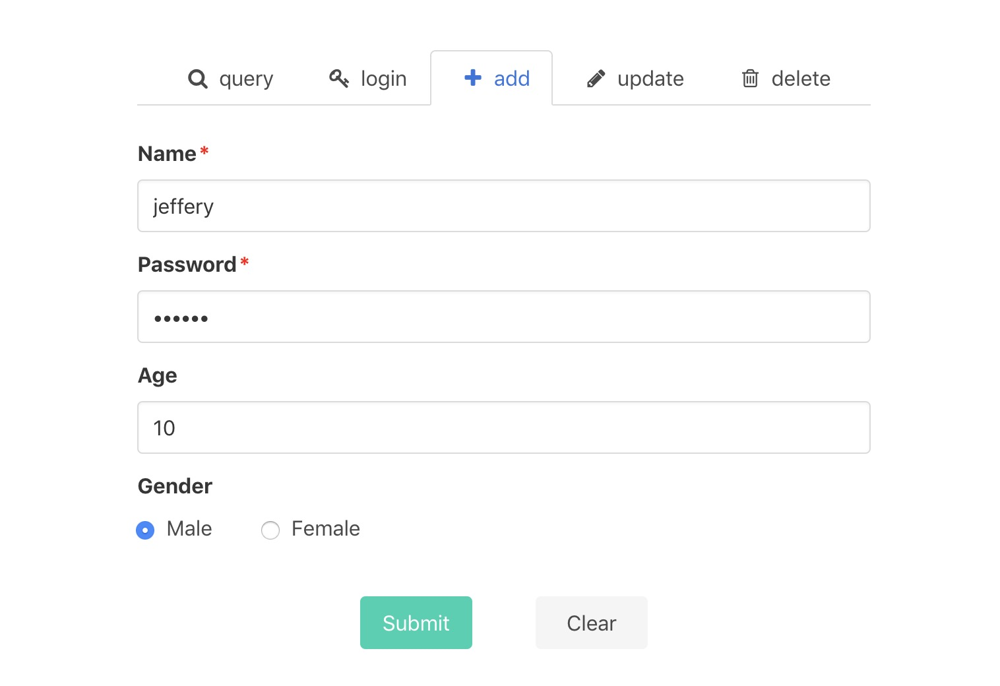
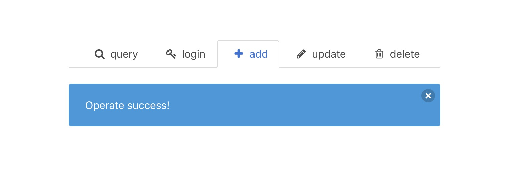

# graphQL 入门（含 server 和 client）

最近公司大佬在推 `GraphQL & Thrift` 的 `BFF` 层方案，自己也跟着学习，为全栈做准备

根据自己的理解做了个 graphQL 的 demo 练练手

## 介绍

1. 对于 `GraphQL` 的介绍和作用就不多说了，各位自行 [GraphQL 官网](https://graphql.cn/) 吧

2. `GraphQL` 带来的好处是显著的：

- 架构清晰，各层职责明确，上手相对容易

- 前后端基于一套“协议”开发，交流通畅，同时 mock data 成本降低

- 可取缔 Restful 风格的接口，避免接口僵硬，数据过剩的情况

- ...

3. 当然 `GraphQL` 也有一些不能很好应对的情况，比如：[分页，认证](https://apollographqlcn.github.io/react-docs-cn/pagination.html) 等，所以就仁者见仁了

4. 可以把 `GraphQL` 看做一种“协议”，那用什么来跑这个协议呢，答案是：[Apollo](https://github.com/apollographql)，它基于 `GraphQL` 封装出了 [apollo-client](https://github.com/apollographql/apollo-client)，[apollo-server](https://github.com/apollographql/apollo-client) 等许多宝藏库，喜欢的自行 dive in 吧

## apollo server

主要实现了 user 的 CRUD 和 login 功能

### 一、graphQL schema 定义

语法的话跟着 [官网/learn](https://graphql.cn/learn/) 刷一遍就行了，不做过多讲解

1. user 类型

```js
type User {
   name: String! # ! 为必须
   # password: String 该字段不显示和操作
   gender: Gender # 枚举类型
   age: Int
}

enum Gender {
  MALE
  FEMALE
}

type Result {
  result: Boolean!
  data: User
}
```

2. query 和 mutation 类型

具体定义请在 demo 中查看

```js
# 查询数据的方法
type Query {
  userList(payload: Filter): QueryResult!
  login(payload: LoginPayload!): LoginResult!
}

# 操作数据的方法
type Mutation {
  addUser(payload: AddPayload!): AddResult!
  deleteUser(name: String!): DeleteResult!
  updateUser(name: String!, payload: UpdatePayload!): UpdateResult!
}
```

### 二、定义 resolvers

即关于 Query 和 Mutation 方法的具体实现，所以会牵扯到数据库，这里使用的是 [mongoose](https://github.com/Automattic/mongoose)

1. mongoose schema 定义，结构一致

```js
const userSchema = new Schema(
  {
    name: {
      type: String,
      required: true,
      unique: true,
    },
    password: {
      type: String,
      required: true,
    },
    gender: {
      type: String,
      enum: ['MALE', 'FEMALE'],
    },
    age: Number,
  }
)

export const User = model('User', userSchema)
```

2. 实现 resolvers

其实就是 mongoose 的 api 调用

```js
export const resolvers = {
  Query: {
    async userList(_, { payload }: QueryUserListArgs) {
      const res = (await User.find(payload, '-password')) || []
      return { result: !!res.length, data: res }
    },
    async login(_, { payload }: QueryLoginArgs) {
      const res = await User.findOne(payload, '-password')
      return { result: !!res, data: res }
    },
  },
  Mutation: {
    async addUser(_, { payload }: MutationAddUserArgs) {
      const res = await User.create(payload)
      return { result: !!res, data: res }
    },
    async deleteUser(_, conditions: MutationDeleteUserArgs) {
      const res = await User.findOneAndDelete(conditions)
      return { result: !!res }
    },
    async updateUser(_, { name, payload }: MutationUpdateUserArgs) {
      // 没有更新信息则直接返回
      if (!payload || !Object.keys(payload).length) return { result: false }
      const res = await User.findOneAndUpdate({ name }, payload)
      let newUser: UserType = null
      if (res) {
        newUser = await User.findOne({ name: payload.name || name }, '-password')
      }
      return { result: !!res, data: newUser }
    },
  },
}
```

### 三、apollo-server：在 types 的限制下装载 resolvers

```js
const app = express()
const server = new ApolloServer({ typeDefs, resolvers })
server.applyMiddleware({ app })

app.listen(4000)
```

### 四、运行

```bash
yarn server
```

1. add



2. query



3. update



...

## apollo client

### 一、整体结构

1. 打包使用 [parcel](https://github.com/parcel-bundler/parcel)，如果没有定制化的配置，还是很推荐使用，内置的插件系统香的一匹

2. UI 组件自己通过 [bulma](https://github.com/jgthms/bulma) 搭建。好像 react 还没有基于 bulma 打造的组件库（有的话可以告诉我），vue 的版本有 [buefy](https://github.com/buefy/buefy)

3. form 提交采用 hooks + mobx，各种 use 复用他也香的一匹

### 二、graphql-tag：定义 schema 生成函数

这个是 graphQL schema 生成函数，即使用前端传入的数据生成相应的 **上面 server 端左侧使用的 schema**，要注意区分

```js
import gql from 'graphql-tag'

const userFrag = gql`
  fragment UserFrag on User {
    name
    age
    gender
  }
`
// $payload 就是前端传入的变量对象
export const getUserList = gql`
  query getUserList($payload: Filter) {
    userList(payload: $payload) {
      result
      data {
        ...UserFrag
      }
    }
  }
  ${userFrag}
`

export const addUser = gql`
  mutation addUser($payload: AddPayload!) {
    addUser(payload: $payload) {
      result
      data {
        ...UserFrag
      }
    }
  }
  ${userFrag}
`
```

### 三、apollo/react-hooks

1. ApolloClient

将之前启动的 server 地址喂给 ApolloClient，返回的 client 就拥有server 发请求的能力，然后通过 context 传递将其给子组件

```js
const client = new ApolloClient({ uri: 'http://localhost:4000/graphql' })

render(
  <ApolloProvider client={client}>
    <App />
  </ApolloProvider>,
  document.querySelector('#app'),
)
```

2. useQuery 和 useMutation

- 使用 apollo/react-hooks 封装两个 hooks 会直接去读取 ApolloProvider 注入进去的 context，使用该 hooks 的组件也就具备了相应的 server 发请求的能力

- 有一个坑点就是使用 useQuery 的组件，在一挂载就会发出请求，而 useMutation 可以手动触发（不懂往下看），所以正常下每个组件应执行一个 useQuery，而一个组件可以执行多个 useMutation

```js
// 把之前定义的 getUserList 传给 useQuery，其内部会将 variables.payload 拼给 $payload 变量形成正确的 schema
export function Query(props) {
  // 函数组件一执行就会直接发请求
  const { loading, error, data } = useQuery(getUserList, {
    variables: {
      payload: formData,
    },
    fetchPolicy: 'network-only', // 放弃缓存，每次都发请求
  })

  if (loading || error) return <LoadingOrErrorComponent />
  return <RealComponent />
}

export function Mutation(props) {
  const { formData, type, onBack } = props
  // 把之前定义的 mutation schema 生成函数传给 useMutation
  // 可以创建多个 mutation hooks，并且根据 props.type 控制具体发那个请求
  const [add] = useMutation<(addUser)
  const [update] = useMutation<(updateUser)

  useEffect(() => {
    let request: MutationRequest = null
    // props.type 变化后，根据 type 重新发请求
    switch (type) {
      case 'add':
        request = add({
          variables: {
            payload: formData as any,
          },
        })
        break
      case 'update':
        const { prevName, ...rest } = formData
        request = update({
          variables: {
            name: prevName + '',
            payload: rest,
          },
        })
        break
    }

    request.then(({ data }) => {
      // success and do something
    })
  }, [type])

  return <SomeComponent />
}
```

### 四、hooks + mobx

看看就行，相信各位都会

```js
function TabAdd() {
  const store = useLocalStore(() => ({
    data: {
      name: { name: 'name', value: '', required: true },
      password: { name: 'password', value: '', required: true },
      age: { name: 'age', value: '' },
      gender: { name: 'gender', value: '' },
    },
    change(payload, key: string) {
      Object.assign(this.data[key], payload)
    },
  }))

  return useObserver(() => {
    const { data, change } = store
    const handleChange = (payload, name: string) => {
      // ...
      change(payload, name)
    }

    return (
      <div>
        <Input label="Name" onChange={handleChange} {...data.name} />
        <Input label="Password" onChange={handleChange} {...data.password} />
        <Input label="Age" onChange={handleChange} {...data.age} />
      </div>
    )
  })
}
```

### 五、运行

```js
yarn server
yarn start
```

1. query


2. query result



3. add



4. add result



## graphQL schema to ts

觉得定义 graphQL schema 又定 ts 类型很麻烦？没关系 [graphql-codegen](https://github.com/arjunyel/angular-spacex-graphql-codegen) 帮你搞定

1. codegen-server.yml

```js
// 设置 schema 的位置和 generate 的路径，然后就可以访问了
schema: server/models/**/schema.ts
generates:
  common/types.ts:
    config:
      declarationKind: interface
      skipTypename: true
    plugins:
      - typescript

```

2. 使用：`graphql-codegen --config codegen-server.yml`

## 最后

1. 源码获取：[graphql learn demo](https://github.com/lawler61/graphQL-learn)

2. 喜欢的小伙伴，记得留下你的小 ❤️ 哦~
