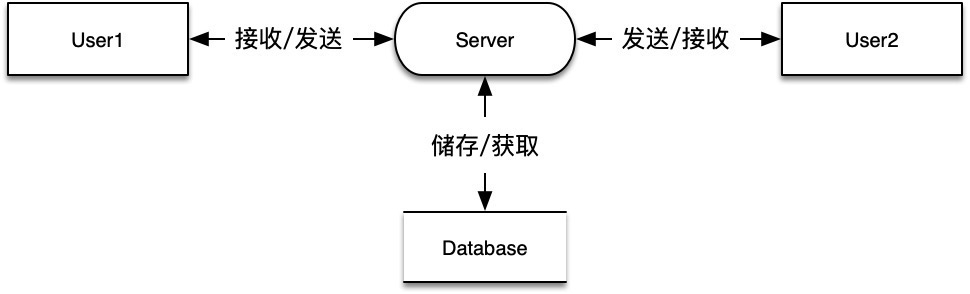
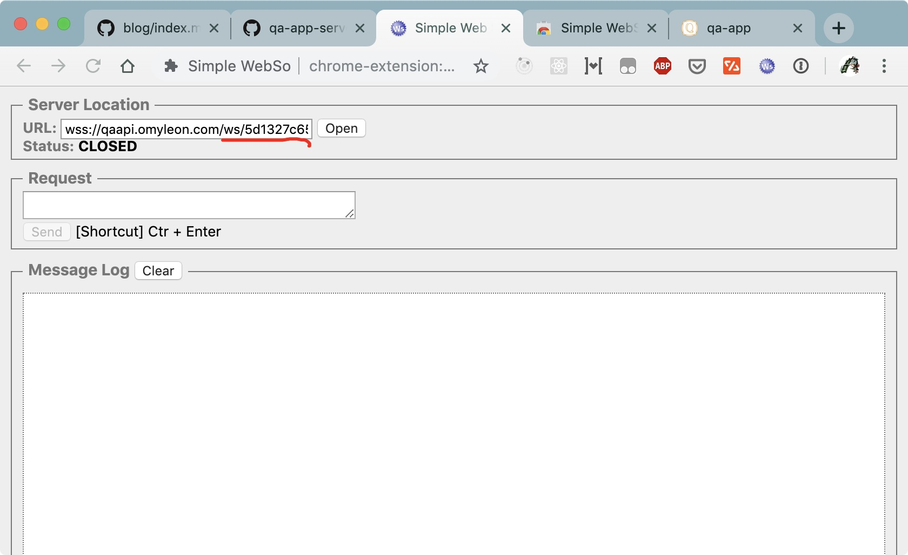
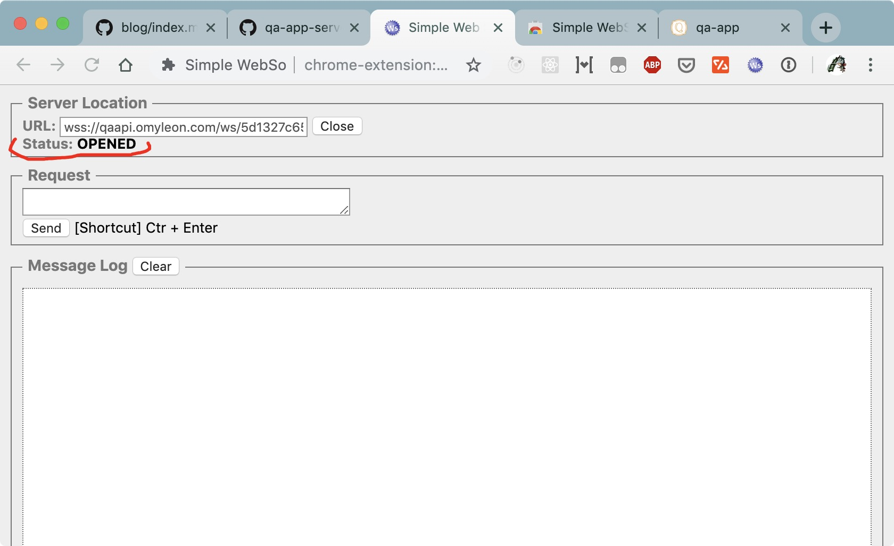
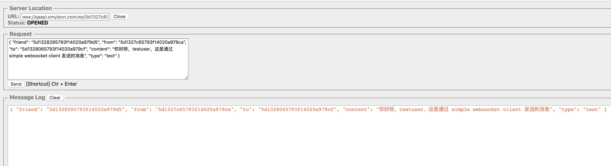
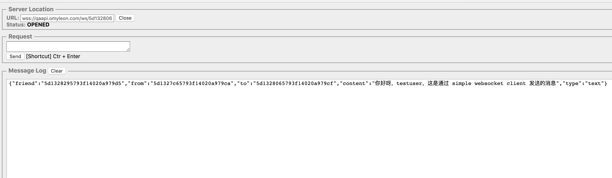
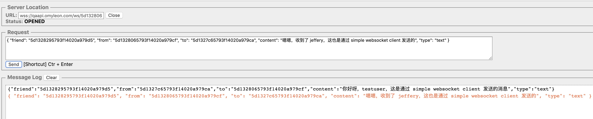

# websocket 实战——好友聊天

还不了解 websocket 的同鞋，请先学习阮一峰老师的 [WebSocket 教程](http://www.ruanyifeng.com/blog/2017/05/websocket.html)

## websocket

1. websocket 在实际项目中有着很广的应用，如好友聊天，异步请求，react-hot-loader 的热更新等等

2. 本文前端采用原生 `WebSocket`，后端采用 `express-ws 库` 实现聊天通信

3. 后端 mongodb 数据存储采用 [mongoose](https://github.com/Automattic/mongoose) 操作，不了解的可以先看看 [文档](https://mongoosejs.com/docs/api.html) 哦

4. 聊天原理很简单，如下图:



## 简单版本

先撸个简单版本，能够实现用户与服务器之间的通信

1. 前端：WsRequest 封装类

```js
class WsRequest {
  ws: WebSocket

  constructor(url: string) {
    this.ws = new WebSocket(url)

    this.initListeners()
  }

  initListeners() {
    this.ws.onopen = _event => console.log('client connect')

    this.ws.onmessage = event => console.log(`来自服务器的信息：${event.data}`)

    this.ws.onclose = _event => console.log('client disconnect')
  }

  send(content: string) {
    this.ws.send(content)
  }

  close() {
    this.ws.close()
  }
}

// 使用
const ws = new WsRequest('your_websocket_url') // 如: ws://localhost:4000/ws
ws.send('hello from user')
```

2. 服务端：WsRouter 封装类，使用单例模式

```js
import expressWs, { Application, Options } from 'express-ws';
import ws, { Data } from 'ws';
import { Server as hServer } from 'http';
import { Server as hsServer } from 'https';

class WsRouter {
  static instance: WsRouter;

  wsServer: expressWs.Instance;

  clientMap: Map<string, ws>; // 保存所有连接的用户 id

  constructor(
    private path: string,
    private app: Application,
    private server?: hServer | hsServer,
    private options?: Options
  ) {
    this.wsServer = expressWs(this.app, this.server, this.options);

    this.app.ws(this.path, this.wsMiddleWare);

    this.clientMap = new Map();
  }

  static getInstance(path: string, app: Application, server?: hServer | hsServer, options: Options = {}) {
    if (!this.instance) {
      this.instance = new WsRouter(path, app, server, options);
    }

    return this.instance;
  }

  wsMiddleWare = (wServer: any, _req: any) => {
    this.clientMap.set(id, wServer);

    this.broadcast('hello from server'); // send data to users

    wServer.on('message', async (data: Data) => console.log(`来自用户的信息：${data.toString()}`));

    wServer.on('close', (closeCode: number) => console.log(`a client has disconnected: ${closeCode}`));
  }

  broadcast(data: Data) { // 全体广播
    this.clientMap.forEach((client: any) => {
      if (client.readyState === ws.OPEN) {
        client.send(data);
      }
    });
  }
}

export default WsRouter.getInstance;

// 使用：bootstrap.ts
const server = new InversifyExpressServer(container);
// 注：本项目后端使用的是 [Inversify](https://github.com/inversify) 框架
// 具体传的 private server?: hServer | hsServer 参数值，请类比改变
server.setConfig((app: any) => WsRouter('/ws/:id', app))
server.build().listen(4000);
```

## 升级版本

要实现好友通信，在前后端的 `send` 方法中，当然要指定 `from` 和 `to` 的用户

再者，后台要记录发送的消息，也必须要有好友表的主键 friendId，表示为这两个人之间的消息

1. mongoose 数据存储

```js
// user.ts
const userSchema = new Schema(
  {
    name: { type: String, required: true, unique: true }
  }
);

export default model('User', userSchema);

// friend.ts 两个用户之间的好友关系
import { Schema, model, Types } from 'mongoose';

const FriendSchema = new Schema(
  {
    user1: { type: Types.ObjectId, ref: 'User', required: true }, // user1Id < user2Id
    user2: { type: Types.ObjectId, ref: 'User', required: true }
  }
);

export default model('Friend', FriendSchema);

// message.ts
const MessageSchema = new Schema(
  {
    friend: { type: Types.ObjectId, ref: 'Friend', required: true }, // 关联 Friend 表
    from: String,
    to: String,
    content: String,
    type: { type: String, default: 'text' },
  }
);

export default model('Message', MessageSchema);
```

2. 接口说明

```js
type msgType = 'text' | 'emoji' | 'file'

interface IMessage {
  from: string
  to: string
  content: string
  type: msgType
}
```

3. 前端：WsRequest 封装类

```js
import { IMessage, msgType } from './interface'

export default class WsRequest {
  ws: WebSocket

  constructor(url: string, private userId: string) {
    this.ws = new WebSocket(`${url}/${this.userId}`)

    this.initListeners()
  }

  initListeners() {
    this.ws.onopen = _event => console.log('client connect')

    this.ws.onmessage = event => {
      const msg: IMessage = JSON.parse(event.data)

      console.log(msg.content)
    }

    this.ws.onclose = _event => console.log('client disconnect')
  }

  // friendId 指 Friend Model 的 _id
  async send(friendId: string, content: string, receiverId: string, type: msgType = 'text') {
    const message: IMessage = { from: this.userId, to: receiverId, content, type }

    await this.ws.send(JSON.stringify({ friend: friendId, ...message }))
  }

  close() {
    this.ws.close()
  }
}

// 使用
const ws = new WsRequest('your_websocket_url', 'your_user_id') // example: ws://localhost:4000/ws
await wsRequest.send('Friend_model_id', '你好啊，jeffery', 'jeffery_id')
```

4. 服务端：WsRouter 封装类，使用单例模式

```js
import expressWs, { Application, Options } from 'express-ws';
import ws, { Data } from 'ws';
import { Server as hServer } from 'http';
import { Server as hsServer } from 'https';
import Message, { IMessage } from 'models/message';
import Friend from 'models/friend';

class WsRouter {
  static instance: WsRouter;

  wsServer: expressWs.Instance;

  clientMap: Map<string, ws>; // 保存所有连接的用户 id

  constructor(
    private path: string,
    private app: Application,
    private server?: hServer | hsServer,
    private options?: Options
  ) {
    this.wsServer = expressWs(this.app, this.server, this.options);

    this.app.ws(this.path, this.wsMiddleWare);

    this.clientMap = new Map();
  }

  static getInstance(path: string, app: Application, server?: hServer | hsServer, options: Options = {}) {
    if (!this.instance) {
      this.instance = new WsRouter(path, app, server, options);
    }

    return this.instance;
  }

  wsMiddleWare = (wServer: any, req: any) => {
    const { id } = req.params; // 解析用户 id

    wServer.id = id;
    this.clientMap.set(id, wServer);

    wServer.on('message', async (data: Data) => {
      const message: IMessage = JSON.parse(data.toString());

      const { _id } = await new Message(message).save(); // 更新数据库

      this.sendMsgToClientById(message);
    });

    wServer.on('close', (closeCode: number) => console.log(`a client has disconnected, closeCode: ${closeCode}`));
  };

  sendMsgToClientById(message: IMessage) {
    const client: any = this.clientMap.get(message.to);

    if (client) {
      client!.send(JSON.stringify(message));
    }
  }

  broadcast(data: Data) {
    this.clientMap.forEach((client: any) => {
      if (client.readyState === ws.OPEN) {
        client.send(data);
      }
    });
  }
}

export default WsRouter.getInstance;

// 使用：bootstrap.ts
const server = new InversifyExpressServer(container);
// 注：本项目后端使用的是 [Inversify](https://github.com/inversify) 框架
// 具体传的 private server?: hServer | hsServer 参数值，请类比改变
server.setConfig((app: any) => WsRouter('/ws/:id', app))
server.build().listen(4000);
```

5. 心跳检测

参考：

- [ws faq: how-to-detect-and-close-broken-connections](https://github.com/websockets/ws#faq)

```js
// 服务端
wsMiddleWare = (wServer: any, req: any) => {
  const { id } = req.params;

  wServer.id = id;
  wServer.isAlive = true;
  this.clientMap.set(id, wServer);

  wServer.on('message', async (data: Data) => {...});

  wServer.on('pong', () => (wServer.isAlive = true));
}

initHeartbeat(during: number = 10000) {
  return setInterval(() => {
    this.clientMap.forEach((client: any) => {
      if (!client.isAlive) {
        this.clientMap.delete(client.id);

        return client.terminate();
      }

      client.isAlive = false;
      client.ping(() => {...});
    });
  }, during);
}
```

## 在线测试

### 一、准备

1. 为方便大家测试，可以访问线上的服务端接口: `wss://qaapi.omyleon.com/ws`，具体使用要附上用户 id，如：`wss://qaapi.omyleon.com/ws/asdf...`，参见 [升级版本的 websocket](#升级版本)

2. 客户端：可以使用谷歌插件：[Simple WebSocket Client](https://chrome.google.com/webstore/detail/simple-websocket-client/pfdhoblngboilpfeibdedpjgfnlcodoo?hl=zh)；也可以访问在线项目，使用项目提供的客户端，具体参见：[qa-app](https://github.com/lawler61/qa-app)

3. 使用线上的一对好友信息

- friend: jeffery 与 testuser => _id: 5d1328295793f14020a979d5

- jeffery => _id: 5d1327c65793f14020a979ca

- testuser => _id: 5d1328065793f14020a979cf

> **2019.11.15 更新**
>
> 线上项目数据已重置，请使用新的 id 测试
>
> friend: jeffery 与 testuser => _id: 5d1328295793f14020a979d5
>
> jeffery => _id: 5dce50cbb869af711db528f1
>
> testuser => _id: 5dce5119b869af711db528fc

### 二、实际演示

1. 打开 WebSocket Client 插件，输入测试链接，如下图：

```js
wss://qaapi.omyleon.com/ws/5d1327c65793f14020a979ca
```



2. 点击 `Open`，下方 `Status` 显示 `Opened` 表示连接成功



3. 发送消息，请根据 [IMessage](#升级版本) 接口来发送，当然还要附上 `friendId`，否则不能对应到相应的好友关系上

```js
{
  "friend": "5d1328295793f14020a979d5",
  "from": "5d1327c65793f14020a979ca",
  "to": "5d1328065793f14020a979cf",
  "content": "你好呀，testuser，这是通过 simple websocket client 发送的消息",
  "type": "text"
}
```



4. 同时用 simple websocket client 连接另一个用户，会收到发来的消息



5. 同理，在另一个 client 中改变 from 和 to，就能回复消息给对方

```js
wss://qaapi.omyleon.com/ws/5d1328065793f14020a979cf

{
  "friend": "5d1328295793f14020a979d5",
  "from": "5d1328065793f14020a979cf",
  "to": "5d1327c65793f14020a979ca",
  "content": "嗯嗯，收到了 jeffery，这也是通过 simple websocket client 发送的",
  "type": "text"
}
```



6. 补充，在线上项目 [qa-app](https://github.com/lawler61/qa-app) 中，也是用的是个原理，只不过在显示时候做了解析，只显示了 content 字段，而在这个简易的测试客户端中没有做其他处理

## 源码获取

1. [前端：qa-app app/websocket/index.ts](https://github.com/lawler61/qa-app/blob/master/app/websocket/index.ts)

2. [后端：qa-app-server server/wsRouter/index.ts](https://github.com/lawler61/qa-app-server/blob/master/server/wsRouter/index.ts)

3. [线上地址，去看看 -> https://qa.omyleon.com](https://qa.omyleon.com)
