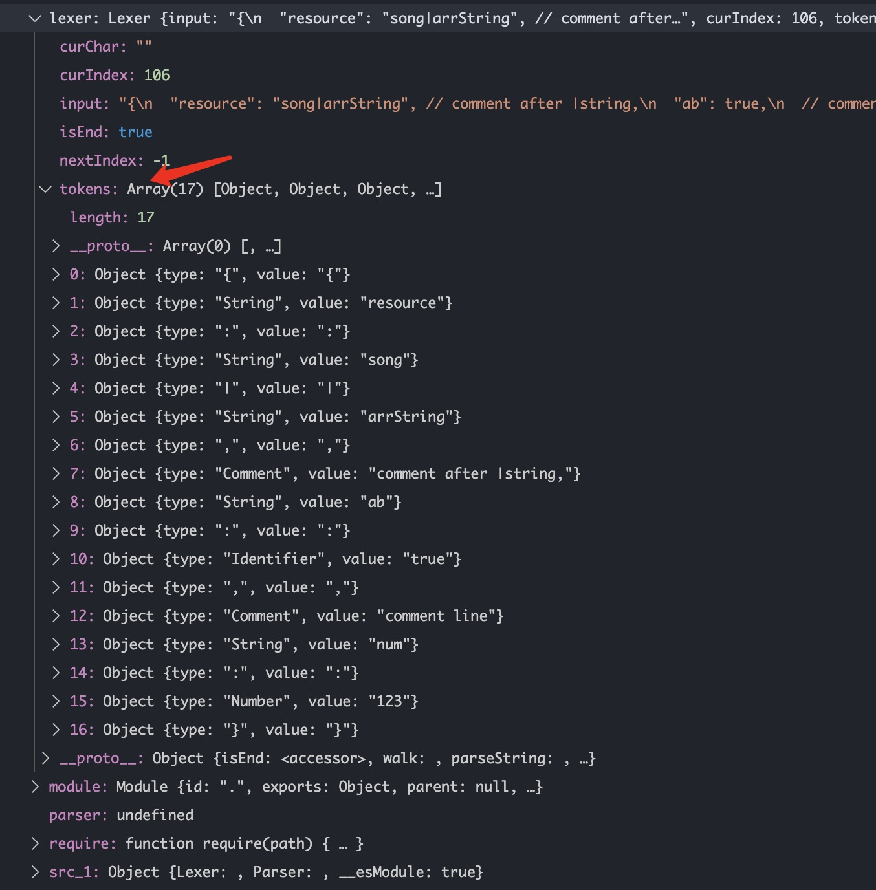
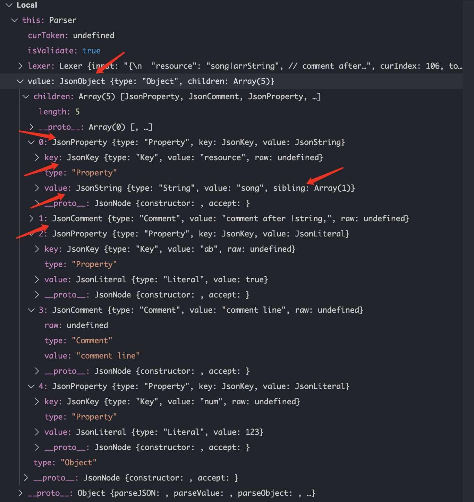

# 从零开始手撸一个 Json Parser

前几周看 [云音乐前端技术团队](https://juejin.im/user/5cd23730f265da03576edbf1) 发表的 [从零实现自定义 JSON Parser](https://juejin.im/post/5dba337df265da4d26043666) 觉得很过瘾，然后就结合 [json-to-ast 库](https://github.com/vtrushin/json-to-ast) 自己完善了一套简单的 `Json Parser`

## 介绍

### 一、基本功能

1. 能完成 `json` 的基本功能

2. 能够识别字符串通过`|`分隔符完成自定义的 array

3. 自动忽略 `//` 后的注释

4. 一些错误输入的兼容

### 二、效果

1. 输入

```js
const input = `{
  "resource": "song|arrString|", // end of line（| 已做容错）
  "ab": true,
  // comment in line
  "cc": [1, "asr4", { "objInArr": false }],
  "obj": {
    "un": null
  }, // , 已做容错
}`;
```

2. 输出

输出的最后没有处理结尾的`,`，当然这可以自定义 `Visitor`（后面会讲）来做，在递归函数里传`depth`即可

```js
{
  "resource":["song", "arrString", ],
  "ab": "true",
  "cc": [1, "asr4", { "objInArr": false, }, ],
  "obj": { "un": null, },
},
```

### 三、关于 `AST` 抽象语法树

1. 对于我们熟悉的`babel`，`typescript`，以及各大编程语言都会用到 `AST` 的知识。通过对 `词法`，`语法`的分析，我们可以规定编程语言如何拆分、解析，又如何链接执行

2. 如果你还完全不知道这方面的知识，强推 [你不知道的JavaScript](https://book.douban.com/subject/26351021/)

3. 如果你了解基本的概念，但却没能应用于实践的话，那让我们一起来学习学习

## 开撸

### 一、基本类型定义

```js
export interface TokenType {
  type: TOKEN_TYPE;
  value: string | null;
}

export enum TOKEN_TYPE {
  OpenBrace = '{',
  CloseBrace = '}',
  OpenBracket = '[',
  CloseBracket = ']',
  String = 'String',
  Number = 'Number',
  Colon = ':',
  Comma = ',',
  BitOr = '|',
  Quote = '"',
  SingleSlash = '/',
  Comment = 'Comment',
  Identifier = 'Identifier',
  True = 'true',
  False = 'false',
  Null = 'null',
}

export const KEY_TOKENS = [
  TOKEN_TYPE.True,
  TOKEN_TYPE.False,
  TOKEN_TYPE.Null
];
```

### 二、词法分析（lexer）

1. 对于输入的字符串无非就是挨个处理，如果是对象、字符串、数组的话，就记录其起始位置，然后往下解析，遇到闭合符号为止

2. 基本结构

```js
export class Lexer {
  curIndex = 0; // 当前处理的字符 index
  curChar: string; // 当前处理的字符
  tokens: TokenType[] = []; // 收集的 token 数组
  nextIndex = -1; // 遍历使用

  constructor(private input: string) {
    this.curChar = this.input.charAt(this.curIndex); // 赋初值
    this.walk(); // 进行解析
  }

  get isEnd() {
    return this.curIndex >= this.input.length;
  }

  walk() {
    // while 循环，直到 input 走完为止
    while (!this.isEnd) {
      let token: TokenType;

      switch (this.curChar) {
        // ...
        // 判断类型，生成相应结构
        token = { type: 'someType', value: 'someValue' };
        this.consume();
      }
      // 入栈
      token && this.tokens.push(token);
    }
  }

  // 消费当前 char，并指到下一个
  consume(step = 1) {
    if (this.isEnd) return;
    this.curIndex += step;
    this.curChar = this.input.charAt(this.curIndex);
  }
}
```

3. walk 函数的 switch 处理

```js
switch (this.curChar) {
  case TOKEN_TYPE.OpenBrace: // {
  case TOKEN_TYPE.CloseBrace: // }
  case TOKEN_TYPE.OpenBracket: // [
  case TOKEN_TYPE.CloseBracket: // ]
  case TOKEN_TYPE.Colon: // :
  case TOKEN_TYPE.Comma: // ,
    // 符号类型，直接入栈即可
    token = { type: this.curChar, value: this.curChar };
    this.consume();
    break;
  case TOKEN_TYPE.SingleSlash: // / 注释单独处理
    this.consume();
    this.parseComment();
    break;
  case TOKEN_TYPE.Quote: // " 类型单独处理
    this.consume();
    this.parseString();
    break;
  default:
    // 关键词和数字，没办法通过 switch 列举出来的，单独处理
    token = this.parseKeyword() || this.parseNumber();
}
```

4. parseComment，与到换行符后，注释结束

```js
parseComment() {
  // 先判断是否还有个 /
  if (this.input.charAt(this.curIndex) !== TOKEN_TYPE.SingleSlash) return;
  this.consume();

  let buffer = ''; // 缓存注释
  while (!this.isEnd && !/\r?\n/.test(this.curChar)) {
    buffer += this.curChar;
    this.consume();
  }
  // 保存注释，并入栈
  buffer && this.tokens.push({ type: TOKEN_TYPE.Comment, value: buffer });
}
```

5. parseString（parseNumber 同理）

注意遇到`|`后，之前缓存的 buffer 要先入栈，再清空 buffer，以便获取下一个字符串

```js
parseString() {
  let buffer = '';

  while (!this.isEnd) {
    switch (this.curChar) {
      case TOKEN_TYPE.BitOr: // |
        // 如果是 |，入栈并清空
        buffer && this.tokens.push({ type: TOKEN_TYPE.String, value: buffer });
        this.tokens.push({ type: TOKEN_TYPE.BitOr, value: TOKEN_TYPE.BitOr });
        buffer = '';
        break;
      case TOKEN_TYPE.Quote: // "
        // 如果是结束的 "，则退出
        buffer && this.tokens.push({ type: TOKEN_TYPE.String, value: buffer });
        this.consume();
        return;
      default:
        // 默认就继续缓存
        buffer += this.curChar;
    }
  }
}
```

6. parseKeyword

keyword 只有 true, false, null，直接整体比较即可

```js
parseKeyword() {
  let buffer = '';
  ['true', 'false', 'null'].some(name => {
    // 获取到 input 的部分整体，与 keyword 比较
    const key = this.input.substr(this.curIndex, name.length);
    if (key === name) {
      buffer = name;
      this.consume(name.length);
      return true;
    }
  });
  return buffer ? { type: TOKEN_TYPE.Identifier, value: buffer } : null;
}
```

7. 分析结果

- 输入

```js
const input = `{
  "resource": "song|arrString", // comment after |string,
  "ab": true,
  // comment line
  "num": 123
}`;
```

- 输出



### 三、语法分析（parser）

1. 语法分析中剔除无用的结构符号，生成出 json 的 **tree结构**。在这一环节还要对 lexer 生成的 tokens 进行纠错和容错

2. 为了方便后续访问 tree，我们采用 Visitor 模式，不懂得小伙伴可以看下这篇 [设计模式之访问者模式](https://juejin.im/entry/5ab4c3d65188251fc3293550)

3. tree node 结构，它们都继承最基本的 JsonNode

```js
// JsonObject
{
  type: 'Object',
  children: <JsonProperty | JsonComment>[]
}

// JsonProperty，即键值对
{
  type: 'Property',
  key: JsonKey,
  value: JsonObject | JsonArray | JsonString | JsonLiteral
}

// JsonKey
{
  type: 'Key',
  value: string
}

// JsonArray
{
  type: 'Array',
  children: <JsonObject | JsonArray | JsonLiteral>[]
}

// JsonString
{
  type: 'String',
  value: string,
  sibling?: JsonString[]
}

// JsonLiteral
{
  type: 'Literal',
  value: number | boolean | null
}
```

4. 基本结构

```js
export class Parser {
  curToken: TokenType; // 当前的 token
  value: JsonNode; // 生成的树结构
  visitor: Visitor; // 默认访问者

  constructor(private lexer: Lexer) {
    this.consume();
    this.value = this.parseValue(); // 开始 parse token
    this.visitor = new JsonVisitor();
  }

  // 用户可以定义 visitor 返回相应数据
  parseJSON(visitor = this.visitor) {
    this.value.accept(visitor);
    return visitor.value;
  }

  parseValue() {
    let parsedValue: JsonNode = null;

    const { type, value } = this.curToken;
    switch (type) {
      // ...
      // 判断类型，new 相应节点
      parsedValue = new SomeNode();
    }
    return parsedValue; // 作为根节点并返回
  }

  consume() {
    this.curToken = this.lexer.next();
  }
}
```

5. 看看 switch 如何处理

```js
switch (type) {
  case TOKEN_TYPE.Number:
  case TOKEN_TYPE.Identifier:
    // number 和 keyword 都属于 JsonLiteral
    parsedValue = new JsonLiteral(JSON.parse(value));
    this.consume();
    break;
  case TOKEN_TYPE.String:
    parsedValue = this.parseString(); // string 单独处理
    break;
  case TOKEN_TYPE.Comment:
    parsedValue = new JsonComment(value); // 注释直接 new
    break;
  default:
    parsedValue = this.parseObject() || this.parseArray(); // object 和 array 单独处理
}
```

6. parseString，注意`|`token，其下个 token，放进 sibling 即可

```js
parseString() {
  const str = new JsonString(this.curToken.value);
  this.consume();

  while (this.curToken) {
    switch (this.curToken.type) {
      // 遇到逗号，结束并返回 JsonString
      case TOKEN_TYPE.Comma: // ,
        return str;
      case TOKEN_TYPE.BitOr: // |
        // 放进 JsonString 的 sibling 中
        str.sibling.push(new JsonString(this.curToken.value));
        this.consume();
    }
  }
}
```

7. parseProperty，处理键值对

通过 state 状态机，便于管理

```js
parseProperty() {
  const property = new JsonProperty();

  let state = PROPERTY_STATE.START;
  while (this.curToken) {
    const { type, value } = this.curToken;

    switch (state) {
      case PROPERTY_STATE.START:
        if (type === TOKEN_TYPE.String) {
          property.key = new JsonKey(value);
          break;
        }
        return null;
      case PROPERTY_STATE.KEY:
        // 遇到逗号，即处理下一对
        if (type === TOKEN_TYPE.Colon) {
          state = PROPERTY_STATE.COLON;
          this.consume();
          break;
        }
      case PROPERTY_STATE.COLON:
        // 遇到分号，接下来值可能是 string, array, object，递归即可
        property.value = this.parseValue();
        return property;
    }
  }
}
```

8. parseObject，挨个处理 property，遇到逗号则处理下个 property（parseArray 同理）

此处较复杂，具体请看源码

```js
function parseObject() {
  const obj = new JsonObject();

  let state = OBJECT_STATE.START;
  while (this.curToken) {
    const { type, value } = this.curToken;

    switch (state) {
      case OBJECT_STATE.START:
        if (type === TOKEN_TYPE.OpenBrace) {
          state = OBJECT_STATE.OPEN;
          this.consume();
          break;
        }
        return null;
      case OBJECT_STATE.OPEN: {
        obj.children.push(this.parseProperty());
        break;
      }
      case OBJECT_STATE.PROPERTY: {
        // ...
        break;
      }
      // 继续下一个键值对
      case OBJECT_STATE.COMMA: {
        obj.children.push(this.parseProperty());
        // ...
        break;
      }
    }
  }
}
```

9. 解析结果

- 输入

```js
const input = `{
  "resource": "song|arrString", // comment after |string,
  "ab": true,
  // comment line
  "num": 123
}`;
```

- 输出



### 四、定义 Visitor

1. 拿到了 AST，接下来就只用定义访问者去访问访问节点就行了，这里生成 ast 时使用的访问者模式就起作用了

2. 此处即可以定义自己的 visitor，想怎么输出就怎么输出

```js
export default class JsonVisitor extends Visitor {
  value = '';

  visitObject(jsonObject: JsonObject) {
    this.value += '{ ';
    jsonObject.children.forEach(node => node.accept(this));
    this.value += ' }, ';
  }

  visitArray(jsonArray: JsonArray) {
    this.value += '[';
    jsonArray.children.forEach(node => this.visit(node));
    this.value += '], ';
  }

  visitKey(jsonKey: JsonKey) {
    this.value += `"${jsonKey.value}": `;
  }

  visitString(jsonString: JsonString) {
    const { value, sibling } = jsonString;

    if (sibling.length) {
      this.value += `["${value}", `;
      sibling.forEach(js => (this.value += `"${js.value}", `));
      this.value += '], ';
    } else this.value += `"${value}", `;
  }
}
```

## 使用

造轮子是痛苦的，但用起来真的爽！

```js
const lexer = new Lexer(`{some text}`);
const parser = new Parser(lexer);
console.log(parser.parseJSON(/* your visitor if have */));
```

## 最后

1. 源码获取：[json-parser demo](https://github.com/lawler61/blog/tree/master/js/json-parser/demo)

2. 喜欢的小伙伴，记得留下你的小 ❤️ 哦~

## 参考资料

- [从零实现自定义 JSON Parser](https://juejin.im/post/5dba337df265da4d26043666)

- [JSON AST parser](https://github.com/vtrushin/json-to-ast)

- [设计模式之访问者模式](https://juejin.im/entry/5ab4c3d65188251fc3293550)
