# JS mobx 源码解读（一）：从零到 observable 一个 object 如何

文本是 [mobx 源码解读系列](https://github.com/lawler61/blog/labels/mobx%20%E6%BA%90%E7%A0%81%E8%A7%A3%E8%AF%BB) 第一篇

本系列文章全部采用 mobx 较新版本：[v5.13.0](https://github.com/lawler61/mobx)

## 技术前提

在阅读之前，希望你对以下技术有所**了解或实践**，不然可能会影响你对本文的理解

1. [ES6 装饰器：decorator](http://es6.ruanyifeng.com/#docs/decorator)

2. [ES6 代理：proxy](http://es6.ruanyifeng.com/#docs/proxy)

3. [ES6 反射：reflect](http://es6.ruanyifeng.com/#docs/reflect)

4. [定义对象属性：Object.defineProperty](https://developer.mozilla.org/zh-CN/docs/Web/JavaScript/Reference/Global_Objects/Object/defineProperty)

5. [实现简易版 MVVM（可选）](https://github.com/lawler61/blog/issues/5)

## 准备

### 一、目录结构

```js
├── src
│   ├── api // 进行劫持方法和作出反应的 api
│   ├── core // 全局状态、函数等
│   ├── types // 重写关于 object，array 等类型的 api
│   ├── utils // 工具方法
│   ├── internal.ts
│   └── mobx.ts // 全局导出
└── package.json
```

### 二、劫持原理

两个关键词：**属性劫持**，**递归**

1. 属性劫持，可以理解为是在编程语言层面上进行编程，这点在 `proxy & reflect` 中体现的尤为明显

2. 通过 `Object.defineProperty` 或 `proxy` 可以实现在获取或修改对象属性时，做一些额外的操作

3. mobx5 版本默认劫持重构为了 `proxy`，主要是 `proxy` 相对于 `Object.defineProperty` 较稳定，并且劫持的手段更多，具体就不展开了

4. 对象的属性值可能也是个对象或数组，那么如果是引用类型就进行递归劫持

### 三、整体步骤（本文先只讨论劫持对象）

先对整体步骤有个大概的了解，方便后面的理解

1. 处理装饰器，准备好装饰器所需的参数

> 装饰器书写有带括号和不带括号的，但最后都要求返回 descriptor
>
> @observable obj ...
>
> @log({ name: 'lawler' }) obj2 ...

2. 劫持对象当前层的属性

> 根据属性值的类型，调用的相应 enhancer（即劫持器，后面会说到）进行劫持

3. 递归劫持

> 判断是否为引用类型，如果是，则递归劫持

4. 暴露操作 api，方便用户操作，如 mobx 的 keys, values, set

## 上源码

源码截图上有很多对应代码的注释，也请一起阅读

### 一、observable 的定义

1. 从 mobx.ts 全局导出，找到 observable（src/api/observable.ts）

> 可以看到，observable 用 createObservable 赋值
>
> 并将 observableFactories 的 keys 遍历，将其属性挂在 observable 下（同时也是挂在 createObservable 下）

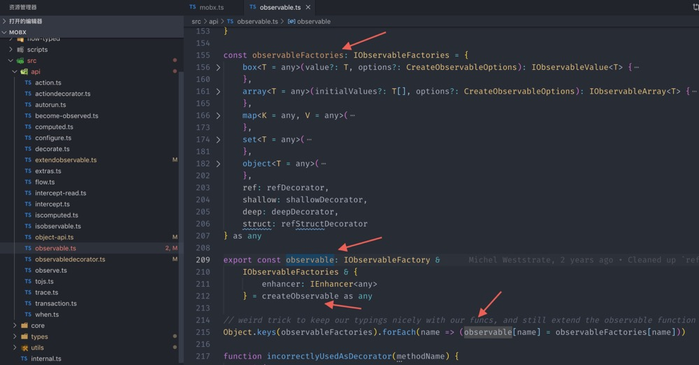

2. createObservable 劫持器

> 利用刚 observableFactories 挂上来的 object, array 等属性，来根据变量类型调用相应方法劫持
>
> 注意 observable 和 createObservable 是一个对象并且在相互调用，这个弯要注意

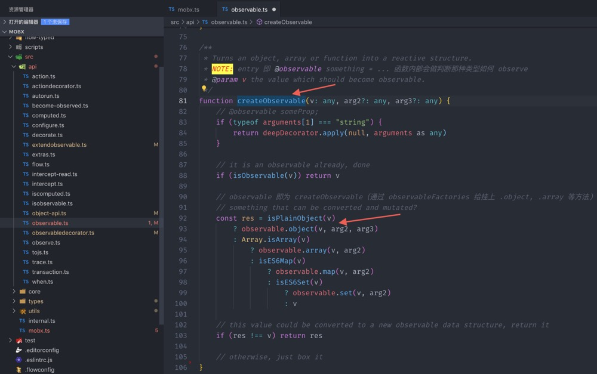

3. 重点看看 observable.object，即 observableFactories.object

> object 函数接收三个参数，第三个参数为 options 可以定制化劫持方式

```js
const person = observable({
  name: 'lawler',
  get labelText() {
    return this.showAge ? `${this.name} (age: ${this.age})` : this.name;
  },
  setAge(age) {
    his.age = age;
  }
}, { // 此为第二个参数 decorators
  setAge: action
} /*, 这里传第三个 options 参数 */);
```

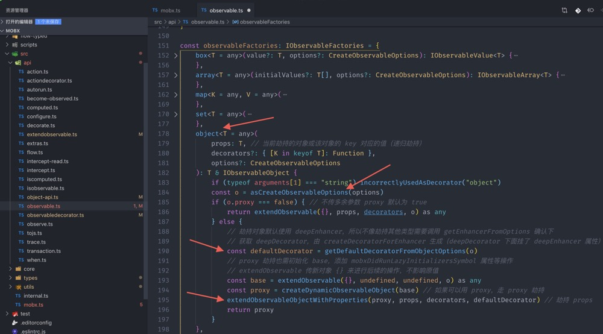

4. asCreateObservableOptions 处理 Options

> 如果不传 options 返回默认的 defaultCreateObservableOptions，如果传了 options 就按照用户写的来
>
> 回到第 3 步，如果 o.proxy 为 false 采用 `Object.defineProperty` 劫持，否则采用 `proxy` 劫持

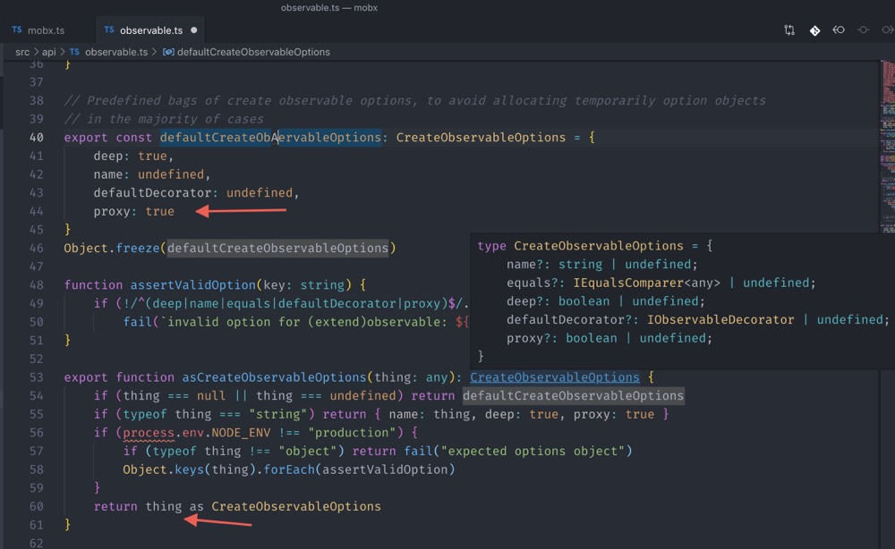

5. 根据 options 获取到对应处理该类型的 decorator，看看 getDefaultDecoratorFromObjectOptions 做了什么

> options.deep 默认为 true，所以默认取 deepDecorator
>
> deepDecorator 来自于 createDecoratorForEnhancer（**这个是后面的重点，先放这**），需要传一个参数 enhancer
>
> 需要 deepDecorator 就传 deepEnhancer；需要 shallowDecorator 就传 shallowEnhancer ...
>
> deepEnhancer 其实就是根据变量的不同类型，调用 observable 的不同参数，如 object, array 来进行劫持
>
> 有没有似曾相识的感觉，其实就和步骤 2 的 createObservable 是一样的
>
> 现在一定要牢记：**enhancer 其实就是一个劫持器，里面提供了劫持各种类型的方法（相当于 observable）**

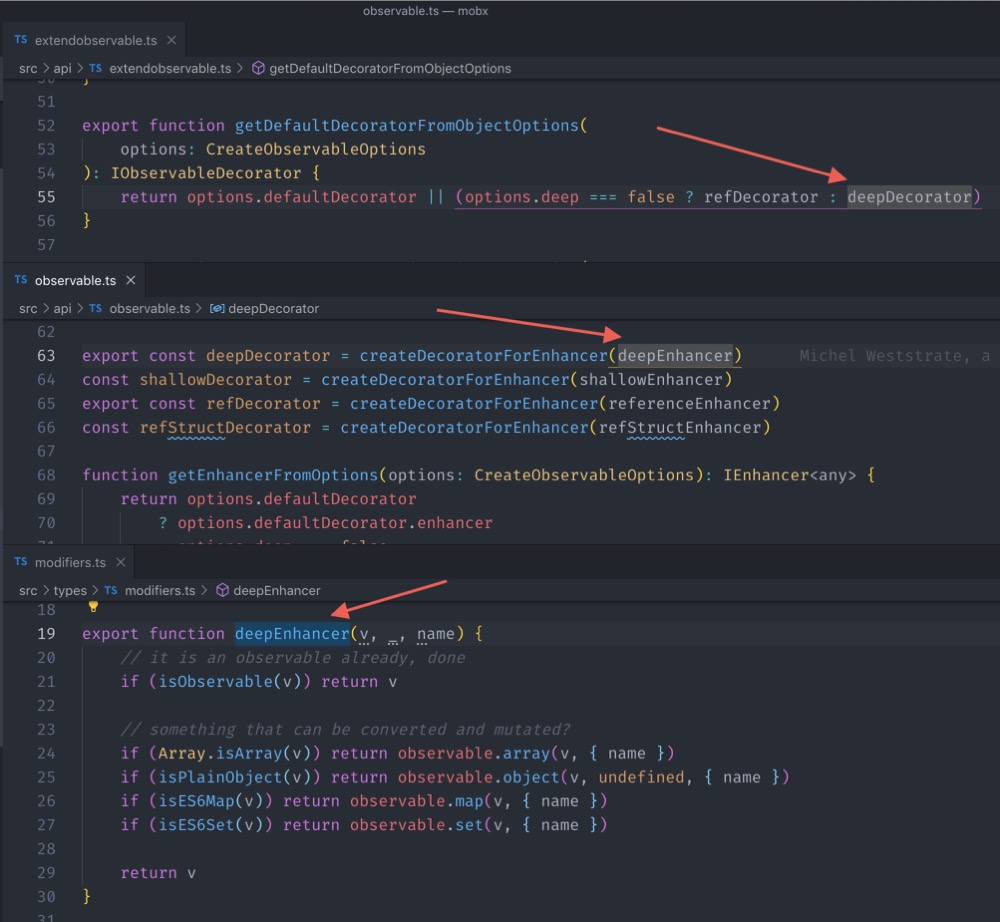

6. 接下来 extendObservable 里面传一个空对象，进行新产物属性的初始化

> 所以 @observable obj ... 不会改变原来对象的
>
> 如果 properties 不为空的话（即 Object.defineProperty 劫持）则直接进行调用 extendObservableObjectWithProperties
>
> 如果走 proxy 劫持，在获取到代理对象后（const proxy = createDynamicObservableObject(base)），主动调用 extendObservableObjectWithProperties。见 `章节一 步骤3`
>
> 所以能看出来这个函数主要目的就是初始化不同劫持情况下目标产物的属性：initializeInstance（**记住这个函数，后面讲**）和 asObservableObject

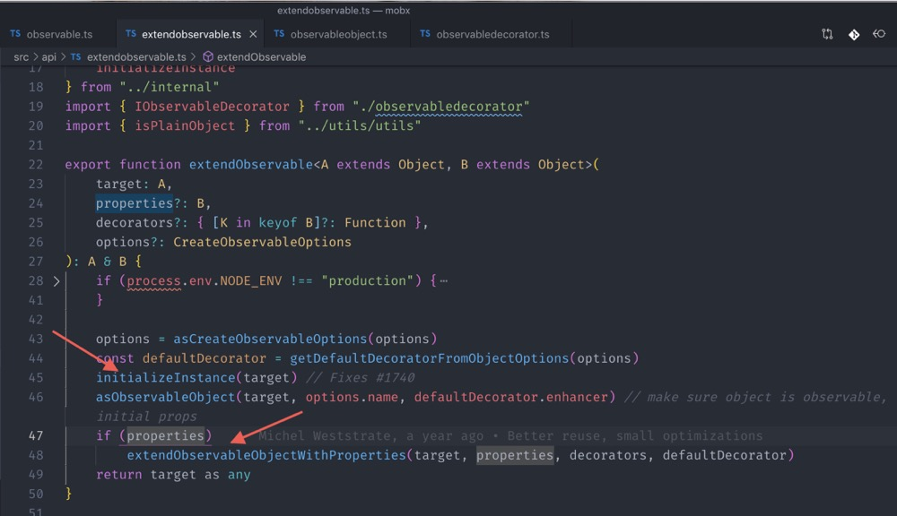

7. 各种参数准备完毕，进行当前层的劫持，看看 extendObservableObjectWithProperties 怎么做的

> for of 不用说
>
> 获取到准备好的用来处理该对象的 decorator，然后传入属性装饰器需要的三个基本参数：target, key, descriptor
>
> 返回的结果就是劫持完该属性后的 resultDescriptor，再通过 Object.defineProperty 写入 target（即被 proxy 代理的 base 空对象）中
>
> 由此完成当前层的当前 key 的劫持

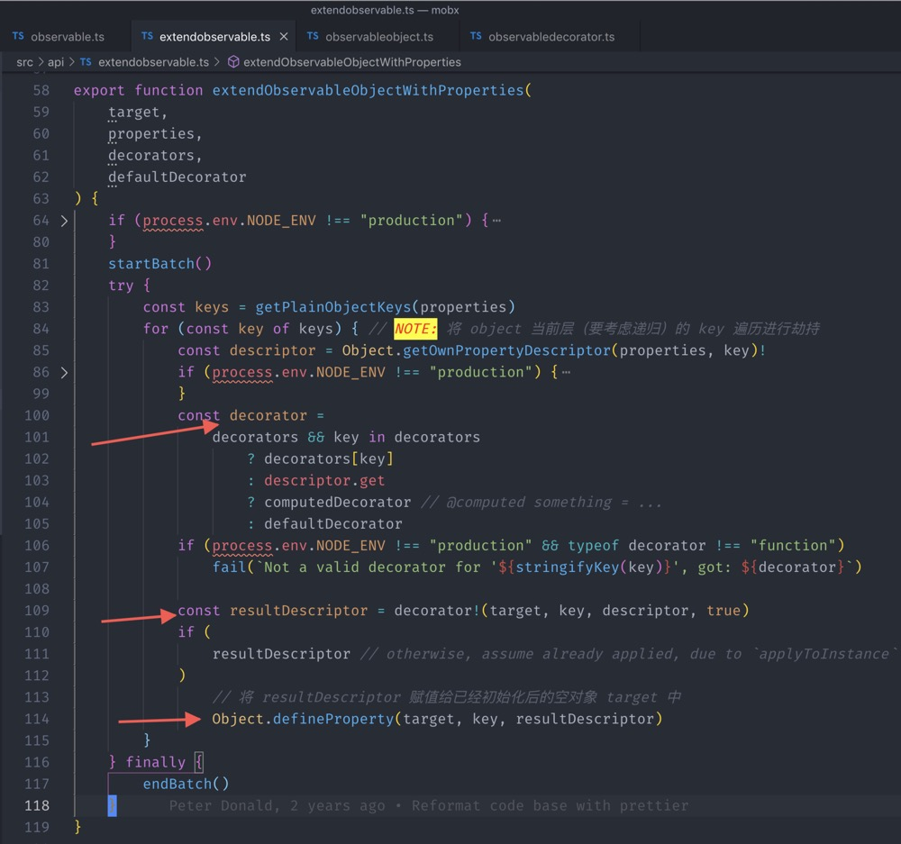

### 二、decorator 造神工具

为了方便大家理解可以参考下：[codesandbox: decorator demo](https://codesandbox.io/embed/exciting-ardinghelli-xjhbb)

1. 推敲下 decorator 的来源

> 看完 `章节一 步骤5` 你可能会疑惑，你怎么得到我当前任何装饰器、任何数据类型、任何定制化劫持的 decorator 函数的
>
> 现在就回到那里，之前埋下了伏笔：createDecoratorForEnhancer
>
> 我们从 getDefaultDecoratorFromObjectOptions 出发，里面通过调用 createDecoratorForEnhancer 并传入 deepEnhancer 得到 deepDecorator 供我们使用
>
> 现在看看 createDecoratorForEnhancer 怎么生成各种 decorator。这是一个**非常重难点**，请耐心反复阅读

2. createDecoratorForEnhancer 造神工具

> 首先，调用 createPropDecorator 函数拿到 decorator，申明一个变量 res，将 enhancer 挂在下面，然后返回 res
>
> 在 createPropDecorator 传了两个参数，第一个是 boolean，第二个是**函数**
>
> 该函数是装饰器的代理函数，是为了在 createDecoratorForEnhancer 层面上拿到 enhancer


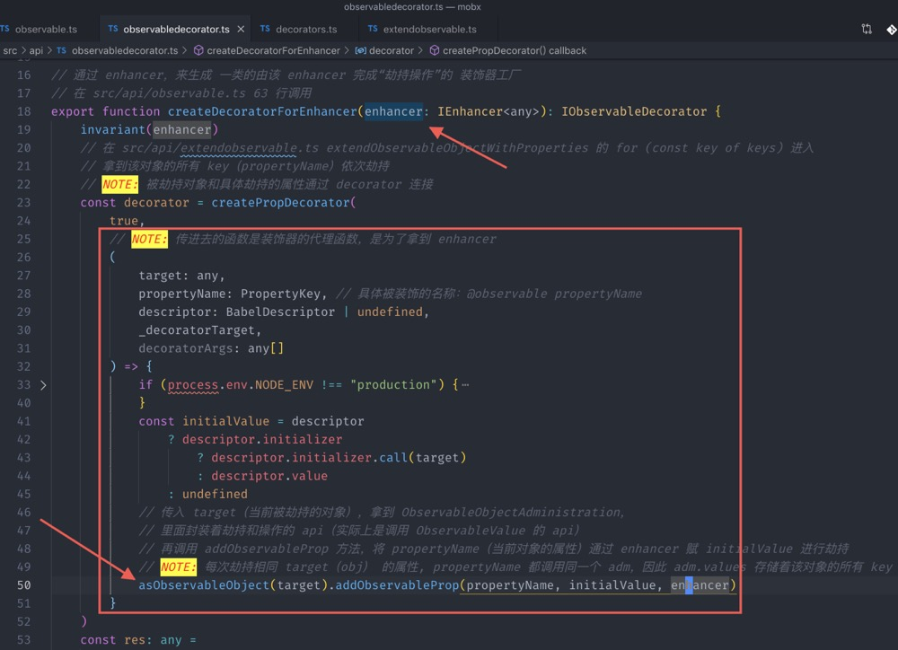

3. 进去 createPropDecorator 看看里面怎么使用这个`函数参数`的

> 可以看到整体是个创建 decoratorFactory 工厂的函数，主要就是根据 enhancer 的不同，返回相应的工厂
>
> 在 decoratorFactory 中主要就是统一了 @decorator obj 和 @decorator('decoratorArguments') obj2 的用法
>
> decorator 函数返回的是 createPropertyInitializerDescriptor 执行的结果，其具体返回的是个 descriptor
>
> 再申明一遍，decorator 函数执行后返回的是 descriptor，而这正是我们需要的 **resultDescriptor**，见 `章节一 步骤7`
>
> 在 decoratorFactory 最后通过 quacksLikeADecorator 判断装饰器为哪种类型
>
> 如果为 @decorator obj，则直接 decorator 返回 descriptor（decorator.apply(null, arguments as any)）
>
> 如果为 @decorator('decoratorArguments') obj2，则返回 decorator（在书写时执行）
>
> 值得一提的是，通过第二种方式传的参数，就是 decoratorFactory 的 arguments 对象，所以为啥 quacksLikeADecorator 利用的是 arguments 来判断

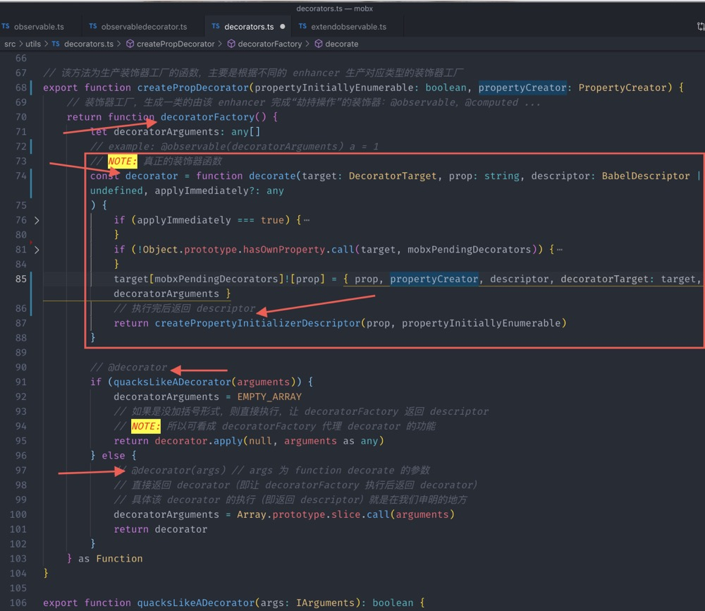

4. 看看 createPropertyInitializerDescriptor 到底返回了哪些

> 是不是终于看到熟悉的 get，set 了，里面调用了 initializeInstance，还记得在 `章节一 步骤6` 说的这个函数吧
>
> 在这个方法里面除了添加 addHiddenProp，还调用了 propertyCreator，这就是 `章节二 步骤3` createPropDecorator 传进来的第二个参数，然后放进了 target[mobxPendingDecorators]![prop] 属性中，供 extendObservable 使用
>
> 提醒一下，整个 `章节二` 是建立在 `章节一 步骤5` 中的
>
> initializeInstance 在初始化 base 空对象会调用，操作对象时也会调用


5. propertyCreator 做了什么呢，回到 `章节二 步骤2`，看看 createPropDecorator 传的第二个参数

> 能发现调用了这样一个函数：asObservableObject，其传入参数为原始对象的一个属性值，并且链式调用了 addObservableProp
>
> 其实我们都可以猜测这个函数干了啥，就是通过 enhancer，把 propertyName 属性赋上劫持后的 initialValue

### 三、asObservableObject 对象管理器

1. 看看 asObservableObject 怎么管理对象

> 通过 target（被装饰器修饰的 target，为整个对象）拿到对象的 ObservableObjectAdministration（如果对象属性值也是对象，则该属性值也会拥有 adm）
>
> 并将其挂到 target 的 $mobx 属性下，方便后面暴露 api 使用
>
> 拿到对象管理器后调用 addObservableProp 方法，将对象当前层的当前 propertyName 劫持

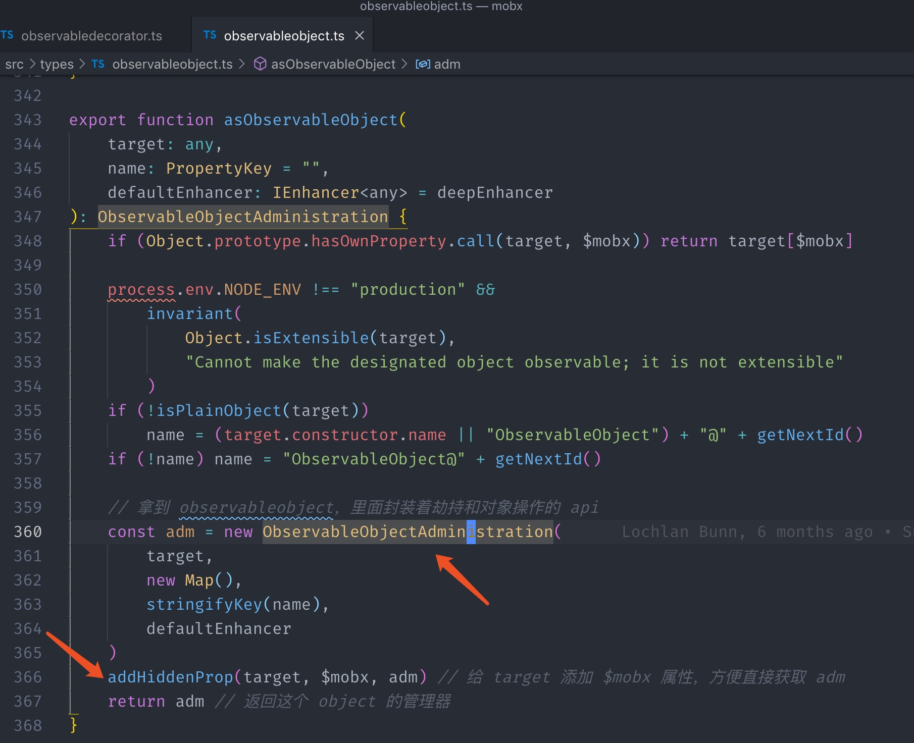

2. ObservableObjectAdministration 管理器（后简称 adm）

> 可以看出 adm 其实也是个封装类，具体围绕 values 展开，而 values 是个 Map，键为 PropertyKey，值为 ObservableValue
>
> 像 read，write 等方法，最后都是调用的 ObservableValue 提供的 api

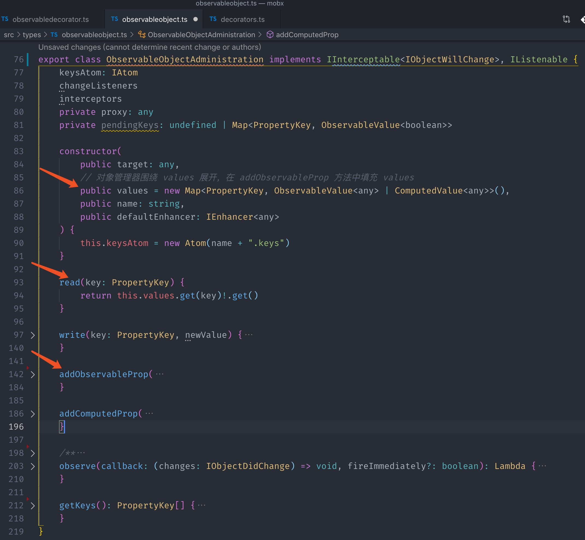

3. addObservableProp 如何填充 ObservableValue

> 通过 new ObservableValue 传入 newValue、enhancer 得到劫持后的 observable
>
> 再填充 this.values，之后的操作统一交给 adm 管理

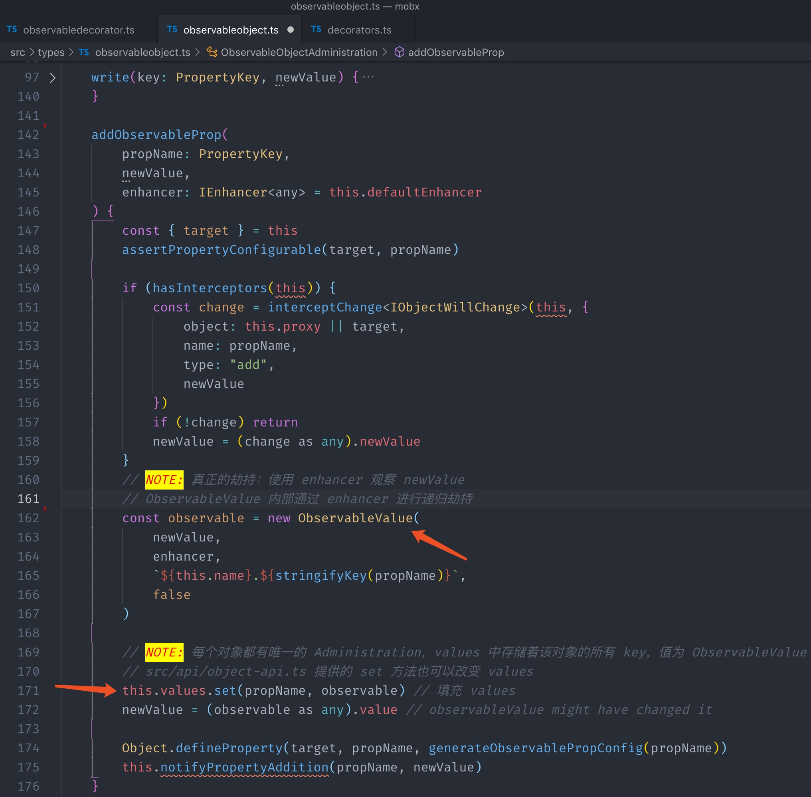

4. ObservableValue 如何劫持

> 可以看到 ObservableValue 围绕 value 展开，通过 enhancer 进行劫持，这里才真正的使用到 enhancer
>
> 这里如果被劫持属性值也是对象，调用 enhancer 劫持，后续会**递归之前所有的步骤**
>
> 此外 ObservableValue 提供了 get，set 方法和 Object 的 api，如 toString
>
> 最后在回到 `章节二 步骤4` 梳理下：createPropertyInitializerDescriptor 执行后返回 get 和 set，它们里面都调用了 initializeInstance
>
> initializeInstance 调用缓存好的 propertyCreator，里面通过 asObservableObject 拿到 adm 来进行各种操作

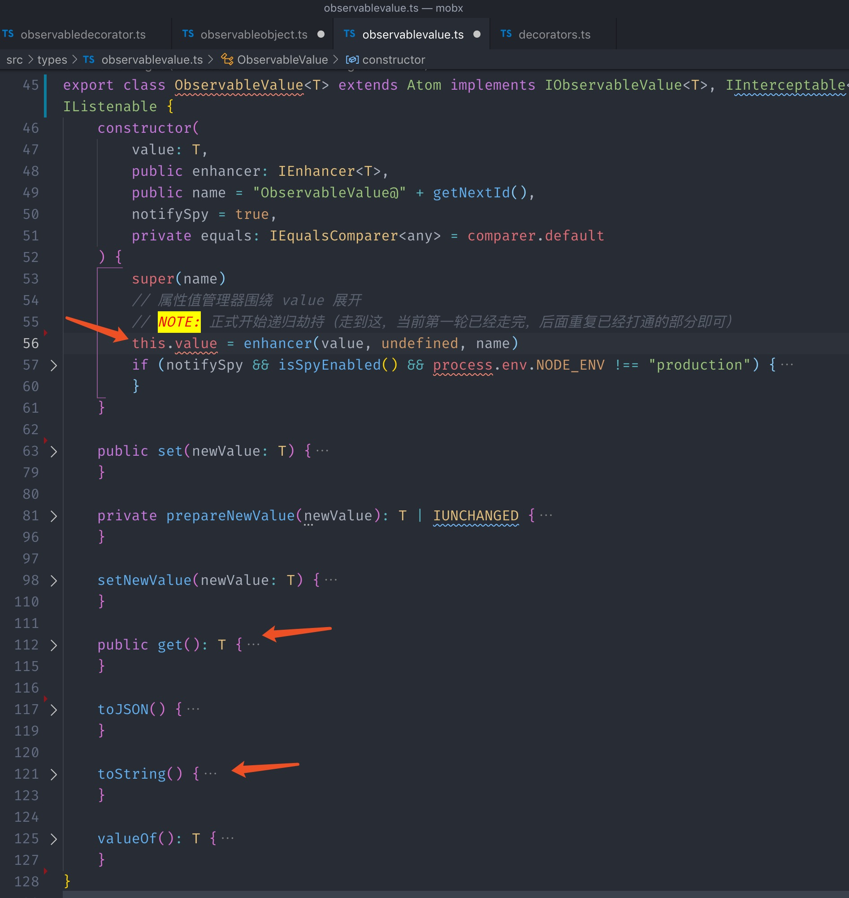

5. set 方法加强劫持

> 回忆我们改变一个 observable 对象后，依然是劫持的对吧
>
> @observable obj = { a: 1 };
>
> obj = { b: 2, c: { d: 3 } };
>
> 其实就是先把新值劫持下再赋值

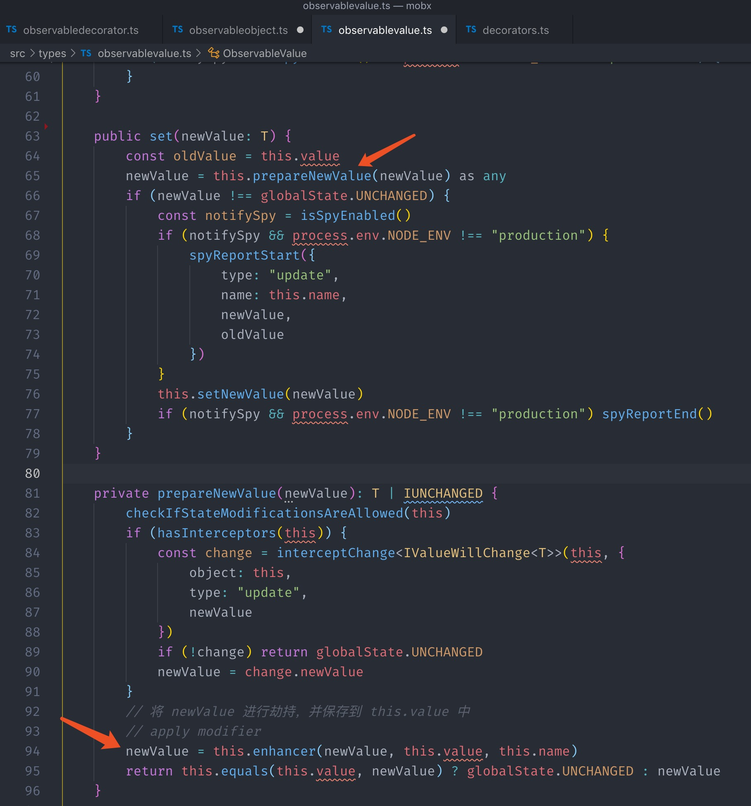

### 四、暴露 api

> 我们知道 adm 是被劫持后的 object 的核心，所以拿到 adm 就可能进行各种操作
>
> 通过 `章节三 步骤1` 缓存的 $mobx 就可以办到，问题迎刃而解

1. keys

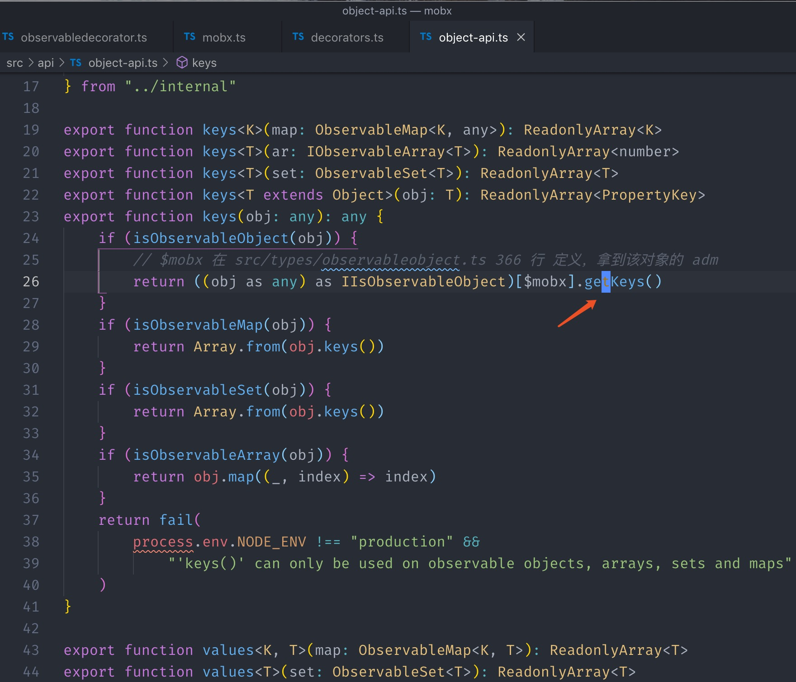

2. set

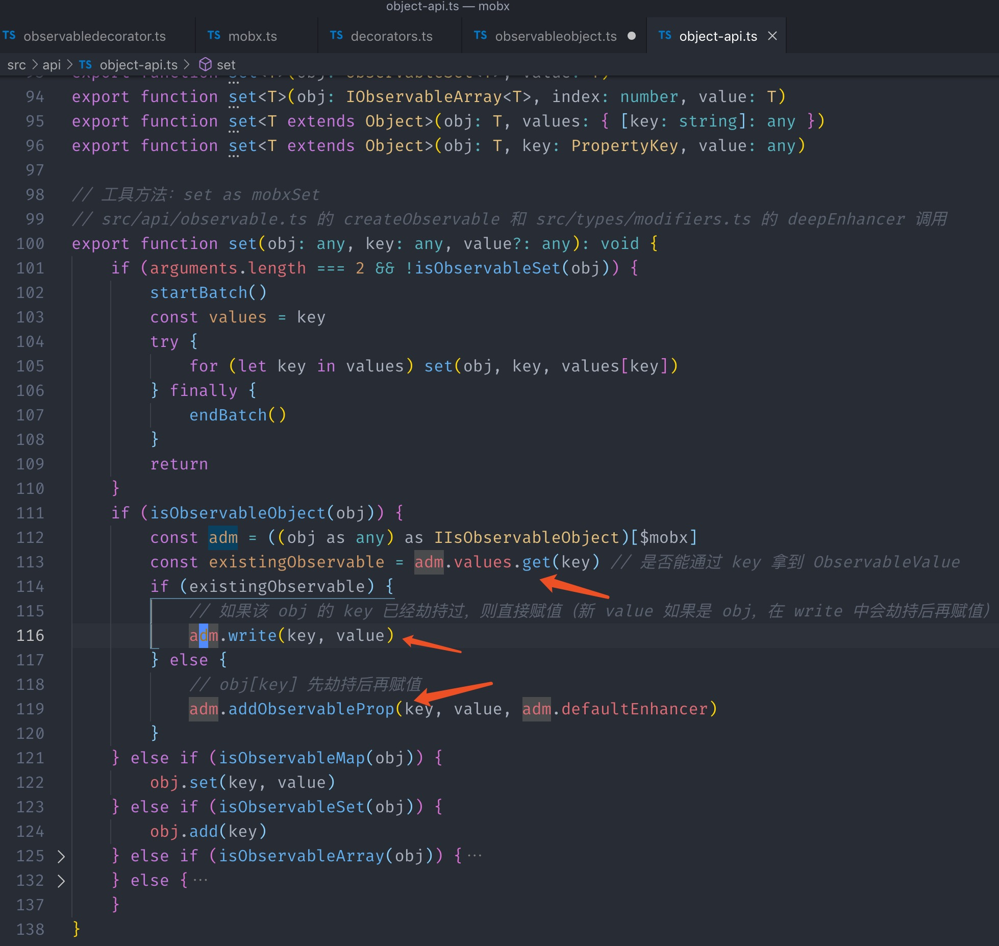

## 最后

1. [带注释的 mobx 源码](https://github.com/lawler61/mobx)

2. 欢迎在 [mobx 源码解读 issue](https://github.com/lawler61/blog/issues?q=is%3Aissue+is%3Aopen+label%3A%22mobx+%E6%BA%90%E7%A0%81%E8%A7%A3%E8%AF%BB%22) 中讨论~

3. 码字不易，喜欢的记得点 💛 哦
