# JS mobx 源码解读（二）：都 observe object 了，其他类型还会远吗

文本是 [mobx 源码解读系列](https://github.com/lawler61/blog#js-%E7%9B%B8%E5%85%B3) 第二篇

本系列文章全部采用 mobx 较新版本：[v5.13.0](https://github.com/lawler61/mobx)

[mobx 源码解读 issue，欢迎讨论](https://github.com/lawler61/blog/issues?q=is%3Aissue+is%3Aopen+label%3A%22mobx+%E6%BA%90%E7%A0%81%E8%A7%A3%E8%AF%BB%22)

## 技术前提

在阅读之前，希望你对以下技术有所**了解或实践**，不然可能会影响你对本文的理解

1. [ES6 装饰器：decorator](http://es6.ruanyifeng.com/#docs/decorator)

2. [ES6 代理：proxy](http://es6.ruanyifeng.com/#docs/proxy)

3. [ES6 反射：reflect](http://es6.ruanyifeng.com/#docs/reflect)

4. [定义对象属性：Object.defineProperty](https://developer.mozilla.org/zh-CN/docs/Web/JavaScript/Reference/Global_Objects/Object/defineProperty)

5. [实现简易版 观察者模式](https://github.com/lawler61/blog/issues/1)

6. [实现简易版 MVVM（可选）](https://github.com/lawler61/blog/issues/5)

## 准备

1. 之前出的第一篇源码解读，本以为应该没人会关注，但这周居然收到网友的催更，还是很感动，准备继续写下去

2. 这篇文章和 [mobx 源码解读系列（一）](https://github.com/lawler61/blog/blob/master/js/mobx-source/1.observable-an-object.md)，有很强的关联，如果你第一篇文章啃下来了，这篇相对来说会是篇水文，但你没啃下来的话，emm...估计你看的会很艰难

3. 上篇文章我们知道了：`万能的装饰器`，`递归劫持`，`adm 管理器`，`支持和露 api`，劫持 `array, Map, Set` 其实同理，接下来就一起验证下源码吧

## 上源码

### 一、劫持 array

1. 回到 observableFactories，它遍历后给 observable 挂上处理各种类型数据的方法

> 先调用 asCreateObservableOptions 计算 options，当然默认的就是 defaultCreateObservableOptions，也就是使用 deep 和 proxy 劫持
>
> 那 getEnhancerFromOptions 获取的当然是 deppEnhancer

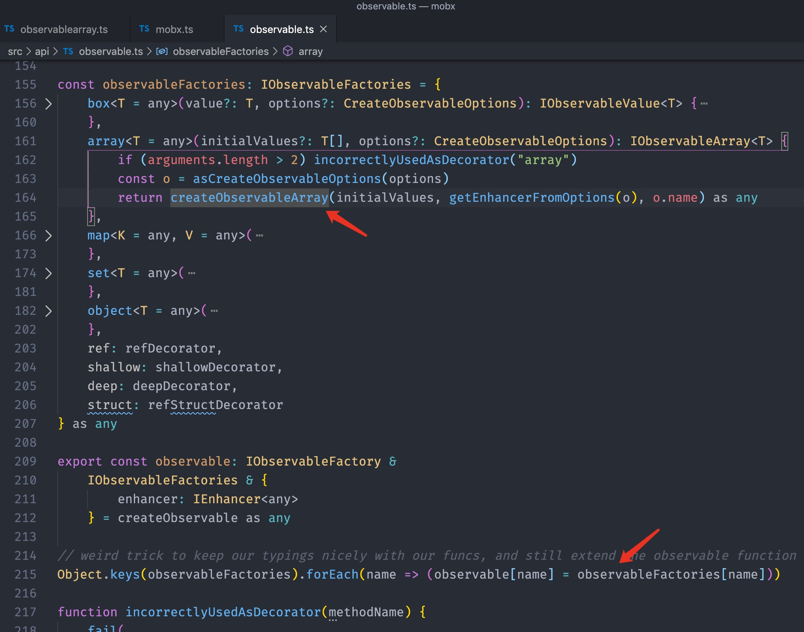

2. 看看 createObservableArray 做了什么

> 首先创建 ObservableArrayAdministration 管理器
>
> 挂上 hidden 属性 $mobx 方便暴露 api
>
> 通过 arrayTraps（一会讲）给 adm.values 挂上自己实现的一套 array 的 api
>
> 然后调用 adm.spliceWithArray 给 adm.values 初始化 initialValues 值（你当然能猜到是利用 enhancer 递归劫持）

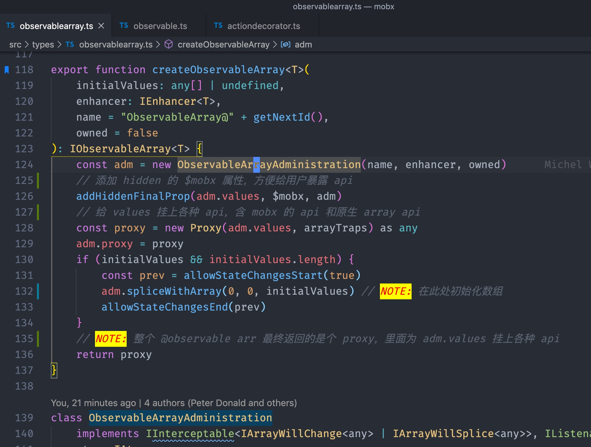

3. 看下 ObservableArrayAdministration

> 里面围绕 values 展开，并且提供了很多操作在 mobx 层面上操作数组的方法
>
> 同时也为后文的 arrayExtensions 提供了实现”支持原生数组 api“的支持

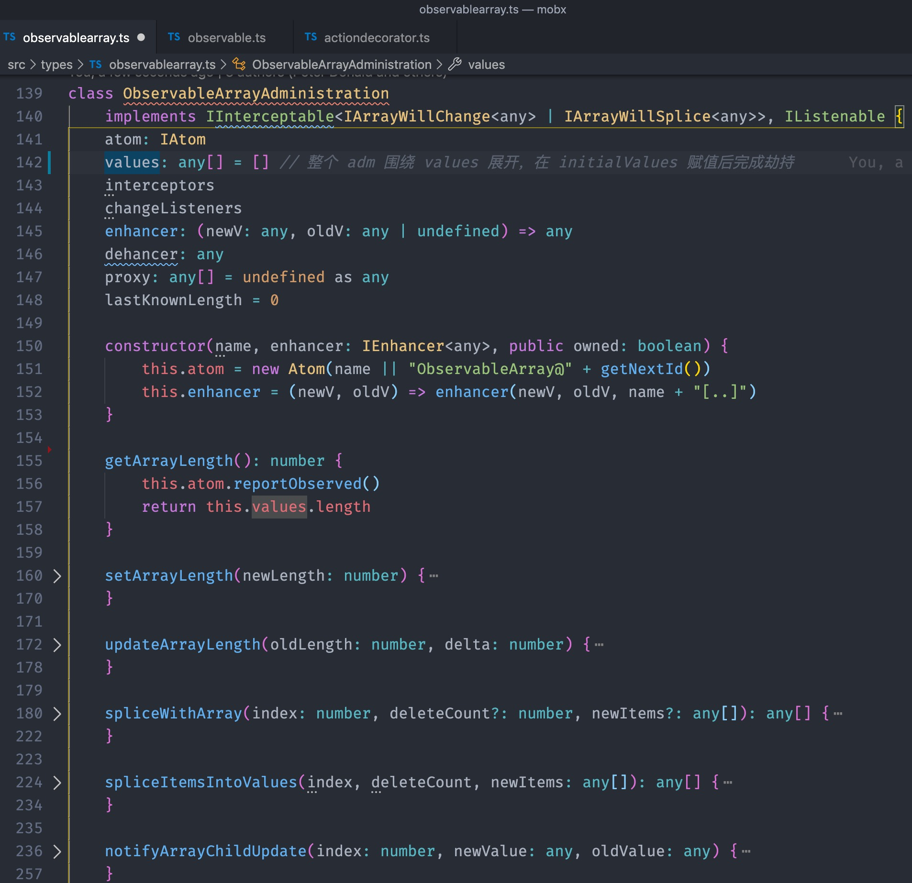

4. 其中最重要的是 spliceWithArray，成它为“万金油”

> 里面做了各种兼容，能够达到对数组的增删改，同时还能在通知变化消息（hasInterceptors，notifyArraySplice 等，这也是重写 api 的原因之一）
>
> 注意到 newItems，初始化的时候值就是 initialValues，然后走 map 通过 enhancer 递归劫持返回新数组
>
> 所以 adm.values 的 item 项类型是在 mobx 层面上的值，如：
>
> [1, { a: 2 }, "c", [3], new Map(...)]，会返回为：
>
> [1, Observableobject, "c", Observablearray, Observablemap]
>
> 劫持后调用 spliceItemsIntoValues，其最终调用 values.splice

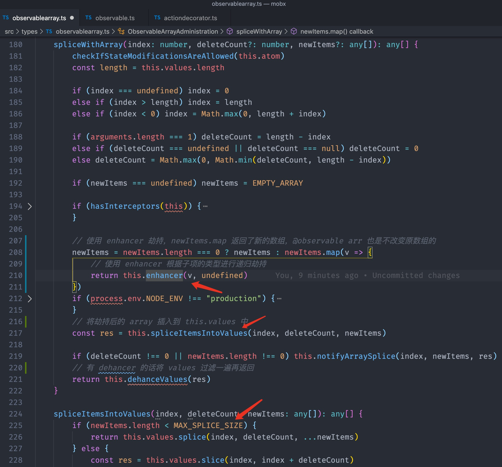

5. 接下来就是如何使用“万精油”：arrayExtensions

> 里面通过 \$mobx 拿到 adm 一阵乱用（当然对象里使用 this[\$mobx] 肯定是 .call 过去的）
>
> 支持完原生 array api 后，然后提供了些 mobx 层面的 api（toJS，observe 等）
>
> 然后不改变数组本身的 api，让 adm.values 出场就行了

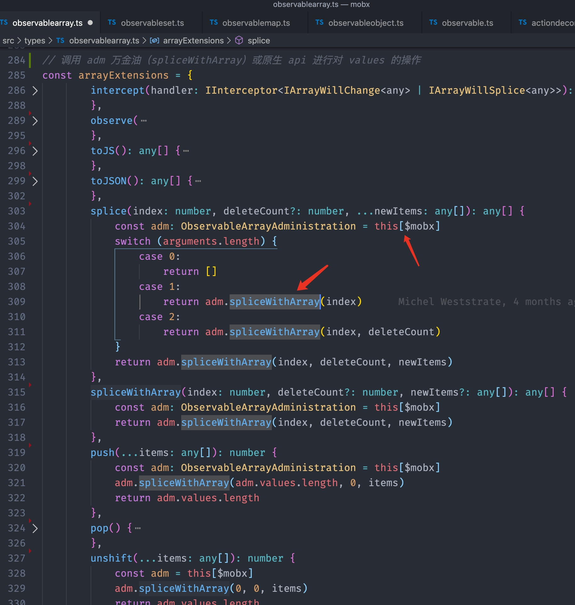

6. 完成了一整套 api，最终肯定是要挂在 values 上的，arrayTraps 登场

> 其实就是 descriptor 嘛，没啥说的，与之前的 proxy 配合就挂上去了呗

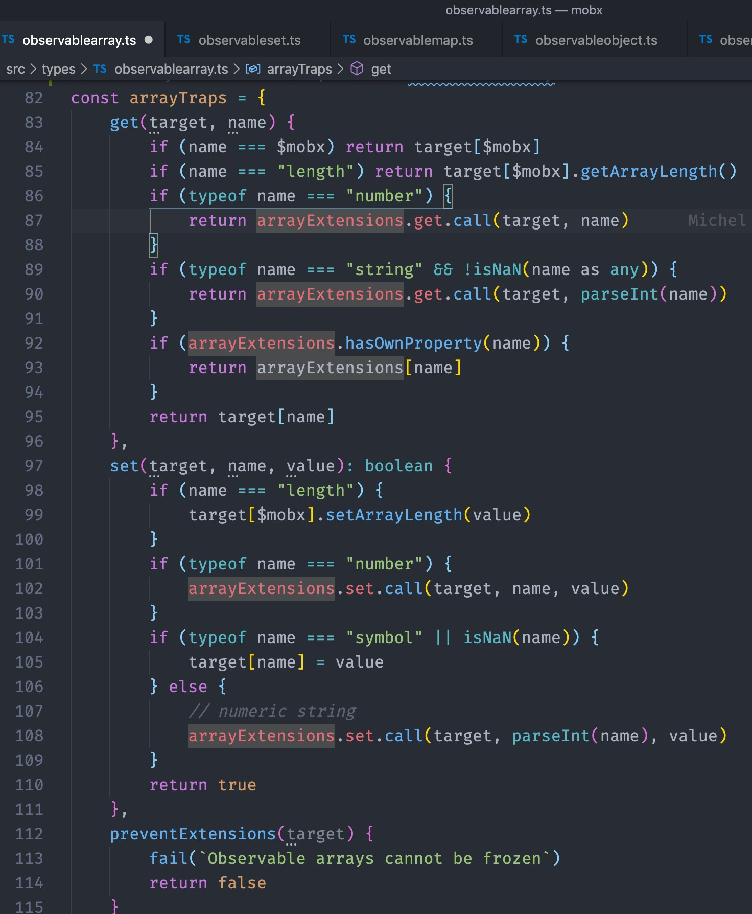

7. 暴露 api

> 快乐就完事了

### 二、劫持 Map

接下来就没啥说的了

1. 还是回到 observableFactories，获取参数后，返回了一个 ObservableMap

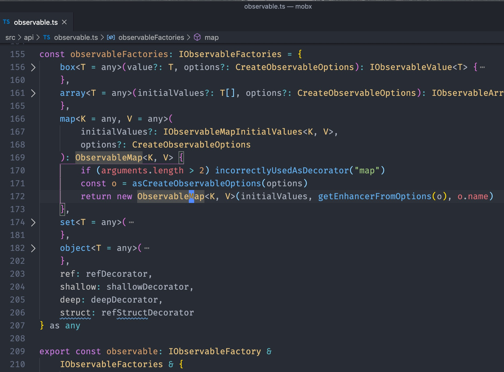

2. 看看 ObservableMap

> 又是围绕 this._data 展开，通过 merge 方法赋初始值
>
> 你闭着眼都能猜到：foreach 遍历 key，拿到 value 然后用 enhancer 递归劫持
>
> 然后提供原生 Map 和 mobx 层面上的 api

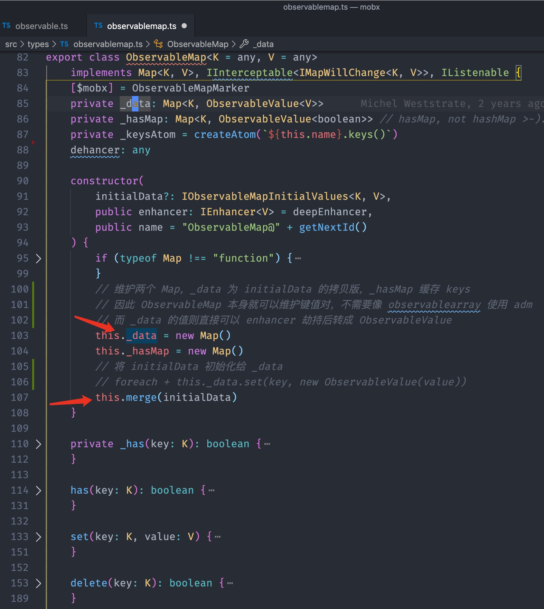

3. 暴露 api，图略

### 三、劫持 Set

1. 从 observableFactories 出发，返回 ObservableSet

> 围绕 this._data 展开，通过 replace 方法赋初值
>
> 换汤不换药：foreach + _data.add(new ObservableValue(value))
>
> 然后实现原生 api，暴露出去使用

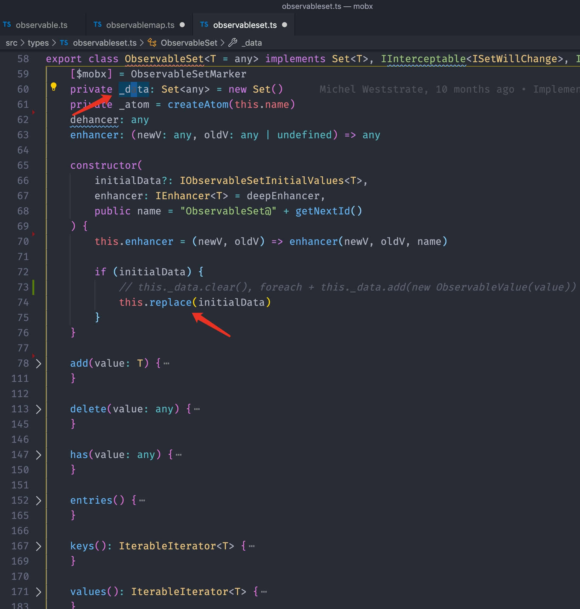

### 四、劫持 box

1. 对于基本类型 string, boolean, number 可以用 box 来劫持，可以挂上 get, set 的方法

2. 其具体使用的是 ObservableValue，也是我们在 [mobx 源码解读系列（一）](https://github.com/lawler61/blog/blob/master/js/mobx-source/1.observable-an-object.md) 中讲的 ObservableObjectAdministration 维护的 values 的值

3. 到这是不是对 observableobject 理解又加深了一步呢

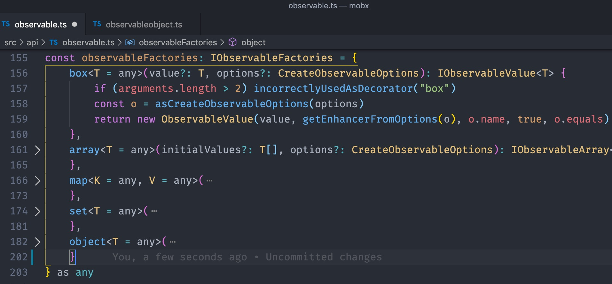

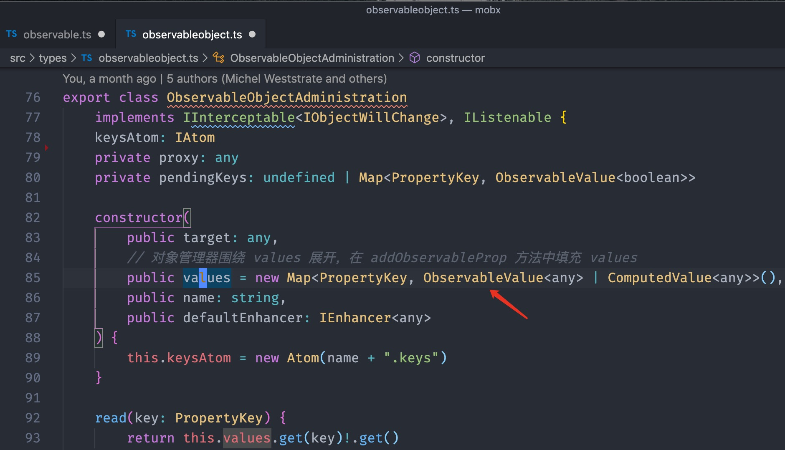

## 最后

1. [带注释的 mobx 源码](https://github.com/lawler61/mobx)

2. 欢迎在 [mobx 源码解读 issue](https://github.com/lawler61/blog/issues?q=is%3Aissue+is%3Aopen+label%3A%22mobx+%E6%BA%90%E7%A0%81%E8%A7%A3%E8%AF%BB%22) 中讨论~

3. 下章剧透：**讲讲 mobx 中的依赖收集**

3. 码字不易，喜欢的记得点 💛 哦
