# mobx 源码解读（三）：mobx 中的依赖收集：订阅-发布模式

文本是 [mobx 源码解读系列](https://github.com/lawler61/blog#js-%E7%9B%B8%E5%85%B3) 第三篇

本系列文章全部采用 mobx 较新版本：[v5.13.0](https://github.com/lawler61/mobx)

[mobx 源码解读 issue，欢迎讨论](https://github.com/lawler61/blog/issues?q=is%3Aissue+is%3Aopen+label%3A%22mobx+%E6%BA%90%E7%A0%81%E8%A7%A3%E8%AF%BB%22)

## 技术前提

在阅读之前，希望你对以下技术有所**了解或实践**，不然可能会影响你对本文的理解

1. [ES6 装饰器：decorator](http://es6.ruanyifeng.com/#docs/decorator)

2. [ES6 代理：proxy](http://es6.ruanyifeng.com/#docs/proxy)

3. [ES6 反射：reflect](http://es6.ruanyifeng.com/#docs/reflect)

4. [定义对象属性：Object.defineProperty](https://developer.mozilla.org/zh-CN/docs/Web/JavaScript/Reference/Global_Objects/Object/defineProperty)

5. [实现简易版 观察者模式](https://github.com/lawler61/blog/issues/1)

6. [实现简易版 MVVM（可选）](https://github.com/lawler61/blog/issues/5)

## 准备

### 一、目的

1. 本来想直接从 `autorun` 讲的，发现有些坑还是要先填上，之前觉得 `ComputedValue` 和`ObservableValue` 相似，后面发现大不相同

2. 文本主要围绕 `Derivation`，`ComputedValue`，`ObservableValue` 讲讲 `mobx` 中的订阅-发布模式

3. 顺便梳理下把三者变化过程的`状态机`，为其他 `autorun` 做铺垫

### 二、提要

**每点都很重要，牢记**

1. `mobx` 中由 `Derivation`（`reaction` 也是实现它）充当观察者，其中 `observing` 代表依赖的可观察对象集合，`dependenciesState` 代表观察者状态

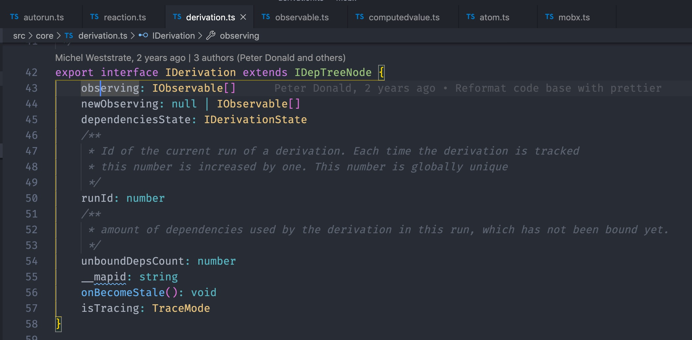

2. `ObservableValue` 充当可观察对象，其中 `observers` 代表依赖它的观察者集合，`lowestObserverState` 代表可观察对象的状态（全文的 observable 代表 observableValue，observableObject，observableArray...）

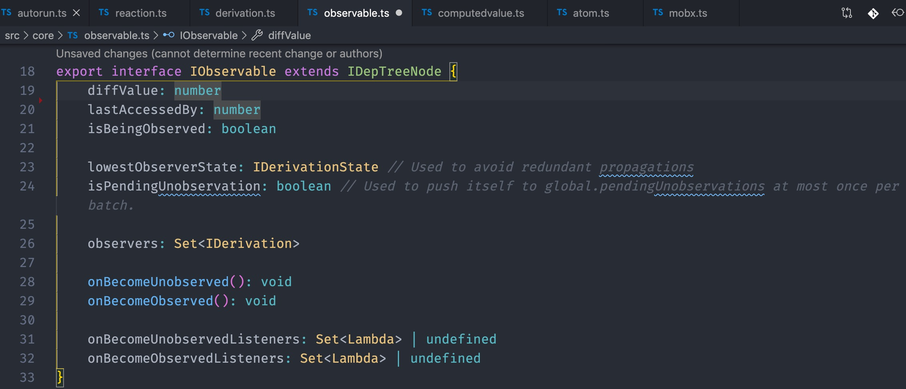

3. `ComputedValue` 有点特殊同时实现了 `IDerivation` 和 `IObservable` 接口，所以它拥有上述两点的特征。因为`ComputedValue` 可以被 `Derivation` 依赖，同时也可以依赖 `ObservableValue`

```js
class Store {
  @observable num = 3;
  @computed get mixed() {
    return store.num + 1; // 依赖 observableValue
  }
}

const store = new Store();
autorun(reaction => {
  console.log("autorun:", store.mixed); // 被 Derivation 依赖
});
```

4. 要注意的是 `ComputedValue` 作为可观察对象向 `Derivation` 提交变化时，要使用 `observing` 和 `lowestObserverState`。相反作为观察者时，用 `observers` 和 `dependenciesState`

5. `DerivationState` 状态机，状态越高表示越不稳定（POSSIBLY_STALE、STALE），相反同理（UP_TO_DATE）

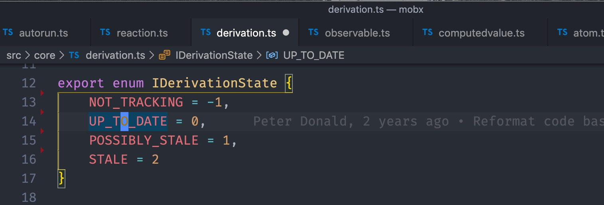

## 上源码

### 一、reaction 准备

1. autorun 会调用 reaction.schedule 方法将其 push 到 globalState.pendingReactions

> 再调用 runReactions 遍历 pendingReactions 逐一收集 reaction 的依赖

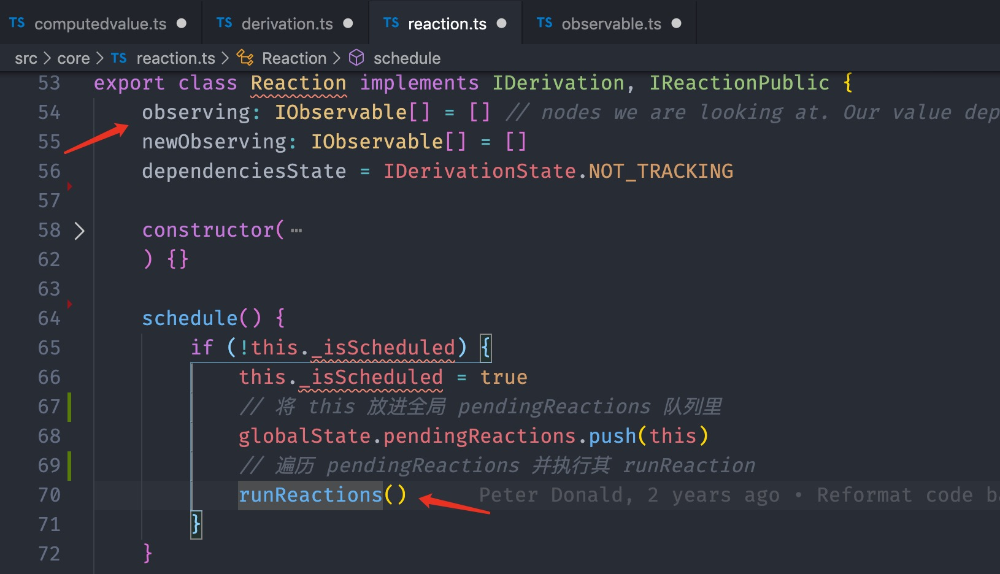

2. runReactions 中通过 while 取出 pendingReactions 来执行它们的 runReaction 方法（下章会说）

> 用 while 是因为在此轮收集依赖过程中可能会有其他的 reaction 加入
>
> 新增的 pendingReaction 也会调用 schedule，但会在 runReactions 的判断中将其 return 掉（因为 while 能拿到新增的 reaction）
>
> runReaction 最终会掉用 trackDerivedFunction 开始依赖收集

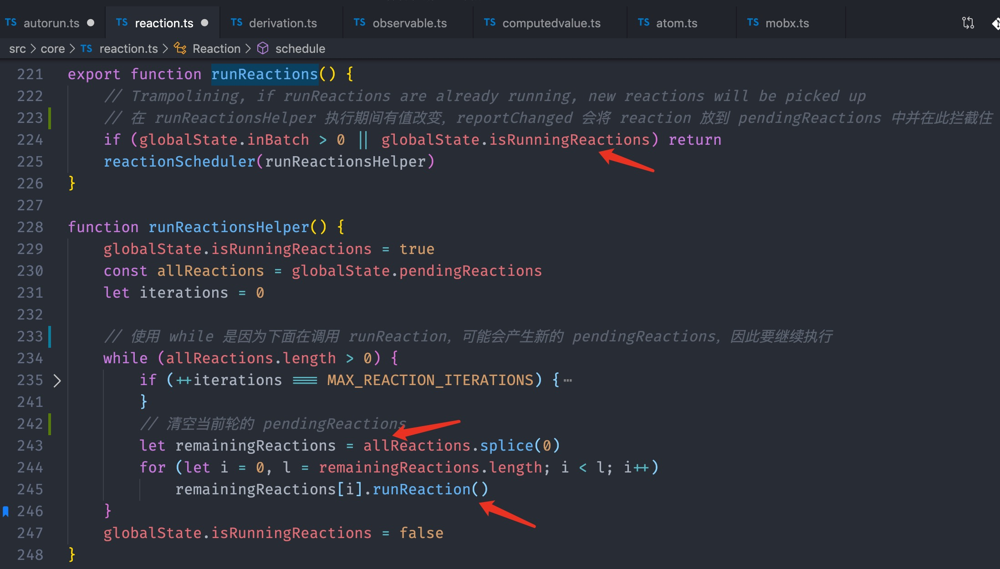

### 二、收集依赖

1. 收集依赖核心：trackDerivedFunction

> 先调用 changeDependenciesStateTo0 方法将 derivation 和 observing 置为稳定态 UP_TO_DATE，主要是方便后续判断是否处在收集依赖阶段（下章会讲）
>
> trackingDerivation 为在全局正在收集依赖的 derivation，初始为 null
>
> 使用 newObserving 临时变量储存依赖和为后面的绑定依赖做准备
>
> 然后是“切分支”，见下代码，**记住这种神迹的操作**，后面会多次用到
>
> 其主要目的是保存正在收集依赖的 derivation，以防 f.call(context) 时递归调用了 trackDerivedFunction，而找不到上下文
>
> 聪明的你可能猜到了其中包含 ComputedValue
>
> f.call(context) 正式执行 autorun 中传入的函数，newObserving 数组也是在这一阶段填充的
>
> 最后是 bindDependencies 绑定依赖

```js
const prevTracking = globalState.trackingDerivation
globalState.trackingDerivation = derivation;
doSomething(); // use globalState.trackingDerivation do something fun
globalState.trackingDerivation = prevTracking;
```

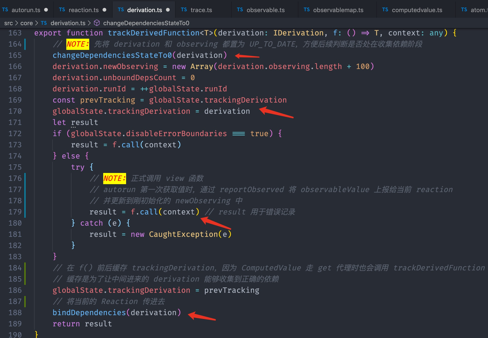

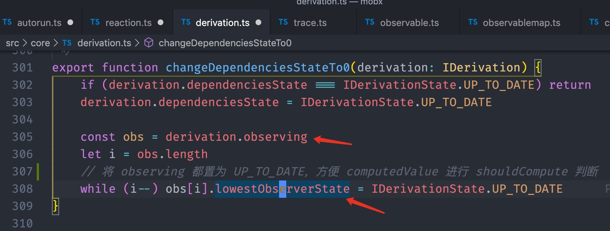

2. newObserving 储存依赖

回想下我们怎么使用 autorun 的：

```js
const store = new Store();
autorun(reaction => {
  console.log("autorun:", store.mixed);
});
```

> 如果你对 observable 敏感的话，肯定会反应过来：get 代理
>
> 在 observableValue 和 computedValue 的 get 代理通过调用 reportObserved 通知给 derivation
>
> observable 的 reportObserved 能力是因为继承 Atom

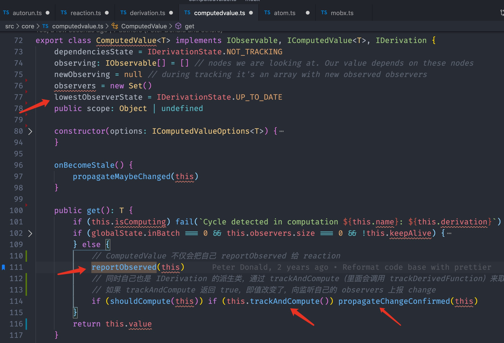


3. reportObserved 当然是调用 globalState.trackingDerivation 咯

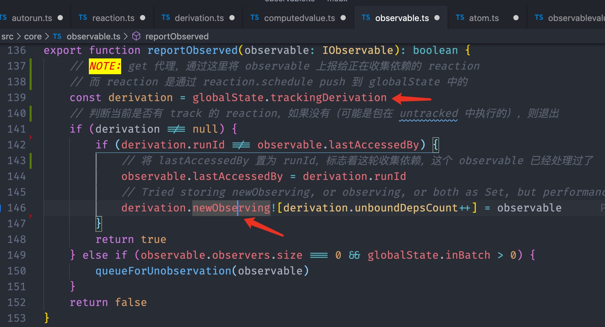

4. 看上面图，再说下 computedValue 的 get 代理

> 里面调用 trackAndCompute 就是刚说到的“切分支”的情况
>
> 如果 computedValue 还没被 derivation 依赖且没被计算过
>
> 就递归 trackDerivedFunction，传入 derivation（computed 属性）和 scope（store）
>
> 开始 computedValue 分支的依赖收集，收集完后再回到原来的 derivation

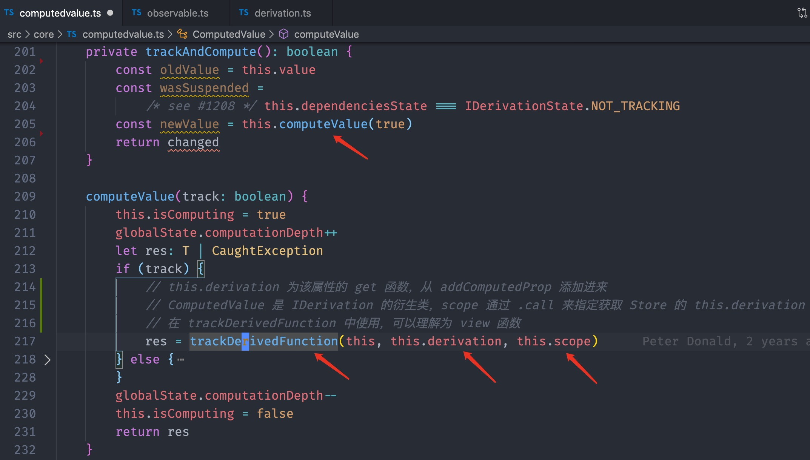

5. 如果 trackAndCompute 的值有改变则调用 propagateChangeConfirmed

> 将自己置为“高状” STALE，并通知 observers 自己改变了，你们也去作出相应反应吧
>
> 需要注意，就是如果 d.dependenciesState 为 UP_TO_DATE，则说明这个 derivation 正在走 trackDerivedFunction
>
> 需要恢复 changeDependenciesStateTo0 的工作，将 observable 返回稳定态

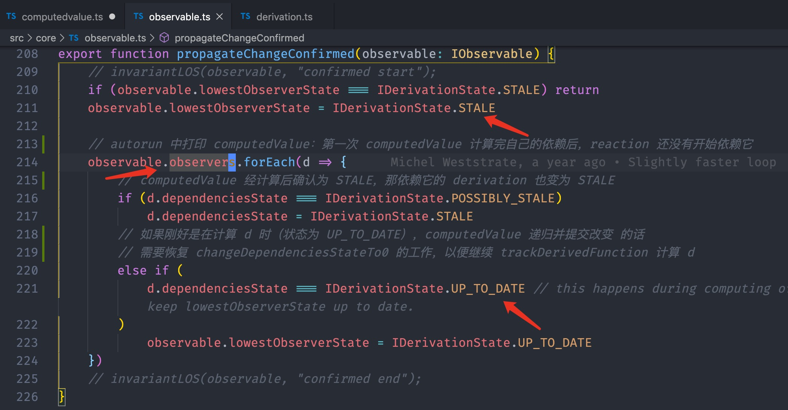

6. 既然说到了改变，那 observableValue 走 set 代理也同理

> observableValue 不会递归 trackDerivedFunction，直接调用 d.onBecomeStale 变为不稳定态即可

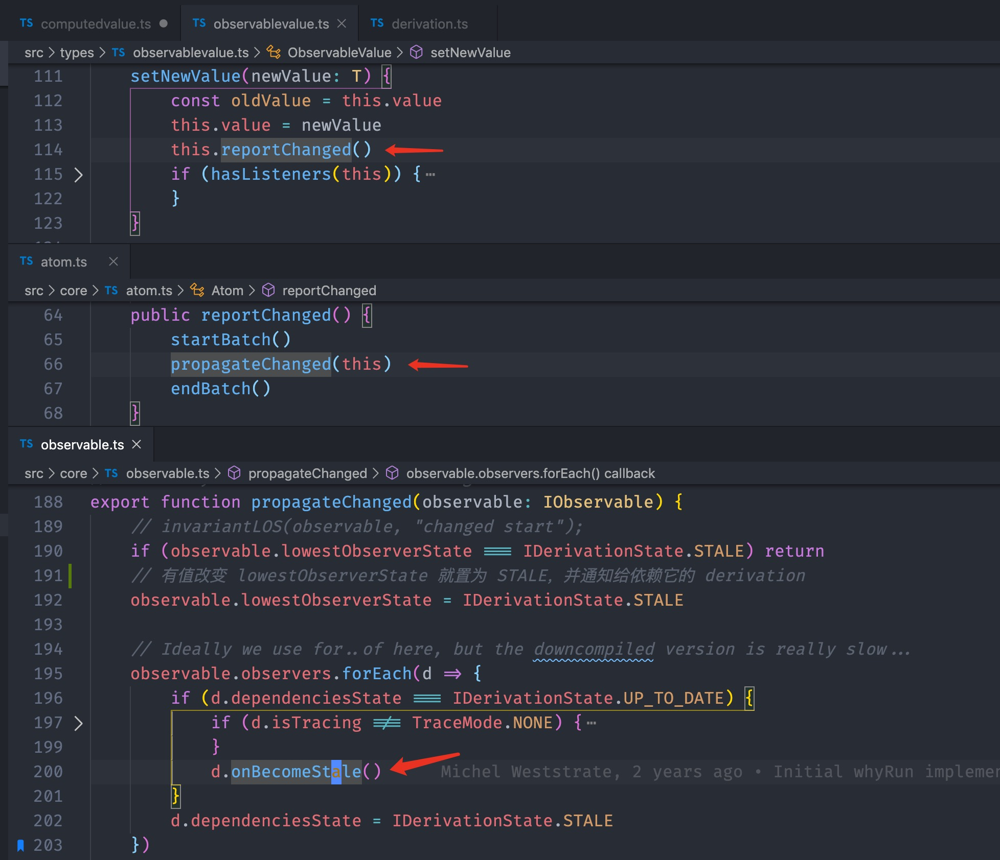

### 三、绑定依赖

f.call(context) 期间完成了 derivation 对 observable 依赖的收集

1. 回到 trackDerivedFunction 的 bindDependencies

> 通过三个循环完成 observable 对 derivation 的收集和感知
>
> ① 遍历 newObserving 将未收集的依赖 diffValue 置为 1，之前收集过了则忽略
>
> ② 给 observable 解绑 derivation（看清楚顺序哦），即 observable 的改变不需要通知 derivation 了
>
> ③ 给新的 observable 绑定 derivation，代表它们的改变需通知 derivation，之前绑过则忽略

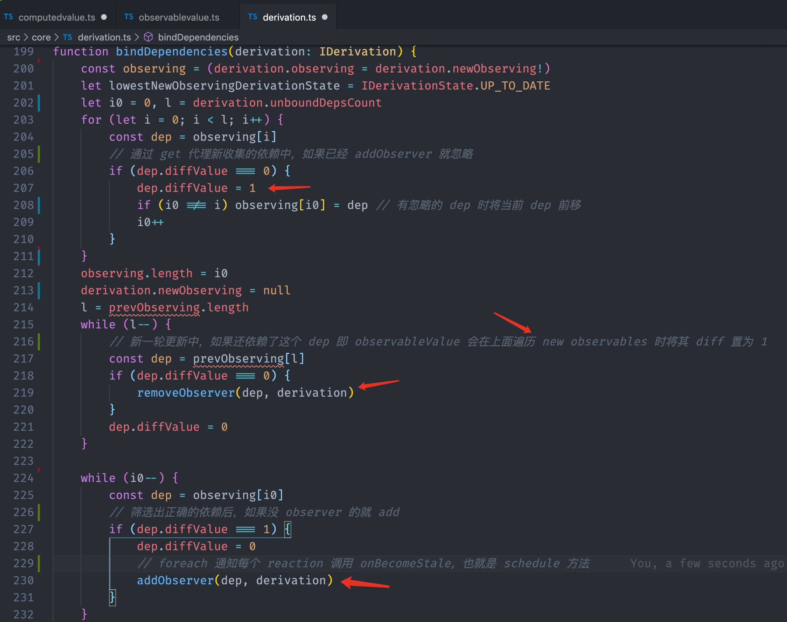

2. addObserver 很简单

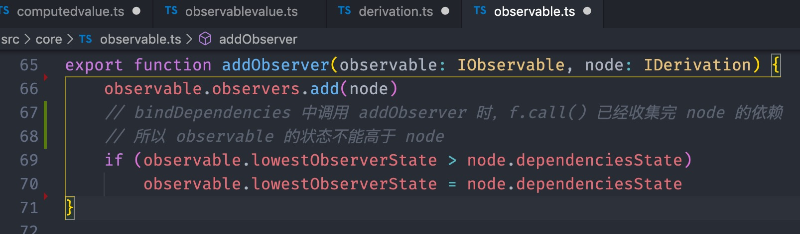

## 最后

1. [带注释的 mobx 源码](https://github.com/lawler61/mobx)

2. 欢迎在 [mobx 源码解读 issue](https://github.com/lawler61/blog/issues?q=is%3Aissue+is%3Aopen+label%3A%22mobx+%E6%BA%90%E7%A0%81%E8%A7%A3%E8%AF%BB%22) 中讨论~

3. 推荐：`minbx: mini mobx`，供学习使用：[minbx 项目地址](https://github.com/lawler61/minbx)

4. 下章剧透：**讲讲 mobx 的 autorun 机制**

5. 码字不易，喜欢的记得点 ❤️ 哦
