# mobx 源码解读（四）：讲讲 autorun 和 reaction

文本是 [mobx 源码解读系列](https://github.com/lawler61/blog#js-%E7%9B%B8%E5%85%B3) 第四篇

本系列文章全部采用 mobx 较新版本：[v5.13.0](https://github.com/lawler61/mobx)

[mobx 源码解读 issue，欢迎讨论](https://github.com/lawler61/blog/issues?q=is%3Aissue+is%3Aopen+label%3A%22mobx+%E6%BA%90%E7%A0%81%E8%A7%A3%E8%AF%BB%22)

## 技术前提

在阅读之前，希望你对以下技术有所**了解或实践**，不然可能会影响你对本文的理解

1. [ES6 装饰器：decorator](http://es6.ruanyifeng.com/#docs/decorator)

2. [ES6 代理：proxy](http://es6.ruanyifeng.com/#docs/proxy)

3. [ES6 反射：reflect](http://es6.ruanyifeng.com/#docs/reflect)

4. [定义对象属性：Object.defineProperty](https://developer.mozilla.org/zh-CN/docs/Web/JavaScript/Reference/Global_Objects/Object/defineProperty)

5. [实现简易版 观察者模式](https://github.com/lawler61/blog/issues/1)

6. [实现简易版 MVVM（可选）](https://github.com/lawler61/blog/issues/5)

## 准备

1. 这篇文章和 [mobx 源码解读系列（三）](https://github.com/lawler61/blog/blob/master/js/mobx-source/3.collect-dependencies.md) 有很强的关联，建议先看懂再看文本

2. 上篇讲的 `mobx 中的依赖收集` 可以浓缩为一个函数：`schedule`，这篇我们讨论该函数是如何使用的

3. 说明：`mobx` 对于依赖收集的优化是非常多的，其中包括 `computedValue` 的 `POSSIBLY_STALE` 状态和 `shouldComputed` 判断等等，喜欢的自行 dive in 吧

## 上源码

### 一、Reaction

1. Reaction 最重要的两个函数：onInvalidate 和 track

> 前者作用是对变化作出反应，为构造函数参数，后者作用是收集依赖
>
> 试想，将两者结合到一起：根据变化自动收集依赖，然后作出反应。这不就是 autorun 吗
>
> 那 schedule 函数又是啥呢，其实它最终调的就是 track + onInvalidate

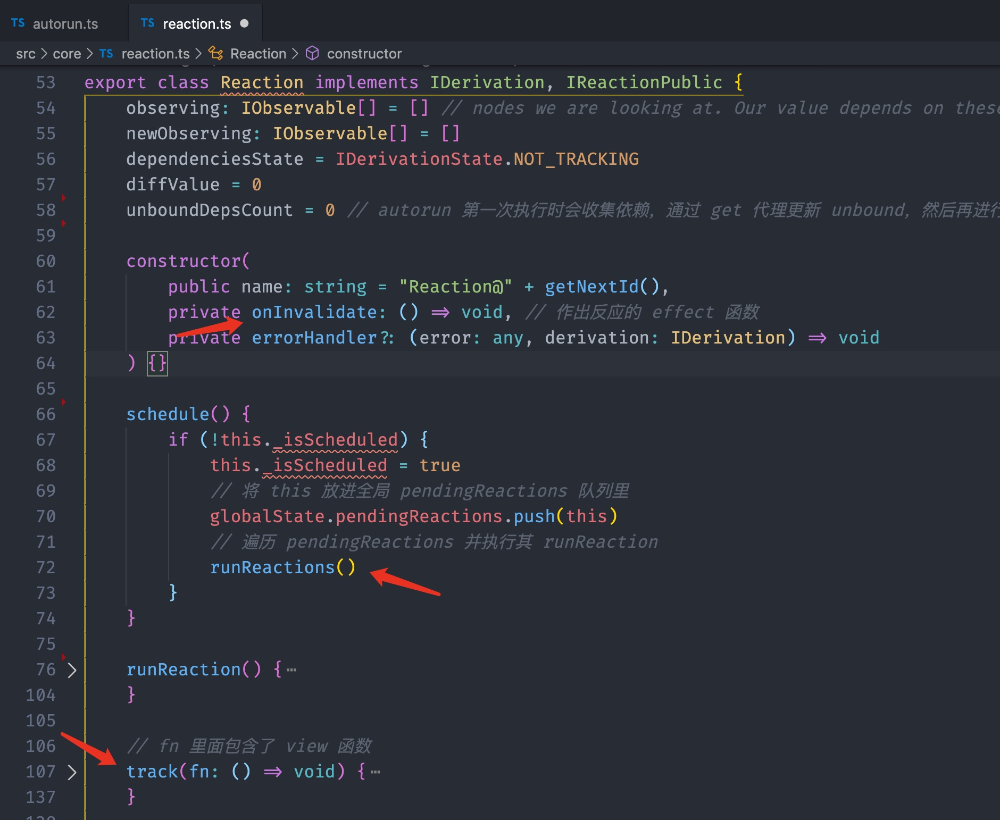

2. schedule 的处理

> 首先将 reaction push 到 globalState.pendingReactions 中，作为 runReactions 中 while 的调用对象（详见：[上篇](https://github.com/lawler61/blog/blob/master/js/mobx-source/3.collect-dependencies.md)）
>
> while 循环中调用每个 reaction 的 runReaction 方法
>
> 在里面加了各种锁，最后调用 onInvalidate 方法，那 track 方法在哪调呢

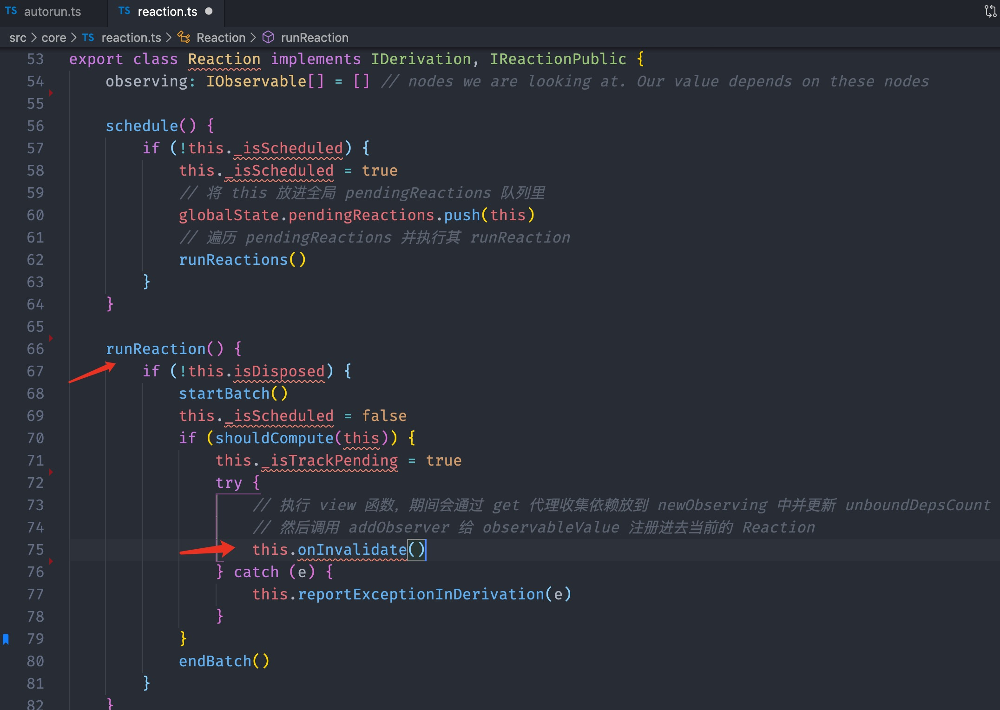

3. autorun

> 答案是 new Reaction 时通过构造函数，将自己的 track 方法塞到 onInvalidate 中
>
> track 函数的入参为 view 函数，那么通过执行 view 就知道依赖了哪些 observables，那么就可以记录到当前 reaction 中
>
> 这样就将 track、view 方法结合为 onInvalidate，形成了顺序：
>
> 数据变化 -> observables 遍历 observers 并调用其 schedule（里面调用 track 再调 view） -> view 通过 get 代理获取数据并重新 bind derivation 和 observable 的依赖 -> 计算完毕，view 执行完成，视图更新
>
> 问题：传参这么绕，为啥不直接在将 view 当做 Reaction 的入参传进去，在里面调用 track 呢，代码如下：
>
> 这样做是有原因且合理的，文末 “下章剧透” 告诉你

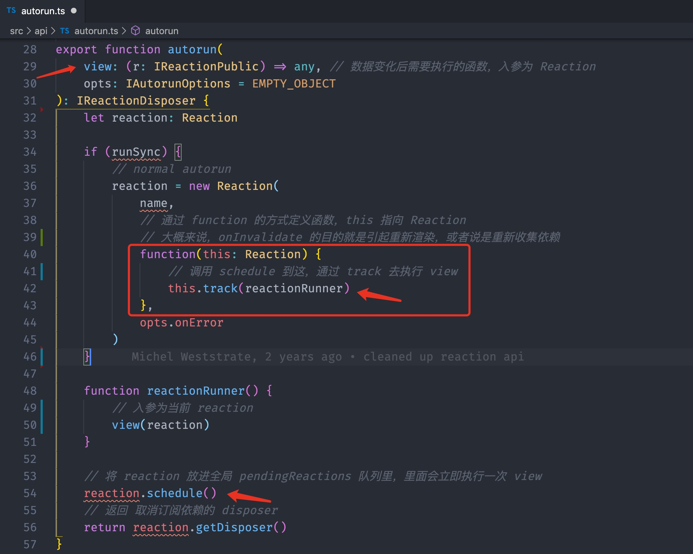

```js
new Reaction(name, view); // 直接传 view

class Reaction {
  constructor(public name: string, private view: (r: Reaction) => void) {}

  runReaction() {
    // ...
    this.track(this.view);
  }

  track(fn) {
    const result = trackDerivedFunction(this, fn, undefined)
  }
}
```

4. track 方法如何收集依赖的呢

> 当然是上篇讲的 trackDerivedFunction。同理，computedValue 对它依赖的数据也是如此
>
> 在 get 代理中重新收集依赖，发现 value 改变后就向观察自己的观察者发出信号

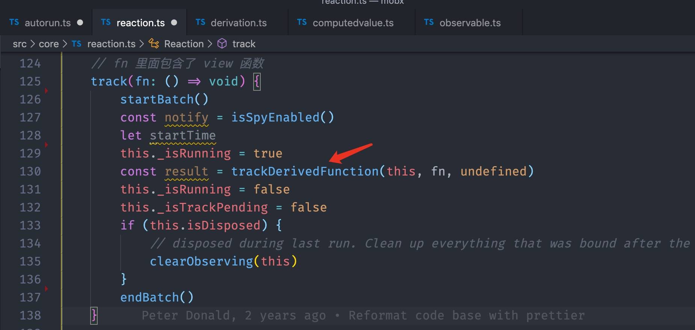

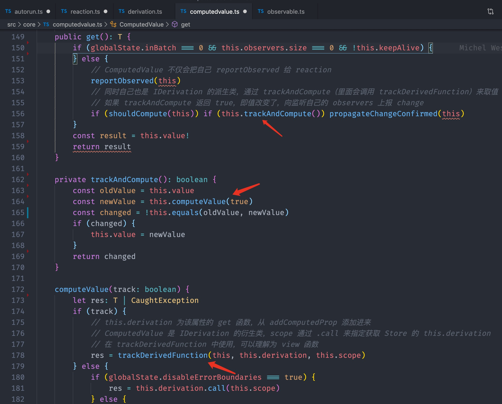

### 二、其他“对 observables 作出响应”

em...，autorun 就讲完了，其实 autorun 中最重要也是 mobx 核心之一的是 trackDerivedFunction 方法

1. reaction（小写）

> reaction 允许我们主动申明依赖，并在依赖改变是自动执行副作用
>
> 换汤不换药，将 track 自动收集换成了手动传入即可
>
> 在 new Reaction 时传参，将 expression 传入 track，判断是否改变再执行 effect

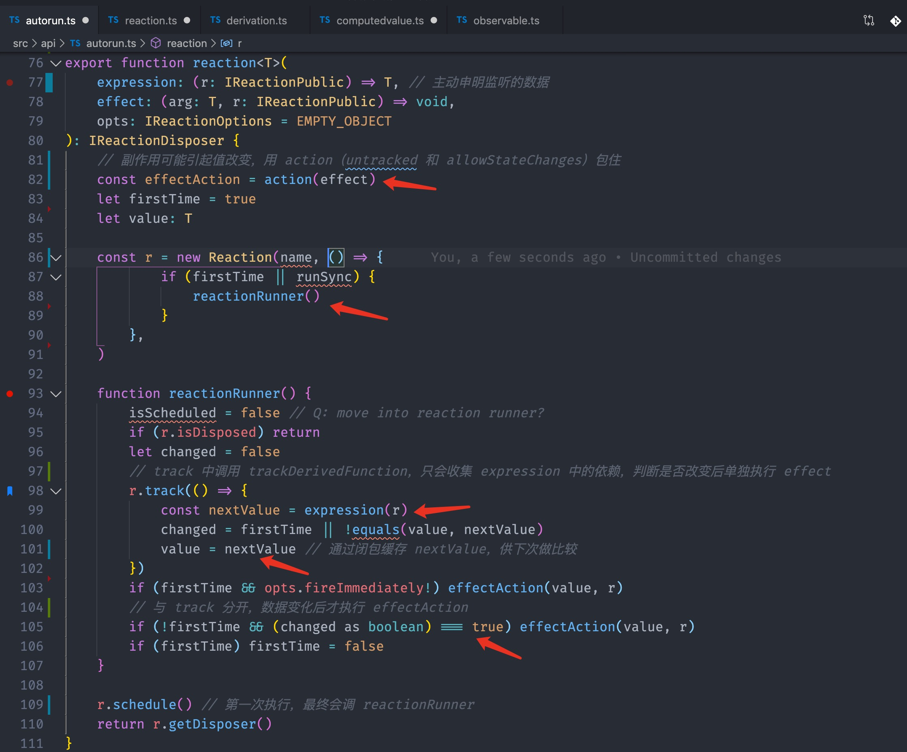

2. when

> when 可以根据传的第一个参数，为 true 时执行 effect。如果没传 effect 则返回一个 promise，供 async await 使用
>
> when 直接由 predicate 决定是否执行 effect，不依赖 observable，用 predicate 代替 track 即可

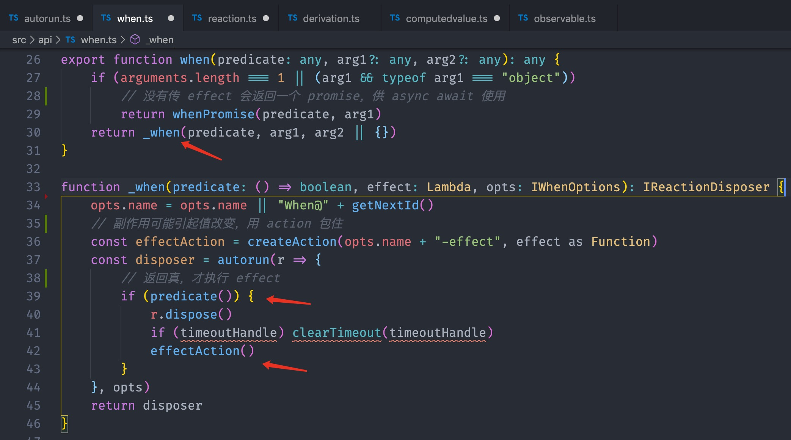

### 三、action

我们设置 `configure({ enforceActions: 'always' })` 就必需在 action 下才能改变数据

1. action 函数和装饰器

> 这个就不多说了，namedActionDecorator 最后调的也是 createAction

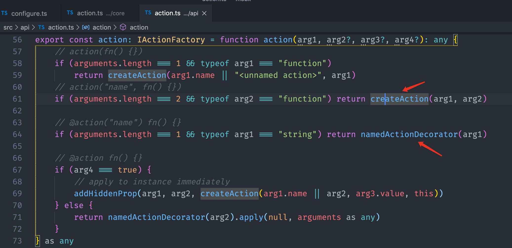

2. createAction 调用 executeAction 开启了“切分支”之旅

> 在 _startAction 保存各种之前分支的信息，然后进入 action 执行：fn.apply，执行完后将 runInfo 传给 _endAction 恢复之前信息
>
> 其中 untrackedStart：将 globalState.trackingDerivation 置为 null，防止错误收集依赖（详见：[上篇](https://github.com/lawler61/blog/blob/master/js/mobx-source/3.collect-dependencies.md)），即在 action 期间不进行依赖收集（get 代理）
>
> startBatch：锁住 inBatch，即在 action 期间也不进行实际的 runReactions，而只是 push 到 globalState.pendingReactions，待 action 执行完后再 schedule
>
> allowStateChangesStart：enforceActions 也是判断该值是否为 'always' 来决定是否可以在 action 改变 observable
>
> 这里将 globalState.allowStateChanges 置为 true，即在 action 中一定可以改变 observable
>
> 让 action 在“安静”的情况下运行，主要还是为了优化，让 action 全部改变完数据后，再进行依赖收集

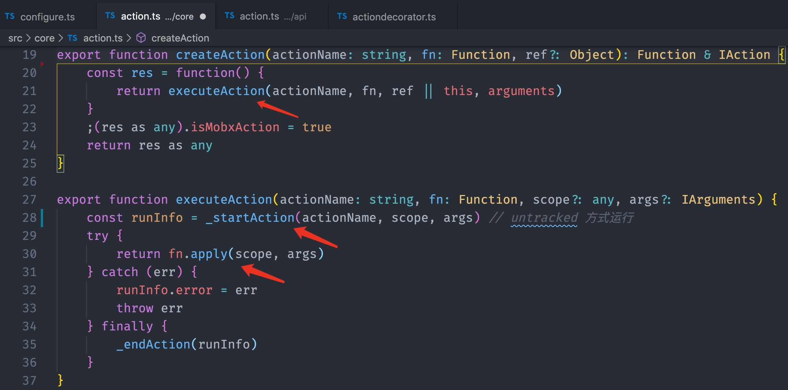

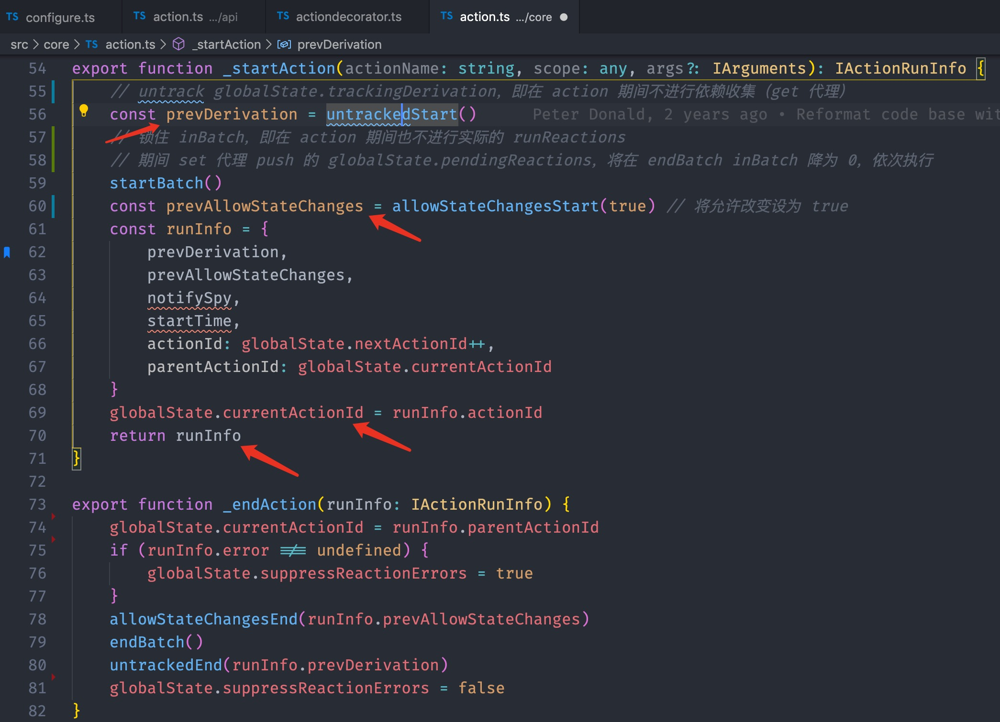

3. runInAction

> runInAction(f) 是 action(f)() 的语法糖，那就是直接执行 executeAction 咯

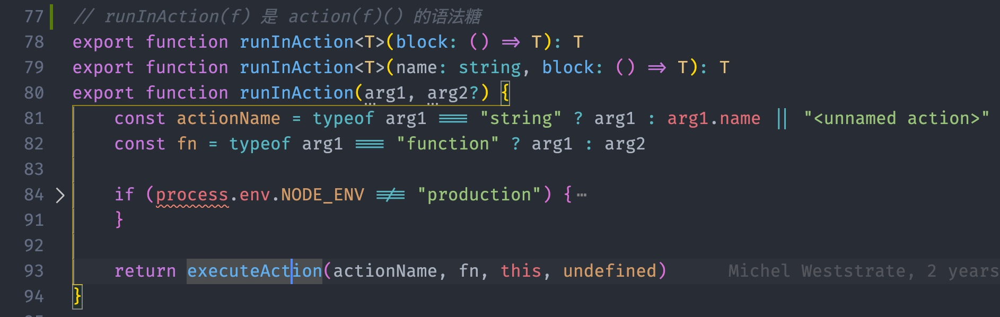

## 最后

1. [带注释的 mobx 源码](https://github.com/lawler61/mobx)

2. 欢迎在 [mobx 源码解读 issue](https://github.com/lawler61/blog/issues?q=is%3Aissue+is%3Aopen+label%3A%22mobx+%E6%BA%90%E7%A0%81%E8%A7%A3%E8%AF%BB%22) 中讨论~

3. 推荐：`minbx: mini mobx`，供学习使用：[minbx 项目地址](https://github.com/lawler61/minbx)

4. 下章剧透：**如虎添翼的 mobx-react**

5. 码字不易，喜欢的记得点 ❤️ 哦
