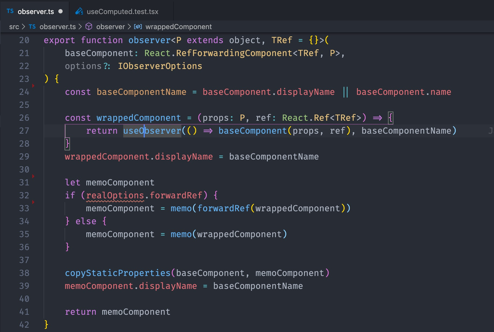
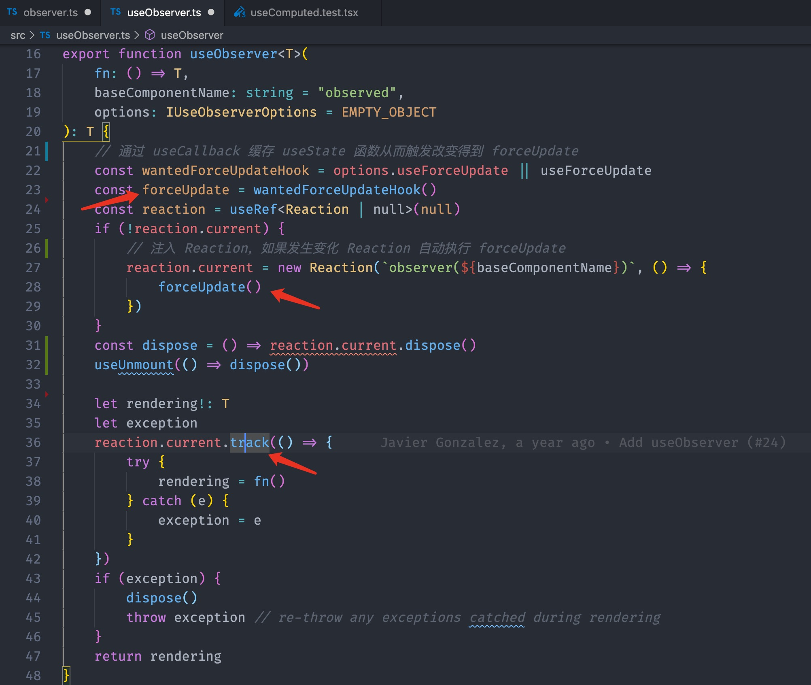
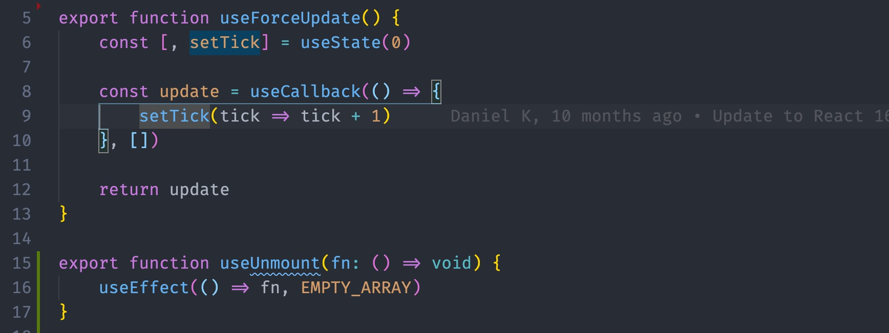
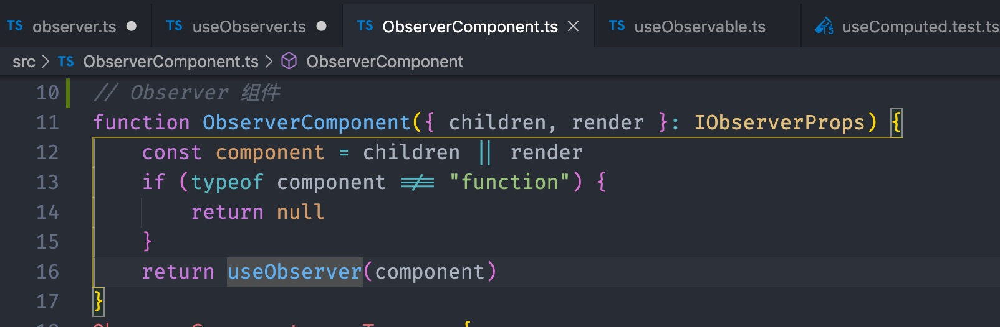
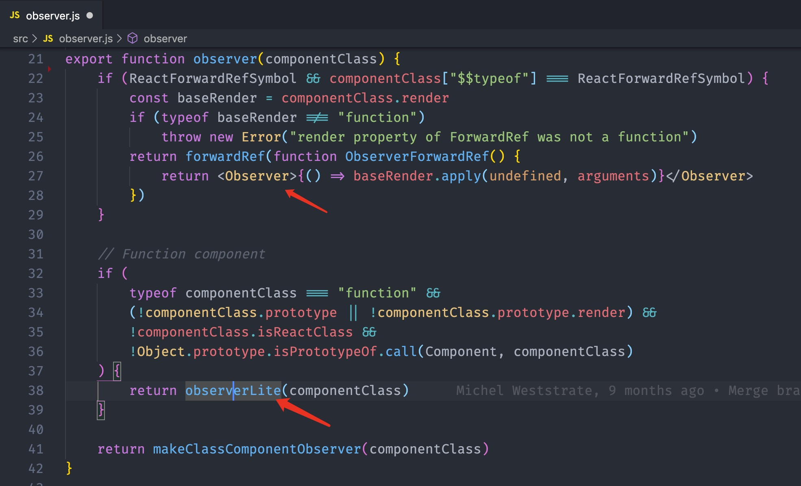
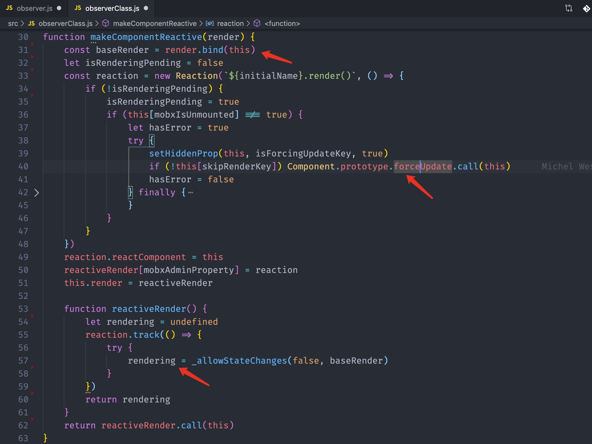

# mobx 源码解读（五）：如虎添翼的 mobx-react

文本是 [mobx 源码解读系列](https://github.com/lawler61/blog#js-%E7%9B%B8%E5%85%B3) 第五篇

本系列文章全部采用 mobx 较新版本：[v5.13.0](https://github.com/lawler61/mobx)

[mobx 源码解读 issue，欢迎讨论](https://github.com/lawler61/blog/issues?q=is%3Aissue+is%3Aopen+label%3A%22mobx+%E6%BA%90%E7%A0%81%E8%A7%A3%E8%AF%BB%22)

## 技术前提

在阅读之前，希望你对以下技术有所**了解或实践**，不然可能会影响你对本文的理解

1. [ES6 装饰器：decorator](http://es6.ruanyifeng.com/#docs/decorator)

2. [ES6 代理：proxy](http://es6.ruanyifeng.com/#docs/proxy)

3. [ES6 反射：reflect](http://es6.ruanyifeng.com/#docs/reflect)

4. [定义对象属性：Object.defineProperty](https://developer.mozilla.org/zh-CN/docs/Web/JavaScript/Reference/Global_Objects/Object/defineProperty)

5. [实现简易版 观察者模式](https://github.com/lawler61/blog/issues/1)

6. [实现简易版 MVVM（可选）](https://github.com/lawler61/blog/issues/5)

## 准备

### 一、目的

1. 本文是 `mobx 源码解读系列` 的最后一篇，短短的五篇文章，对整个 `mobx` 只能讲了个大概，源码爱好者们请自行深挖宝藏

2. 最后一篇讲 `mobx-react`，自从 `react` 推出 `hooks` 之后，那连接 `mobx` 和 `react` 不要太简单

3. `mobx-react` 6 版本配合了 [mobx-react-lite](https://github.com/mobxjs/mobx-react-lite) 来处理 `function component`

### 二、提要

1. 上篇讲 `autorun` 如何向 `reaction` 传参埋了个坑（详见：[上篇](https://github.com/lawler61/blog/blob/master/js/mobx-source/4.autorun.md)），现在来填填

2. 其实最直接的回答就是：`view` 函数执行的结果，其他地方（库）还要使用呀

## 上源码

### 一、对 mobx 作出响应：observer

先从 mobx-react-lite 出发

1. 函数组件的 observer

> 在 observer 中传入 baseComponent 组件，传参执行后使用 useObserver 包了一层并将其返回
>
> 所以连接函数组件的核心就是：useObserver

2. useObserver

> 先通过 hooks 写了个 useForceUpdate，和类组件的 this.forceUpdate 同理，即**重新执行函数组件**
>
> 然后 new Reaction，onInvalidate 传的是 forceUpdate，下面 track 放在 useObserver 中执行，里面调用 fn（即 view），即每次 render，reaction 都能收集组件中依赖的 observable 并返回其值供视图渲染
>
> 同时利用闭包将 fn 执行的结果 rendering return 出去供 react 使用
>
> 另一方面组件依赖的 observable 变化后会触发 onInvalidate，注意这里是 forceUpdate，会重新走一遍函数组件，从而绑定新一轮的依赖
>
> 所以为什么不能在 Reaction 构造函数中直接传 view，因为 fn 执行的结果 react 会使用，而且通过 state 改变导致的 render 与 mobx 无瓜，你不能全靠 mobx 帮你执行 view 呀
>
> mobx 要做的就是通知重新渲染，即调用 forceUpdate，这也是我们对 mobx-react 的最初理解嘛
>
> 再补充下 autorun，为啥要将 track 和 view 凑在一起形成 onInvalidate（数据变化时 onInvalidate 调用 track，track 调用 view 收集依赖并更新视图），其实说白了就是 autorun 没有像 forceUpdate 一样，**重新执行 autorun** 的能力，你细品

3. useForceUpdate

> 熟悉 hooks 应该一下就猜到了，其实就是个 useState
>
> 创建一个 useState，将 setTick 方法返回，每次执行 setTick 不就 forceUpdate 了吗
>
> useUnmount 更简单，不说了

4. 像组件一样是使用：Observer

> 也很简单，获取 children 用 useObserver 包一下完事

### 二、连接 class 组件

然后看看 mobx-react 项目中处理 class 组件，换汤不换药，两点：

- Reaction 构造函数中传 forceUpdate

- 调用 track 时执行 view，利用闭包将结果返回给 react

1. observer class

> 首先判断是否为 forwardRef 函数，用上面说的 Observer 组件连接
>
> 普通函数组件用 mobx-react-lite 导出的 observer 即可

2. makeClassComponentObserver

> 先对 props 和 state 简单劫持，获取 get 和 set 代理从而提交 reportObserved 和 reportChanged（详见：[第三篇](https://github.com/lawler61/blog/blob/master/js/mobx-source/3.collect-dependencies.md)）
>
> 然后获取 baseRender 传入 makeComponentReactive
>
> componentWillUnmount 也重写了下，为了调用 reaction.dispose

3. makeComponentReactive

> 不用多说，看图

## 最后

1. [带注释的 mobx 源码](https://github.com/lawler61/mobx)

2. 欢迎在 [mobx 源码解读 issue](https://github.com/lawler61/blog/issues?q=is%3Aissue+is%3Aopen+label%3A%22mobx+%E6%BA%90%E7%A0%81%E8%A7%A3%E8%AF%BB%22) 中讨论~

3. 推荐：`minbx: mini mobx`，供学习使用：[minbx 项目地址](https://github.com/lawler61/minbx)

4. 码字不易，喜欢的记得点 ❤️ 哦

ps：整个系列都完结了那些常年白嫖的，该出来点点赞，留留言的吧

pps：祝各位都能所有收获，有问题 [issue](https://github.com/lawler61/blog/issues?q=is%3Aissue+is%3Aopen+label%3A%22mobx+%E6%BA%90%E7%A0%81%E8%A7%A3%E8%AF%BB%22) 见~~
