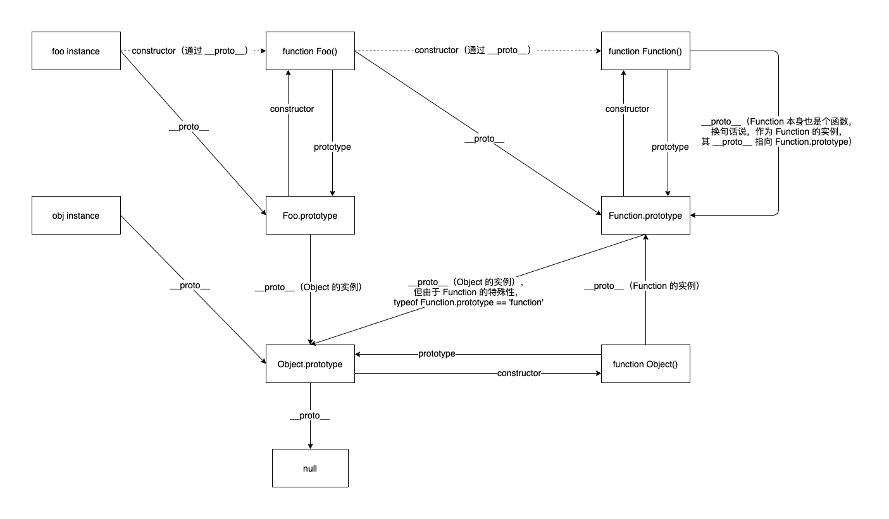
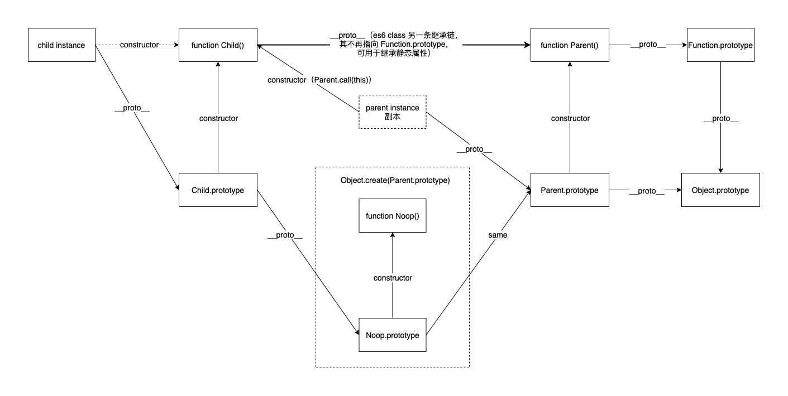

# JS 原型链、继承知识点

笔记而已，欢迎指正

## 原型链



### 一、整体梳理

1. `__proto__` 是实例所独有的，正常情况下指向其构造函数的 prototype

2. `prototype` 是函数独有的，函数声明后自带 prototype 对象

3. `constructor` 是 prototype 对象独有的，指向构造函数

4. 函数是 Function 的实例也是对象，所以函数同时拥有 `__proto__`、constructor

5. ES6 中 `__proto__` 可用 Object.getPrototypeOf 和 Object.getPrototypeOf 来操作

### 二、Function

Function 较为特殊

```js
typeof Function.prototype // "function"

Function.prototype instanceof Function // false

Function.prototype instanceof Object // true
```

1. 最简单的说法是 Function.prototype 类型是函数，是为了[兼容之前版本的 EcmaScript](https://stackoverflow.com/questions/4859308/in-javascript-why-typeof-function-prototype-is-function-not-object-like-ot)

2. Function.prototype 本身是一个对象，是 Object 的实例，只是内部实现了 `[[Call]]` 属性变得可以执行，返回 undefined

### 三、Object

1. Object 是函数，所以是 Function 的实例

```js
Object.__proto__ === Function.prototype // true
```

2. Object.prototype 是个对象，但它的 `__proto__` 为 null（原型链终点）

3. 普通函数是 Function 的实例，其 prototype 是 Object 的实例

```js
function Foo() {}

Foo.__proto__ === Function.prototype // true

Foo.prototype.__proto__ === Object.prototype // true
```

## 继承



### 一、Class 的继承实现

拥有两条继承链

1. 子类 prototype 原型指向父类 prototype，用于继承原型上的属性和方法

```js
class Parent {}

class Child extends Parent {}

Child.prototype.__proto__ === Parent.prototype // true
```

2. 子类原型指向父类，用于继承静态属性和方法

```js
Child.__proto__ === Parent // true
```

3. 内部实现时，子类构造函数中调用父类，用于继承实例属性和方法

```js
function Child() {
  Parent.call(this)
}
```

### 二、Babel polyfill

可自行在 [babel 官网编译](https://babeljs.io/repl)

```js
class Parent {
  constructor() {
    this.setup()
  }

  static level = 'parent'

  setup = () => {
    console.log("parent")
  }
}

class Child extends Parent {
  id = 61

  setup = () => {
    console.log("child")
  }

  getId() {
    console.log("child getId")
    return id
  }
}

new Child()
```

1. 函数属性 `setup`（或称函数表达式）被当做了普通属性，通过 defineProperty 实现

2. 函数声明 `getId` 则是挂在了 prototype 上

3. 另外属性赋值是在构造函数中完成，函数声明则是通过「继承闭包」与构造函数分开，再挂到 prototype

4. 上一点对 JS 的继承会有影响，由打印可见，`setup` 最终还是执行 parent 上的函数，就是因为 Child 在 `Parent.call(this)` 时，就已经把函数属性挂上去了

5. 虽然函数属性书写时绑定 this 方便，但在继承时需要额外注意

### 三、instanceof

1. polyfill：通过不断迭代 `__proto__`，并与查找对象的 prototype 做对比，直到遇到 null，即原型链终点

```js
function instanceOf(object, target) {
  while (object != null) {
    if (object == target.prototype) return true
    object = object.__proto__
  }
  return false
}

instanceOf(new Date(), Object) // true
```

2. 查找细节

```js
function A() {}
function B() {}

// 1
A.prototype = B.prototype

// 2
A.prototype = new B()

// 3
A.prototype = Object.create(B.prototype)

const a = new A()
```

- 2、3 都是继承的“半成品”，只继承了 B 原型上的属性和方法，操作 A.prototype 不会影响 B.prototype

- 1 是赋值，A、B 共用一个原型对象，操作其中一个会影响另一个。但用 instanceof 判断

```js
B.prototype.constructor === B // true

a instanceof A // true

a instanceof B // true
```

3. 可知，instanceof 查找时有且只对比了原型对象，prototype.constructor 不会影响 instanceof 的判断

4. prototype.constructor 原本是 JS 设计的遗留产物，直到 [ES6 时才正式定义和使用](https://stackoverflow.com/a/35538702/12600517)。为保持良好的习惯，应该尽量让原型的 constructor 指向其构造函数
