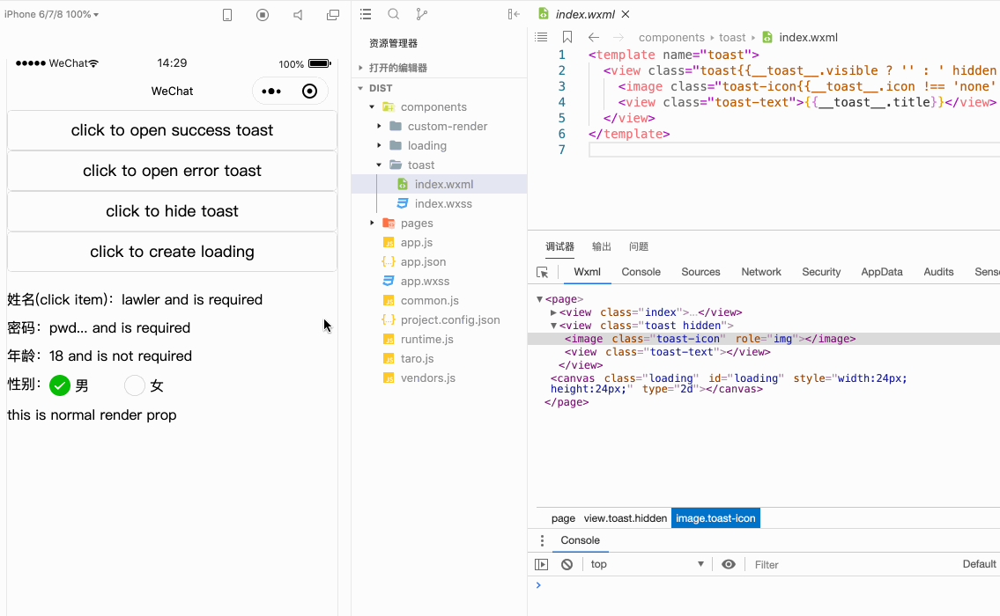
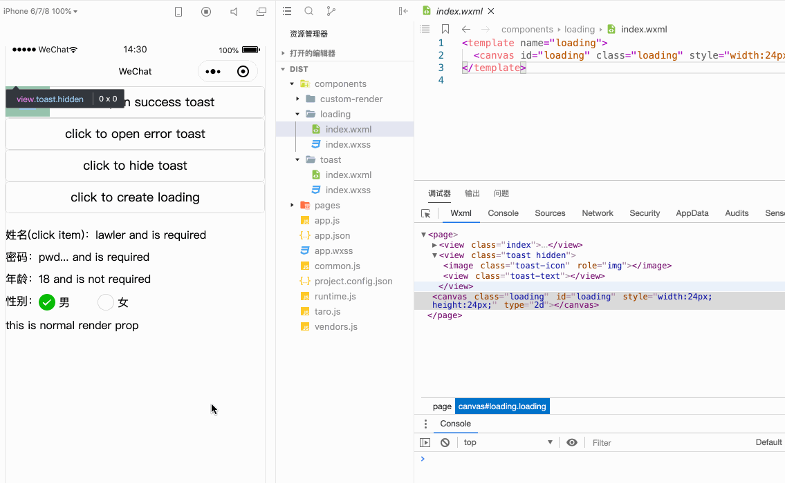
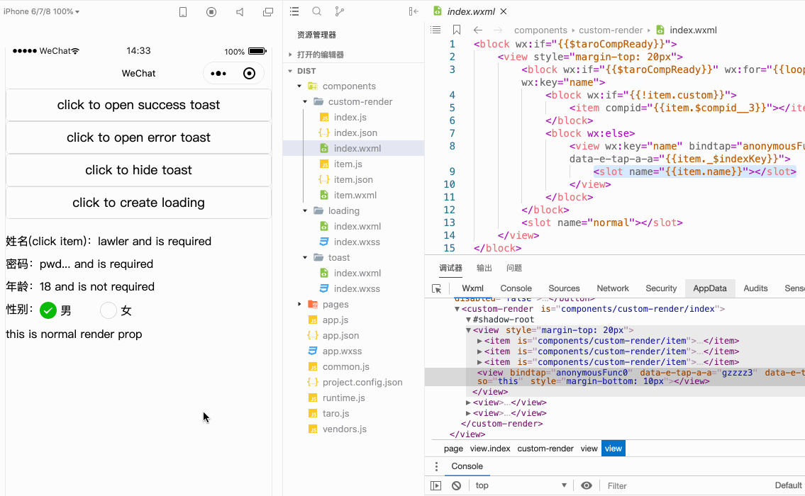

# Taro 小程序开发，你急需的一些“骚操作”

公司开始涉及小程序的业务，由于我们部门以 `React` 技术栈为主，调研过后决定采用京东的 [Taro 框架](https://nervjs.github.io/taro) 。但实际开发还是遇到很多坑，于是总结了一些，也造了些轮子，决定分享出来

## 定制化 toast（或 modal） api

小程序虽然提供了 toast 和 modal 等 [交互 api](https://developers.weixin.qq.com/miniprogram/dev/api/ui/interaction/wx.showToast.html)，Taro 中也同理。但产品希望定制化样式、图标、位置和文字长度，没办法自己搞吧

### 一、效果演示

1. 通过全局的 api 调用 toast 的 show 和 hide

2. 每个界面不手动引入组件的情况下，都可调用



### 二、监听界面路由

1. 首先每个界面都可调用，维护一个全局 store 是最简单的。再动态读取当前界面，然后设置对应界面下的状态

2. 全局 store 简单，读取当前界面呢，还好小程序提供了 [getCurrentPages api](https://developers.weixin.qq.com/miniprogram/dev/reference/api/getCurrentPages.html)

```js
const pages = getCurrentPages()
const curPage = pages[pages.length - 1] || {}
```

3. 那动态读取呢，说白了就是监听路由变化，注意这个是监听全局的路由，Taro 的 componentDidShow，componentDidHide 是 handle 不住的。找了很久在 [微信开放社区一个讨论](https://developers.weixin.qq.com/community/develop/doc/00006a3e9d0940015dc7e54cf5ec00) 搜到了 `wx.onAppRoute`

```js
wx.onAppRoute(res => {
  // 更新全局 store 的 currentPage
})
```

### 三、引入的偷懒：混合开发是真谛

1. 由于不想手动在每个界面引入组件，还好小程序有 [template](https://developers.weixin.qq.com/miniprogram/dev/reference/wxml/template.html) 机制再配合 `import` 即可。那么搞个脚本，在 build 后把 string append 到最后就行

```js
// pages/demo/index.tsx 打包出来的 pages/demo/index.wxml
<block wx:if="{{$taroCompReady}}">
  <view class="demo">Demo page</view>
</block>

// 手动 append toast
<block wx:if="{{$taroCompReady}}">
  <view class="demo">Demo page</view>
</block>
<import src="../../components/toast/index.wxml" />
<template is="toast" data="{{__toast__}}" />
```

2. 关于数据的交互，手动注入模板到 build 后的文件中，那么想在 Taro Component 层面操作就别想了，索性刚提到的 `getCurrentPages` 中有原生的 [setData api](https://developers.weixin.qq.com/miniprogram/dev/reference/api/Page.html#Page.prototype.setData(Object%20data,%20Function%20callback))。那给模板中搞个变量即可：`<template is="toast" data="{{__toast__}}" />`

### 四、toast 实现

技术细节都梳理了，开始愉快的敲代码

1. @/utils/page 简单封装了下

```js
let _currentPage: Taro.Page = {}

export const $page = {
  get() {
    return _currentPage
  },
  update() {
    // 更新当前的 page
    const pages = getCurrentPages()
    _currentPage = pages[pages.length - 1] || {}
  },
  setData(key: string, source: any, force = false) {
    _currentPage.setData({ [key]: source }) // 原生的 setData
    force && _currentPage.$component.forceUpdate() // taro 层面的 forceUpdate，按需使用
  },
  getData(key: string) {
    return _currentPage.data[key]
  },
}
```

2. 撸个 Toast 类，由于是全局引用，用 static + 单例

```js
const iconFactory = {
  success: successSvg,
  error: errorSvg,
}

export default class Toast {
  static instance: Toast

  page: Taro.Page
  visible = false

  static create() {
    if (!this.instance) this.instance = new Toast()
    return this.instance
  }

  // 定义便捷 api
  static success(title: string, during?: number, config?: Omit<ToastConfig, 'title' | 'during'>) {
    return Toast.show({ title, during, ...Object.assign({}, config, { icon: 'success' }) })
  }

  // 定义便捷 api
  static error(title: string, during?: number, config?: Omit<ToastConfig, 'title' | 'during'>) {
    return Toast.show({ title, during, ...Object.assign({}, config, { icon: 'error' }) })
  }

  // 定义便捷 api
  static info(title: string, during?: number, config?: Omit<ToastConfig, 'title' | 'during'>) {
    return Toast.show({ title, during, ...Object.assign({}, config, { icon: 'none' }) })
  }

  // 可自定义调用 api
  static async show(config: ToastConfig) {
    if (this.instance.visible) return
    this.instance.visible = true

    const { title, icon = 'none' } = config

    // 这里开始操作数据给模板
    $page.setData('__toast__', {
      visible: true,
      title,
      icon: iconFactory[icon] || icon,
    })
  }

  static async hide() {
    if (!this.instance.visible) return
    // 隐藏 toast
    $page.setData('__toast__', {
      visible: false,
    })
    this.instance.visible = false
  }
}
```

3. App 挂在时初始化，同时监听路由，然后就直接使用咯

```js
import toast from '@/utils/toast'
import $page form '@/utils/page'
class App extends Component {
  componentWillMount() {
    toast.create()

    wx.onAppRoute(res => {
      toast.hide()
      $page.update() // 上一个界面 toast 隐藏后再更新 page
    })
  }

  render() {
    return <Index />
  }
}

class Index extends Component {
  render() {
    return (
      <View className='index'>
        <Button onClick={() => toast.success('成功提交请求')}>success</Button>
        <Button onClick={() => toast.hide()}>hide</Button>
      </View>
    )
  }
}
```

4. toast wxml，这就很简单了，原生写法

```js
<template name="toast">
  <view class="toast{{__toast__.visible ? '' : ' hidden'}}">
    <image class="toast-icon{{__toast__.icon !== 'none' ? '' : ' hidden'}}" src="{{__toast__.icon}}"></image>
    <view class="toast-text">{{__toast__.title}}</view>
  </view>
</template>
```

5. 模板注入 script。哪里找到所有 pages 呢，其实 Taro 打包后会生成 app.json，里面记录了所有注册的 page，然后去取相应 index.wxml 即可

```js
const fs = require('fs')
const path = require('path')
const outputDir = 'dist/'
const appJson = 'app.json'
const str = `
  <import src="../../components/toast/index.wxml" />
  <template is="toast" data="{{__toast__}}" />
`
let initPages = []

start()

async function start() {
  // 获取所有的 page index.wxml
  initPages = await getInjectPages()
  // 模板写入进去
  await injectAll(initPages, str)
}

function getInjectPages(jsonName = appJson) {
  const appJsonPath = getAbsPath(outputDir, jsonName)
  const suffix = '.wxml'

  return new Promise((resolve, reject) => {
    // check app.json
    if (fs.existsSync(appJsonPath)) {
      const pageJson = require(appJsonPath)
      const pages = (pageJson.pages || []).map(p => outputDir + p + suffix)

      // check all pages
      if (!pages.some(p => !fs.existsSync(p))) resolve(pages)
      else reject('did not find all pages')
    }
  })
}

async function injectAll(pages, template) {
  const injectPromises = pages.map(p => {
    return new Promise((resolve, reject) => {
      fs.appendFileSync(p, template, 'utf8')
      resolve()
    })
  })

  await Promise.all(injectPromises)
}
```

6. bootstrap

```js
"scripts": {
  "build:weapp": "rm -rf dist && taro build --type weapp",
  "inject": "node scripts/import-toast.js"
}

yarn build:weapp
yarn inject
```

## 使用 canvas 加载 json 动画

### 一、效果演示



### 二、原生支持

1. 小程序没有 svg 标签，有些复杂动画不好实现，还好有官网支持 [lottie-miniprogram](https://github.com/wechat-miniprogram/lottie-miniprogram)

2. 用法

```js
// wxml
<canvas id="canvas" type="2d"></canvas>

// js
import lottie from 'lottie-miniprogram'
wx.createSelectorQuery()
  .selectAll('#loading') // canvas 标签的 id
  .node(([res]) => {
    const canvas = res.node
    const context = canvas.getContext('2d')
    lottie.setup(canvas)
    lottie.loadAnimation({
    animationData: jsonData, // 加下 json 文件
    rendererSettings: { context },
  })
}).exec()
```

### 三、api 调用 loading

1. 需要注意的是，测试时发现如果把以上抽成一个组件然后在 page 中引用，`createSelectorQuery` 方法会报错找不到该 canvas id，但放在 page 中就可以。**初步断定是组件引用时 canvas 组件会出现在 shadow dom 中，而调用该 api 必须实写 canvas，有错望指正**

2. 那么组件调用方式不行，就用 api 吧。方法同上还是那几步：监听路由、全局 store 通过 setData 传递变量、在原生模板中使用、script 注入

## 更自由的 render props

使用 Taro [render props](https://nervjs.github.io/taro/docs/render-props.html) 传组件并附带一些逻辑时，总是有各种问题和限制，很烦

### 一、效果演示



### 二、Taro 打包的研究

1. 看了下 Taro 对于 render props 的打包处理，其实就是 [slot](https://developers.weixin.qq.com/miniprogram/dev/framework/custom-component/wxml-wxss.html) + `template` 嘛

2. index page 中引用 CustomRender 组件并向其传递 `renderNormal={() => <View>render prop</View>}` 打包如下：

```js
// pages/index/index.wxml
<block wx:if="{{$taroCompReady}}">
  <view class="index">
    <custom-render compid="{{$compid__3}}">
      // 重点在这，这是插槽的内容
      <view slot="normal">
        <view>
          <template is="renderClosureNormalgzzzz" data="{{...anonymousState__temp}}"></template>
        </view>
      </view>
    </custom-render>
  </view>
</block>
// 打包生成的 template 不用管
<template name="renderClosureNormalgzzzz">
  <block>
    <view>render prop</view>
  </block>
</template>


// components/custom-render/index.wxml
<block wx:if="{{$taroCompReady}}">
  <view>
    // 这是对应的插座
    <slot name="normal"></slot>
  </view>
</block>
```

3. **面向 slot 编程！** Taro 对于小写的组件是不编译的，会直接复制过去，所以我们可以进行“混合开发”

```js
class Index extends Component {
  render() {
    return (
      <View className='index'>
        <CustomRender renderNormal={() => <View>normal render prop</View>}>
          // 自定义的 render props
          <view slot='gender'>
            <View>this is my slot</View>
          </view>
        </CustomRender>
      </View>
    )
  }
}

class CustomRender extends Component {
  render() {
    return (
      <View>
        // 申明插座
        <slot name='gender' />
        {this.props.renderNormal()}
      </View>
    )
  }
}
```

### 三、动态 slot

1. 还不够自由？不就是动态嘛！来！

场景：form 表单中，如果 data 中 custom: true 则渲染 slot，否则渲染常规 item

```js
class Index extends Component {
  render() {
    return (
      <View className='index'>
        <CustomRender
          data={[
            { name: 'name', label: '姓名', value: 'lawler' },
            { name: 'password', label: '密码', value: 'pwd...' },
            { name: 'gender', custom: true }, // 自定义渲染 gender item
          ]}
          renderNormal={() => <View>normal render prop</View>}
        >
          // 小写申明 custom 的 slot 内容
          <view slot='gender'>
            <View>性别：男 radio ？ 女 radio</View>
          </view>
        </CustomRender>
      </View>
    )
  }
}

class CustomRender extends Component {
  render() {
    const { data } = this.props
    return (
      <View>
        {data.map(item => {
          const { name, label, value custom } = item
          if (!custom) return <View>{`normal item, ${label}: ${value}`}</View>
          // 动态插槽，快乐就完事!!
          return <slot name={name} />
        })}
        {this.props.renderNormal()}
      </View>
    )
  }
}
```

## 最后

1. 源码获取：[taro mini demo](https://github.com/lawler61/blog/tree/master/js/taro-mini/demo)

2. 关于 script 注入模板 在 taro watch 模式时，我们改变 pages 中的 index.tsx 它是会重新生成 index.wxml 的，所以必须再 yarn inject，但这不影响项目最后的 build

3. 想在开发时不那么麻烦，就得用 fs.watch 监听 build 下的 index.wxml，如果改变了就自动 append 模板。当然这个脚本服务于公司内部，就不分享出来了，感兴趣的可以邮件私信我~

4. 喜欢的小伙伴，记得留下你的小 ❤️ 哦~

## 参考资料

- [微信小程序：lottie-miniprogram](https://developers.weixin.qq.com/miniprogram/dev/extended/utils/lottie.html)

- [NervJS/taro-sample-weapp](https://github.com/NervJS/taro-sample-weapp)
