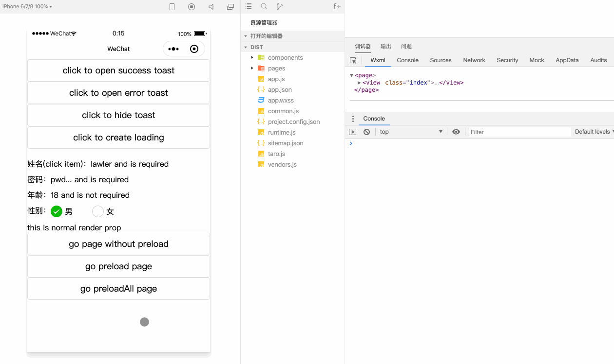

# Taro 小程序开发——关于 preload 的尝试

最近研究了下 Taro 的源码才发现原来，官网是有出 [preload](https://nervjs.github.io/taro/docs/optimized-practice/#%E5%9C%A8%E5%B0%8F%E7%A8%8B%E5%BA%8F%E4%B8%AD%EF%BC%8C%E5%8F%AF%E4%BB%A5%E4%BD%BF%E7%94%A8-thispreload-%E5%87%BD%E6%95%B0%E8%BF%9B%E8%A1%8C%E9%A1%B5%E9%9D%A2%E8%B7%B3%E8%BD%AC%E4%BC%A0%E5%8F%82) 的方案的，但后面分析自身的场景，发现并不适用，于是记录下我们组在**小程序 preload** 方面的尝试

## Taro 官网 preload

### 一、使用姿势

1. Page 层面申明 componentWillPreload 函数并返回一个 Promise，在调用原生 navigateTo 之前帮你发送请求

2. 在 Page 实例化走 componentWillMount 钩子时将之前的 Promise 赋值给 this.$preloadData，这样就能继续请求之后的事

```js
class Index extends Component {
  componentWillMount() {
    this.$preloadData.then(res => {
      console.log('your data:', res)
    })
  }

  componentWillPreload(params) {
    return fetch(params)
  }
}
```

3. 源码实现

- 从源码中可以看出，传递给 componentWillPreload 的参数是我们调用 navigateTo 时 url 的 query 对象

- 如果 cacheData 中有 url 对应的 Component，那么 Component 也会 preCreate，然后保存在 cache 中

```js
// https://github.com/NervJS/taro/blob/2.x/packages/taro-weapp/src/native-api.js#L137
taro[key] = (options, ...args) => {
  options = options || {}
  let obj = Object.assign({}, options)

  // 代理原生的 navigateTo 和 redirectTo
  if (key === 'navigateTo' || key === 'redirectTo') {
    let url = obj['url'] ? obj['url'].replace(/^\//, '') : ''

    const Component = cacheDataGet(url)
    if (Component) {
      // 预先生成 Component 实例
      const component = new Component()
      if (component.componentWillPreload) {
        const cacheKey = getUniqueKey()
        const params = queryToJson(obj.url)
        obj.url += '?' + `${preloadPrivateKey}=${cacheKey}`
        // 执行 componentWillPreload 并放入 cache 中
        cacheDataSet(cacheKey, component.componentWillPreload(params))
        cacheDataSet(preloadInitedComponent, component)
      }
    }
  }

  return new Promise((resolve, reject) => {
    // 调用原生 api
    task = wx[key](obj, ...args)
  })
}
```

- 存的 component 哪里取呢，当然是在正式创建 Component 实例的时候

```js
// https://github.com/NervJS/taro/blob/2.x/packages/taro-weapp/src/create-component.js#L337
const weappComponentConf = {
  data: initData,
  created(options = {}) {
    // 小程序走原生 created 钩子时先判断是否预警实例化过 Component
    if (isPage && cacheDataHas(preloadInitedComponent)) {
      this.$component = cacheDataGet(preloadInitedComponent, true)
      this.$component.$componentType = 'PAGE'
    } else {
    // 没有则 new
      this.$component = new ComponentClass({}, isPage)
    }
    this.$component._init(this)
    // 挂上 $router 的信息
    Object.assign(this.$component.$router.params, options)
  },
}

```

- 还有一点，cacheData 中存的对应 url <-> Component 哪来的呢

```js
// https://github.com/NervJS/taro/blob/2.x/packages/taro-weapp/src/create-component.js#L424
const weappComponentConf = {...}
if (isPage) {
  weappComponentConf.methods = weappComponentConf.methods || {}
  // ...
  // 这里 cacheData 存上 url 和 Component
  __wxRoute && cacheDataSet(__wxRoute, ComponentClass)
} else {}
```

### 二、问题分析

1. 由源码分析可知，componentWillPreload 预请求只能针对于第二次进入界面才有效，因为第一次 Taro 自己都拿不到 ComponentClass。但小程序本身（如微信）是做了第一次进入后的优化的，即第二次进入本身就比第一次快很多（如下图控制台），所以对于 preload 来说，第一次尤为重要，但 Taro 中无法实现

2. 传参限制：我们已经知道 componentWillPreload params 是来自于 url 的 query，就是说我们要使用的参数必须全部 stringify 到 url 上，那如果预请求的参数需要用数组、对象或是对象数组，又或者参数有 20 个呢，全部写到 query 上？那不现实，也不灵活

3. 业务上移：使用 componentWillPreload 就意味着，请求接口必须和界面相绑定，预请求的接口必须通过界面来发送，也必须要 componentWillMount 中使用。而实际开发时肯定有这种场景，一个在多个界面复用的 store 或组件，本身承担了发请求的工作，然后供界面或界面级 store 使用，如果你要用 preload，每个界面都单独写一遍发送接口逻辑？高度臃肿，且业务逻辑要上移到 Page 中，可维护性降低


## 基于接口的 preload

综合了以上痛点，讨论出基于缓存接口的 preload 方案

### 一、使用姿势

1. 维护个全局的 preloadApi 对象，key 为需要 preload 的 page，值为该 page 需要发送的请求

2. 在调 navigateTo 之前，先发送下个界面的需要的 preload api，将 Promise 存起来

3. 实例化后 Page 钩子或 store 中正常使用该 api，只是再调用时，会先判断下缓存，有的话则直接返回

```js
// utils/cache.ts
export const cache = {}

// api/index.ts
import { cache } from '@/utils/cache'

export const getUser = (id = '') => {
  // 该 api 的唯一标志
  const url = '/userInfo'
  const api = cache[url]
  // 有缓存则走缓存
  if (api) {
    delete cache[url]
    return api
  }

  const p = fetchUser({ id })
  // 给 Promise 绑上 url
  p.url = url
  return p
}

export const preloadApi = {
  // 申明 page 对应的 preload api
  '/pages/preload/index': [
    ({ id }) => getUser(id),
  ],
}

// utils/history.ts 封装原生 api
const history = {
  go(url, params) {
    return navigateTo({ url, ...params })
  },
  replace(url, params) {
    return redirectTo({ url, ...params })
  },
  // ...
}

['go', 'replace'].forEach(type => {
  const fn = history[type]
  history[type] = (url, params) => {
    const { query = {}, ...restParams } = params
    // 根据 url 获取对应 apis
    const apis = preloadApi[url]

    if (Array.isArray(apis)) {
      apis.forEach(api => {
        // 给 api 传参，可以就不限于 query
        const p = api({ ...query, ...restParams })
        // 根据挂上的 url 缓存 Promise
        cache[p.url] = p
      })
    }
    // call original
    fn.apply(history, [`${url}?${qs.stringify(query)}`, restParams])
  }
})
```

4. page 中使用，业务对 preload 无感知

```js
import { getUser } from '@/api'

export default class PreloadPage extends Component {
  state = {
    loading: true,
    user: {},
  }

  componentWillMount() {
    this.request()
  }

  request = async () => {
    // 实际调用时可以不传参
    const user = await getUser()
    this.setState({ user, loading: false })
  }

  render() {
    const { loading, user } = this.state
    console.log('render, loading:', loading)
    return (
      <View>
        {loading ? (
          <View>loading...</View>
        ) : (
          <View>user: {user}</View>
        )}
      </View>
    )
  }
}
```

5. Promise.all 的场景，肯定有一个界面发多个请求的

```js
// api/index.ts
export const getUser = (id = '') => {...}

export const getPermission = () => {
  const url = '/userPermission'
  const api = cache[url]
  if (api) {
    delete cache[url]
    return api
  }

  const p = fetchPermissions()
  p.url = url
  return p
}

export const preloadApi = {
  '/pages/preload/index': [({ id }) => getUser(id)],
  // 记录两个即可
  '/pages/preloadAll/index': [({ id }) => getUser(id), () => getPermission()],
}

// pages/preloadAll/index.tsx
import { getUser, getPermission } from '@/api'

export default class PreloadAllPage extends Component {
  state = {
    loading: true,
    user: {},
    perm: {},
  }

  componentWillMount() {
    this.request()
  }

  request = async () => {
    // 直接使用就行了
    const [user, perm] = await Promise.all([getUser(), getPermission()])
    this.setState({ user, perm, loading: false })
  }

  render() {...}
}
```

### 二、优缺点

1. 对第一次加载界面也可做 preload

2. 封装了原生 api，可针对需求传参，不局限于 query，更加灵活

3. 业务代码无感知，正常使用 api。子组件，子 store 等均可调用

4. 调用时机提前，由于不和 Page 绑定，所以不用像 Taro 一样在实例化后，通过原生的 created 钩子才给 this.$preloadData 赋值，现在在 constructor 也可调用（当然 Taro 中会走两次）

5. 良好的可维护性，如果需要增减 prelod 的 api，修改全局的 preloadApi 就行，Page 只需要更改相应的取值

6. 小缺点就是，在 preloadApi 中申明了一次，在实际业务代码中调用时也要写一次，有点难受，但还没想到很好的解决办法

7. 而且，实际业务中的 api 是不用传值的（传了也没用，走的 cache），这让其他人来看代码就比较懵逼，当然其实是推荐你完整传参的，这样 preload api 更改时也不至于多改代码

## 极致的优化

如果你仔细思考，就会发现上面提到的其实还有可优化的点，就是小程序第一次进界面都会很慢，而很多时候接口都已经返回了，可以当做同步数据来处理

但我们还是用 Promise.then 来延后处理，这导致界面会多走一次 loading 为 true 的 render，这样会快速显示 loading 的逻辑，然后 then 后闪为 loading 为 false 的 render，如第一幅图所示

### 一、同步的 Promise

1. 于是我有个大胆的想法，如果 preload api 已经返回了，能否变为同步的 Promise 呢，但修改后的 “Promise” 仍可以调用原来的 then，但却会同步的执行

2. 说白了就是手撸个 Promise 嘛，Promise 原理很简单，内部维护 fulfilledCallback，rejectedCallback 两个队列，每次 then 会 push 入栈，当调用 resolve 或 reject 时再 forEach 执行，当然具体会用到 setTimeout 和递归

3. 我参考了 [es6-promise](https://github.com/stefanpenner/es6-promise) 这个库，喜欢的自行了解吧。同步 Promise 实现你可以理解为删除了 setTimeout 和 队列

```js
class ThenSync<R> implements Thenable<R> {
  private data: any = null
  status: 'pending' | 'resolved' | 'rejected' = 'pending'

  constructor(executor) {
    // resolve 回调
    const resolve = (value?: R | Thenable<R>) => {
      if (this.status === 'pending') {
        this.status = 'resolved'
        this.data = value
      }
    }
    // reject 回调
    const reject = (err?: any) => {
      if (this.status === 'pending') {
        this.status = 'rejected'
        this.data = err
      }
    }
    executor(resolve, reject)
  }

  then<U>(onFulfilled,onRejected): ThenSync<U> {
    const that = this
    let t2: any = null
    let x: any

    if (that.status === 'resolved') {
      t2 = new ThenSync((resolve, reject) => {
        try {
          x = onFulfilled!(that.data)
          resolvePromise(t2, x, resolve, reject)
        } catch (err) {
          reject(err)
        }
      })
    } else {
      // rejected
      t2 = new ThenSync((resolve, reject) => {
        try {
          x = onRejected!(that.data)
          resolvePromise(t2, x, resolve, reject)
        } catch (err) {
          reject(err)
        }
      })
    }
    // new thenable
    return t2
  }

  catch<U>(onRejected): ThenSync<U> {
    return this.then(null as any, onRejected)
  }
}
```

4. 使用

```js
const aa = new ThenSync(resolve => {
  console.log(1);
  resolve(100);
});

const res = aa
  .then(d => {
    // 正常使用
    console.log(2, d);
    return d;
  })
  .then(d => {
    console.log(3, d);
    // 嵌套使用
    return new ThenSync(r => r(d + 2));
  })
  .then(d => {
    // throw err
    console.log(4, d);
    throw new Error("err");
  })
  .catch(err => {
    console.log(5, err.message);
  });
console.log("sync code");


// 会打印
1
2 100
3 100
4 102
5 "err"
"sync code"
```

5. syncify，那么如果将异步的 Promise 转换为同步的呢，首先我们不想改变 `cache[url] = p` 存的 Promise，为啥，因为懒。那反正都要调用 then 和 catch 的，就改这两个方法吧

```js
function syncify<R>(obj: any, res: R) {
  if (!isPromise(obj)) return obj
  const hack = new ThenSync(r => r(res))
  // 注意这里只是改的 Promise 实例的方法
  obj.then = hack.then.bind(hack)
  obj.catch = hack.catch.bind(hack)
  // 挂上已同步的标志
  obj[THEN_SYNC] = hack
  return obj
}
```

6. 那么在 api resolved 后的 then 中 syncify。但要注意如果 Page 业务已经 api 了，但 api 还没 resolved 这时就不要 syncify 了

```js
function syncPromise<T>(promise: Promise<T>) {
  const p: any = promise.then(res => {
    // 如果正式使用时接口还没回来，则直接返回
    if (p[THEN_SYNC] === false) return res
    syncify(p, res)
    return res
  })
  return p as Promise<T>
}

// utils/history.ts
['go', 'replace'].forEach(type => {
  history[type] = (url, params) => {
    // ...
    if (Array.isArray(apis)) {
      apis.forEach(api => {
        const p = api(query)
        // 挂上同步 Promise
        cache[p.url] = syncPromise(p)
      })
    }
    // ...
  }
})

// api/index.ts
export const getUser = (id = '') => {
  const url = '/userInfo'
  const api = cache[url]
  if (api) {
    // 业务正式调用 api，如果没有 THEN_SYNC 标志，说明接口还没返回，则不用 syncify
    if (!api[THEN_SYNC]) {
      api[THEN_SYNC] = false
    }
    delete cache[url]
    return api
  }
  // ...
```

7. 业务代码完全无感知，你给我异步还是同步的 Promise，我都是调用 then，效果图如下。另外可以看到第一次 preload 调用 api 和界面正式调用 api 足足相差了 943 ms，正常的话接口已经回来了，这也反过来证实 sync Promise 的必要性


### 二、Promise.all 的难点

1. 那么现在遇到了难点就是如何处理 Promise.all 呢，为啥，因为 Promise.all 是内部自己 new 了个异步的 Promise 啊

```js
// 单个请求
request = async () => {
  const user = await getUser()
  this.setState({ user, loading: false })
}

// 等同于
request = () => {
  // 可以从 cache 中取 Promise，同时这个 Promise 可能已经被 syncify
  return getUser().then(user => {
    this.setState({ user, loading: false })
  })
}

// 而 Promise.all
request = async () => {
  const [user, perm] = await Promise.all([getUser(), getPermission()])
  this.setState({ user, perm, loading: false })
}

// 等同于
request = () => {
  return Promise.all([getUser(), getPermission()])
    // 注意就是这！这个由 Promise.all 产生的 Promise 无法与之前缓存的 getUser() 的 Promise 关联，自然也无法 syncify
    .then(([user, perm]) => {
      this.setState({ user, perm, loading: false })
    })
}
```

2. 如何让 Promise.all 产生的 Promise 与 cache 的 Promise 产生关联呢，你又不能改 Promise 源码，改 Promise.all。那怎么办呢，实际上我们想左右异步函数的执行，根据我们的需求返回相应的 Promise 是吧。那么 [Generator](https://developer.mozilla.org/zh-CN/docs/Web/JavaScript/Reference/Global_Objects/Generator) 它来了！

3. 自己手撸个异步函数执行器，通过监听 yield 的返回值，去定制化返回，期间加上我们自己的逻辑。那么怎么少的了 [tj 大神的 co 库](https://github.com/tj/co)

```js
export function co<R>(gen,...args): Promise<R> {
  const that = this
  // 记录是否已同步
  let isAsync = true
  let finalRes
  const p: any = new Promise((resolve, reject) => {
    onFulfilled()

    function onFulfilled(res: any = undefined) {
      let ret
      try {
        ret = gen.next(res)
      } catch (err) {
        return reject(err)
      }
      next(ret)
      return null
    }

    function onRejected(err: any) {...}

    // next 递归执行
    function next(ret) {
      const { value, done } = ret
      if (done) {
        finalRes = value
        return resolve(value)
      }
      const finalValue = toPromiseWithPreload.call(that, value)

      if (isPromise(finalValue)) {
        // 如果请求已经返回则返回同步的 Promise
        finalValue[THEN_SYNC] && (isAsync = false)
        return finalValue.then(onFulfilled, onRejected)
      }
      return ...
    }
  })
  // 根据标志返回相应 Promise
  return isAsync ? p : syncify(p, finalRes)
}

function toPromiseWithPreload(this: any, thing: any) {
  if (isPromise(thing)) return thing
  // yield [Thenable, Thenable]
  if (Array.isArray(thing)) {
    // 查看任意一个 api 是否含有 all 的 key
    const key = thing[0][THEN_ALL]
    // 未缓存时直接返回
    if (!key) return Promise.all(thing)

    const allApi = cache[key]
    if (!allApi[THEN_SYNC]) {
      allApi[THEN_SYNC] = false
    }
    delete cache[key]
    // 定制化返回我们之前存的 allApi
    return allApi
  }
  return thing
}
```

4. 那么原生封装稍微改下

```js
// utils/history.ts
['go', 'replace'].forEach(type => {
  history[type] = (url, params) => {
    // ...
    if (Array.isArray(apis)) {
      // 是否为 Promise.all 的预请求
      const isAll = apis.length > 1
      const promises = apis.reduce((arr, api) => {
        const p = api({...query, ...restParams})
        // 单个 Promise 跟 Promise.all 产生关联
        isAll && (p[THEN_ALL] = `${url}all`)
        arr.push(p)
        cache[p.url] = isAll ? p : syncPromise(p)
        return arr
      }, [])
      // 多存一个 all 的 api，正对于 Promise.all syncify
      isAll && (cache[`${url}all`] = syncPromise(Promise.all(promises)))
    }
    // ...
  }
})
```

5. 使用如下，也是亲代码性的修改

```js
import { co } from '@/utils/thenSync'

class PreloadAllPage extends Component {
  state = {...}

  componentWillMount() {
    co(this.request)
  }

  *request() {
    // 不用再写 Promise.all
    const [user, perm] = yield [getUser(), getPermission()]
    this.setState({ user, perm, loading: false })
  }

  render() {...}
}
```

6. 效果图如下



## 最后

1. 源码获取：[taro mini demo](https://github.com/lawler61/blog/tree/master/js/taro-mini/demo)

2. 喜欢的小伙伴，记得留下你的小 ❤️ 哦~

## 参考资料

- [taro-weapp](https://github.com/NervJS/taro/tree/2.x/packages/taro-weapp)

- [es6-promise](https://github.com/stefanpenner/es6-promise)

- [tj/co](https://developer.mozilla.org/zh-CN/docs/Web/JavaScript/Reference/Global_Objects/Generator)
