# hexo-to-your-server

带你跳过各种坑，一次性把 Hexo 博客部署到自己的服务器

完成效果：[点击查看个人网站](https://omyleon.com)

## 一、开始

### 配置本地 node 环境

1. `node`下载 [官网下载](https://nodejs.org/zh-cn/download/)，安装记得把目录改到其他盘，这里我具体是在 `D:\programming\nodejs`

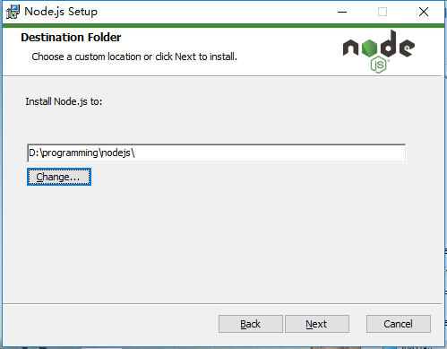

打开`cmd`查看`node`安装情况

```bash
node -v
npm -v
```

3. 配置全局环境

进入安装目录，创建文件夹`node_global`和`node_cache` 并执行

```bash
npm config set prefix "D:\programming\nodejs\node_global"
npm config set cache "D:\programming\nodejs\node_cache"
```

环境配置：新增环境变量`NODE_PATH`和添加`Path`，两个值都为 `D:\programming\nodejs\node_global`

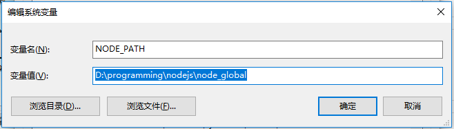

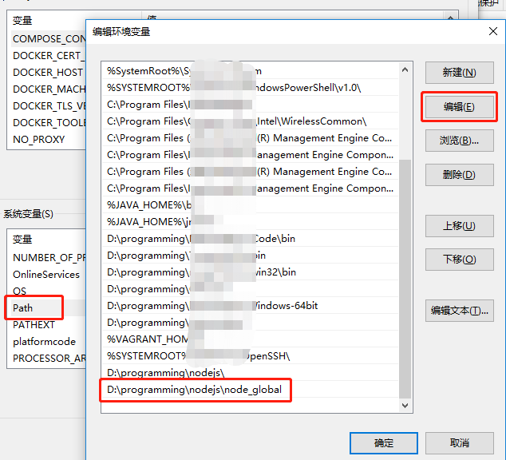

4. 安装`hexo-cli`

```bash
npm i hexo-cli -g
hexo
```

如果显示下面情况，恭喜你成功全局模块调用

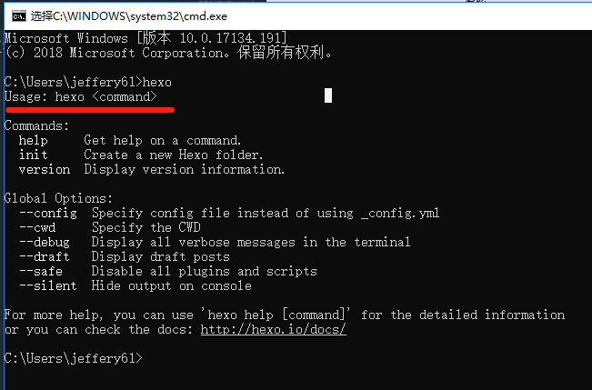

5. 如果出现`命令未找到，或不是可执行程序`，别着急！**先仔细重复 3-4 步**，一般是能够给解决的，如果实在是不能解决，往后看

6. 随便找个地方初始化文件，执行如下命令：

```bash
mkdir hexo-blog
cd hexo-blog && npm init -y
```

现在有 3 种解决方法，**任选其一**

- 法 1：检查全局目录是否的`hexo`模块，执行如下命令：

```bash
D:\programming\nodejs\node_global\hexo
```

- 法 2：如果觉得每次加前缀麻烦，使用`link`命令链接

```bash
npm link hexo
```

package.json 中新建脚本如下

```bash
npm run hexo
```

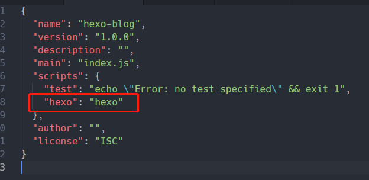

- 法 3：你还可以直接在`hexo-blog`中下载

```bash
npm i hexo-cli
npm run hexo （还是要在package.json中新建脚本）
```

### 初始化`hexo`项目

1. 如果是按照上一节步骤 4 过来的，则在`hexo-blog`文件下初始化

```bash
hexo init myblog && cd myblog
npm i
```

2. 下载主题

```bash
git clone https://github.com/iissnan/hexo-theme-next themes/next
```

在**本地配置文件**中设置`theme`属性

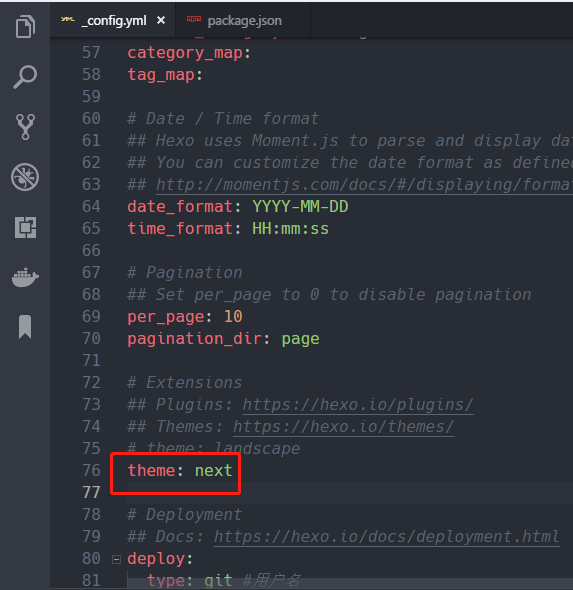

3. 本地执行`hexo`项目，添加`start`脚本

```bash
npm start
```

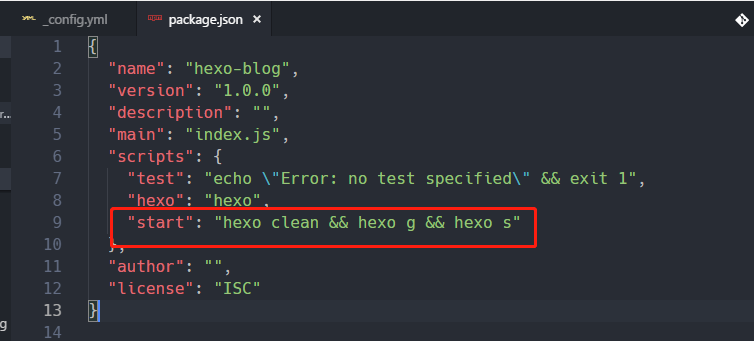

打开 [http://localhost:4000](http://localhost:4000) 验证效果吧

### `git`环境搭建

1. `git`安装：[官网下载](https://git-scm.com/downloads)

2. 生成`ssh`认证，执行如下命令

```bash
git config --global user.name "yourname"
git config --global user.email youremail@example.com
ssh-keygen -t rsa -C "youremail@example.com"
git config --global core.autocrlf false  // 禁用自动转换，这个不设置后面上传时会出现警告，如下
```

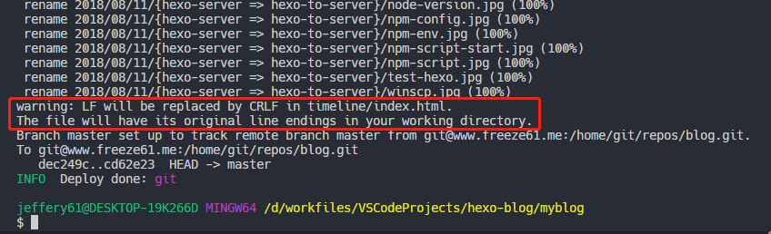

最后获取到的`ssh`认证在`C:\Users\yourname\.ssh`中

---

## 三、服务器配置

### 搭建远程`Git`私库

1. 登录到远程服务器，推荐使用`Xshell 5`

2. 安装 git

```bash
git --version // 如无，则安装
yum install curl-devel expat-devel gettext-devel openssl-devel zlib-devel perl-devel
yum install -y git
```

3. 创建用户并配置其仓库

```bash
useradd git
passwd git // 设置密码
su git // 这步很重要，不切换用户后面会很麻烦
cd /home/git/
mkdir -p projects/blog // 项目存在的真实目录
mkdir repos && cd repos
git init --bare blog.git // 创建一个裸露的仓库
cd blog.git/hooks
vi post-receive // 创建 hook 钩子函数，输入了内容如下
```

```bash
#!/bin/sh
git --work-tree=/home/git/projects/blog --git-dir=/home/git/repos/blog.git checkout -f
```

添加完毕后修改权限

```bash
chmod +x post-receive
exit // 退出到 root 登录
chown -R git:git /home/git/repos/blog.git // 添加权限
```

4. 测试`git仓库`是否可用，另找空白文件夹

```bash
git clone git@server_ip:/home/git/repos/blog.git
```

如果能把空仓库拉下来，就说明 git 仓库搭建成功了

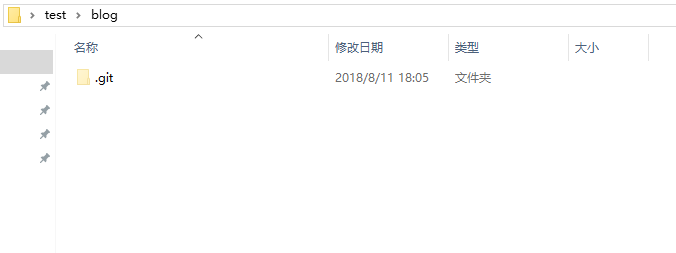

5. 建立`ssh`信任关系，在**本地电脑**

```bash
ssh-copy-id -i C:/Users/yourname/.ssh/id_rsa.pub git@server_ip
ssh git@server_ip // 测试能否登录
```

**注**：此时的 ssh 登录 git 用户不需要密码！否则就**有错**，请仔细重复步骤 3-5

6. 为了安全起见禁用 git 用户的 shell 登录权限，从而只能用 git clone，git push 等登录

```bash
cat /etc/shells // 查看 git-shell 是否在登录方式里面
which git-shell // 查看是否安装
vi /etc/shells
添加上2步显示出来的路劲，通常在 /usr/bin/git-shell
```

修改`/etc/passwd`中的权限

```bash
// 将原来的
git:x:1000:1000::/home/git:/bin/bash

// 修改为
git:x:1000:1000:,,,:/home/git:/usr/bin/git-shell
```

### 搭建`nginx`服务器

1. 下载并安装`nginx`

```bash
cd /usr/local/src
wget http://nginx.org/download/nginx-1.15.2.tar.gz
tar xzvf nginx-1.15.2.tar.gz
cd nginx-1.15.2
./configure // 如果后面还想要配置 SSL 协议，就执行后面一句！
./configure --prefix=/usr/local/nginx --with-http_stub_status_module --with-http_ssl_module --with-file-aio --with-http_realip_module
make && make install
alias nginx='/usr/local/nginx/sbin/nginx' // 为 nginx 取别名，后面可直接用
```

2. 配置`nginx`文件

先启动是否安装成功

```bash
nginx // 直接来！浏览器查看 server_ip，默认是 80 端口
```

修改配置文件

```bash
nginx -s stop // 先停止nginx
cd /usr/local/nginx/conf
vi nginx.conf
修改 root 解析路径，如下图
同时将 user 改为 `root` 如下图，不然nginx无法访问 /home/git/projects/blog
nginx -s reload
```

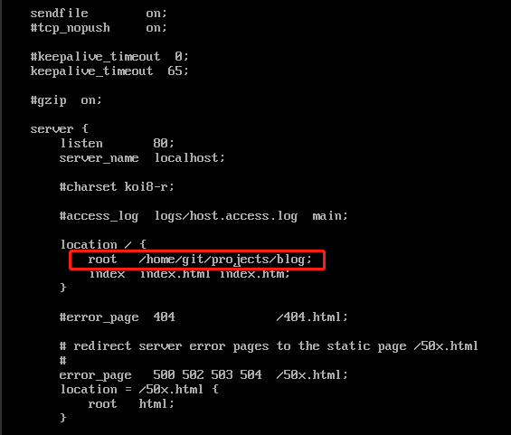

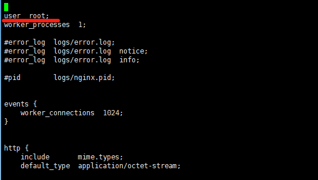

---

## 四、发布

至此我们就把本地和服务器的环境全部搭建完成，现在利用 hexo 配置文件进行链接

### 配置`_config.yml`文件

1. 编辑 _config.yml 的 deploy 属性

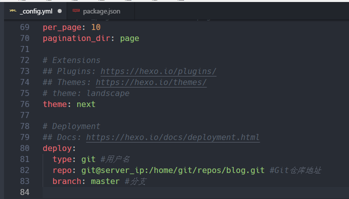

2. 在 package.json 中添加 npm 脚本

```json
"scripts": {
  "deploy": "hexo clean && hexo g -d",
  "start": "hexo clean && hexo g && hexo s"
},
```

3. 链接！这下在本地调试就用`npm start`，调试好了就上传到服务器，美滋滋~快通过你的服务器 ip 访问吧

```bash
npm run deploy
```

## 五、最后说句

本人前端新手一枚，有错误的话欢迎指正

贴上 [个人网站](https://www.omyleon.com)，建站初期，欢迎您的光临~

喜欢的话麻烦给个 ★ 哦

## 六、参考链接

- [史上最详细的 Hexo 博客搭建图文教程](https://xuanwo.org/2015/03/26/hexo-intor/)

- [通过 Git 将 Hexo 博客部署到服务器](https://www.jianshu.com/p/e03e363713f9)

- [windows npm -g 全局安装的命令找不到](https://blog.csdn.net/jizhuanfan0742/article/details/80910187)

- [Hexo 设置主题以及 Next 主题个性设置](https://www.jianshu.com/p/b20fc983005f)

- [使用 Git Hook 自动部署 Hexo 到个人 VPS](http://www.swiftyper.com/2016/04/17/deploy-hexo-with-git-hook/)

- [ssh-copy-id 帮你建立信任](http://roclinux.cn/?p=2551)

- [Git Server - 限制 Git 用户使用 SSH 登陆操作](https://blog.csdn.net/lgyaxx/article/details/72954121)

- [Nginx 源码安装和简单的配置](https://www.jianshu.com/p/4134a44a09c2)
