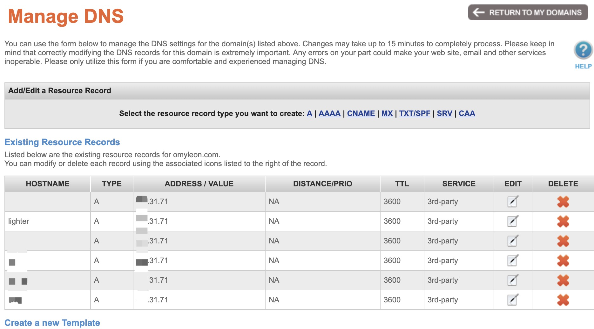
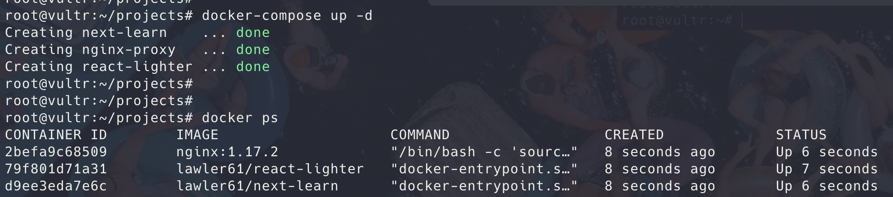
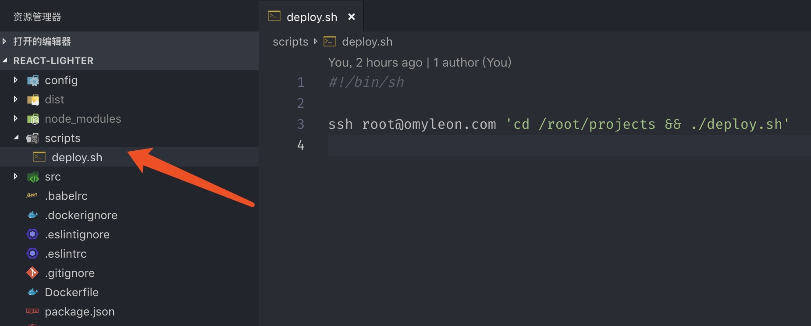
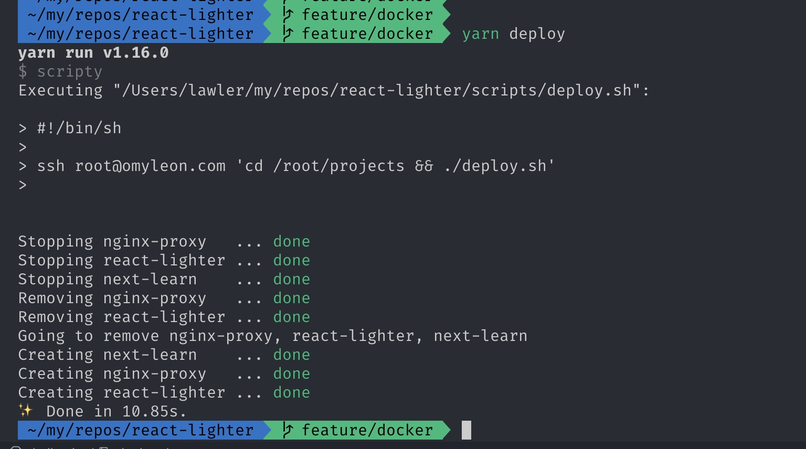

# 折腾服务器：Docker 项目打包发布 + 一键部署多个应用

最近在折腾 docker，可实现本地一键同时部署多个应用

完全不了解 docker 的建议先看 [官方文档](https://docs.docker.com/get-started/) 哦~

## 主要流程

1. 开发完项目后，将项目用 docker 打包成镜像，推到 DockerHub 上

2. 服务器配置好多个应用的 docker-compose 和 nginx 反向代理文件

3. 本地与远程做连接，用`免交互`登录服务器拉取镜像并部署服务

## 本地配置

### 一、下载 docker

1. Mac 可直接用 `brew` 下载

```js
brew cask install docker
```

2. Windows 请参考官网，在此不做过多讲解

- [Install Docker Desktop for Windows](https://docs.docker.com/docker-for-windows/install/)

3. 启动 docker

### 二、docker 配置

本文以打包 [next-learn 服务端渲染](https://github.com/lawler61/next-learn) 项目为例，需要的请自行查看

1. 项目中创建 Dockerfile

```bash
# 拉取 node 镜像，alpine 版本包最小
FROM node:10-alpine

# 设置 maintainer
LABEL maintainer "your_email@example.com"

# 将当前项目拷贝到镜像中的 /app 文件中
COPY . /app

# 设置 /app 为工作区
WORKDIR /app

# 执行命令
RUN yarn \
  && yarn build \
  && yarn cache clean

# 执行运行命令
CMD ["yarn","start"]

# 暴露出 3000 端口
EXPOSE 3000
```

2. 创建 .dockerignore

这个没啥说的，防止将不必要的文件拷贝进 container 中

```bash
node_modules
yarn.lock
package-lock.json

build
dist
```

3. 创建 npm 命令

```json
"scripts": {
  "docker:build": "docker build -t lawler61/next-learn .",
  "docker:run": "docker run --rm --name next-learn -d -p 8080:3000 lawler61/next-learn",
  "docker:push": "docker push lawler61/next-learn",
}
```

- 使用 build 命令打包镜像：`yarn docker:build`

- 本地测试：`yarn docker:run`

- 推到 DockerHub：`yarn docker:push`，推送前记得登录：`docker login -u your_name -p your_password`

## 服务器配置

### 一、安装 docker

博主采用的是 Ubuntu 系统，其他 linux 系统请酌情参考

1. 可以采用 `snap` 下载（博主采用的方式）

```bash
snap install docker
```

2. 也可以采用 `apt`

```bash
apt update
apt install docker.io
```

### 二、创建 docker-compose.yml

为了方便部署多个项目，我们采用 docker-compose 来管理。.yml 文件严格要求对齐格式，请小心书写

```bash
mkdir projects && cd projects
vi docker-compose.yml
# 写入

version: '3'
services:
  # proxy 为服务名称，可自行改变
  proxy:
    # 拉取的镜像，这里也采用 alpine
    image: nginx:1.17.2-alpine
    # 设置容器名称，方便查看
    container_name: nginx-proxy
    ports:
      # 设置 nginx 和宿主机的端口映射，注意 nginx 监听的是 8080
      - 80:8080
      # - 8081:4000 这里写 app2 的端口映射
    # 设置逻辑卷，用来与宿主机共享文件
    volumes:
      - ./nginx.conf:/etc/nginx/nginx.conf
      - ./conf.d:/etc/nginx/conf.d
  # 第一个应用，
  app1:
    # 刚上传的镜像
    image: lawler61/next-learn
    container_name: next-learn
  # app2:
    # image: lawler61/react-lighter
    # ...
```

### 三、配置 nginx 反向代理

1. 我们刚上传的镜像是可以直接运行的

```bash
# 服务端也可以直接运行
docker run --rm --name next-learn -d -p 8080:3000 lawler61/next-learn
```

这样我们可以直接访问 `your_server_ip:8080`，我们用 nginx 是做反向代理，其中可以配置上域名，隐藏端口

2. 配置 nginx.conf，这个没啥说的，原生配置

```bash
user  nginx;
worker_processes  1;

error_log  /var/log/nginx/error.log warn;
pid        /var/run/nginx.pid;

events {
  worker_connections  1024;
}

http {
  include       /etc/nginx/mime.types;
  default_type  application/octet-stream;

  log_format  main  '$remote_addr - $remote_user [$time_local] "$request" '
                    '$status $body_bytes_sent "$http_referer" '
                    '"$http_user_agent" "$http_x_forwarded_for"';

  access_log  /var/log/nginx/access.log  main;

  sendfile        on;

  keepalive_timeout  65;

  gzip  on;

  # 这里来调用所有的 server 配置
  include /etc/nginx/conf.d/*.conf;
}
```

3. 配置 conf.d，里面装了各种 server，要反向代理成域名的请先自行在你购买的域名网站设置 DNS 解析



```bash
# 在当前目录中（projects）
mkdir conf.d && cd conf.d
vi next-learn.conf
# 写入

# 设置代理名
upstream nl_upstream {
  # 这里 next-learn 为 docker-compose 中设置的 container_name
  # docker 自动 link，所以这里能直接访问到 app1 的 3000 端口
  server next-learn:3000;
}

server {
  # 监听 8080
  listen 8080;
  # 配置域名，这里要在你的域名做 DNS 解析，否则直接访问不能够解析到
  server_name lighter.omyleon.com;

  location / {
    # 设置反向代理
    proxy_pass http://nl_upstream;
    proxy_http_version 1.1;
    proxy_set_header Upgrade $http_upgrade;
    proxy_set_header Connection "Upgrade";
    proxy_set_header Host $host;
    proxy_set_header X-Real-IP $remote_addr;
    proxy_set_header X-Forwarded-For $proxy_add_x_forwarded_for;
    proxy_set_header X-Forwarded-Host $server_name;
    proxy_redirect off;
  }
}
```

4. 启动 docker，然后访问直接访问域名就可以啦

```
docker-compose up -d
# 查看容器情况
docker ps
```



5. 自动化部署

为了方便自动化部署，我们再写个脚本 `deploy.sh`

```bash
vi deploy.sh
# 写入

#!/bin/sh
/snap/bin/docker-compose stop
/snap/bin/docker-compose rm -f
/snap/bin/docker-compose up -d
/snap/bin/docker ps

# 保存后记得给个执行权限
chmod +x ./deploy.sh
```

然后我们执行脚本，就可以快乐的一键部署了

```bash
./deploy.sh
```

### 四、本地`免交互`登录服务器

服务器做好了一键部署的脚本，我们在本地只要能够让它执行即可

1. 使用 `ssh-copy-id` 提交 ssh 到服务器，实现`免密`登录

```bash
ssh-keygen -t rsa -C "your_email@example.com"
ssh-copy-id -i /你本地ssh所在地址/id_rsa.pub root@your_server_ip

# 提交完成后就可以免密登录
ssh root@your_server_ip
```

2. `免交互`登录服务器实现一键部署

这里要用到 `scripty` 模块帮助我们自动管理命令，不了解的可以先看看 [文档 testdouble/scripty](https://github.com/testdouble/scripty)

```json
"scripts": {
  "deploy": "scripty"
}
```

- 本地项目中创建 `scripts` 文件夹，在里面创建 `deploy.sh` 文件，并写入



```bash
#!/bin/sh

ssh root@your_server_ip 'cd /root/projects && ./deploy.sh'
```

- 记得给执行权限哦

```bash
chmod + x ./scripts/*
```

3. 去吧！终极一键部署

```bash
# 如果 DockerHub 不是最新的要先 push 下：yarn docker:push
yarn deploy
```



## 源码获取

- [next-learn 本地项目配置：Dockerfile](https://github.com/lawler61/next-learn)

- [服务端配置：docker-compose 和 nginx](https://github.com/lawler61/blog/tree/master/server/server-docker-deploy/projects)

## 最后

折腾了几天，不容易，觉得有帮助的小伙伴加个💜哦~
